# AI Agent 完整入门指南

## 📖 目录
1. [什么是AI Agent](#什么是ai-agent)
2. [Agent vs Workflow：架构差异详解](#agent-vs-workflow架构差异详解)
3. [何时构建Agent：场景判断指南](#何时构建agent场景判断指南)
4. [Agent构建方法论](#agent构建方法论)
5. [Workflow模式详解](#workflow模式详解)
6. [Agent设计原则与最佳实践](#agent设计原则与最佳实践)
7. [工具设计与提示工程](#工具设计与提示工程)
8. [实际案例分析](#实际案例分析)
9. [框架选择指南](#框架选择指南)
10. [总结与建议](#总结与建议)

---

## 什么是AI Agent

### 基础定义

AI Agent（智能体）是一种基于大语言模型（LLM）的系统，能够**动态决定自己的行为流程**，自主使用工具完成复杂任务。与传统的固定流程系统不同，Agent具有：

- **自主决策能力**：根据环境反馈动态调整策略
- **工具使用能力**：能够选择和使用合适的工具
- **学习适应能力**：从执行结果中学习并改进
- **目标导向性**：始终朝着明确的目标前进

### 核心特征

#### 1. 动态性
Agent不遵循预定义的代码路径，而是基于当前状态和目标动态决定下一步行动。

#### 2. 自主性
在明确任务后，Agent能够独立规划和执行，只在必要时寻求人类指导。

#### 3. 工具集成
Agent可以调用各种外部工具，如搜索引擎、数据库、API等。

#### 4. 反馈循环
通过环境反馈（工具执行结果、代码运行结果等）评估进展并调整策略。

### Agent的抽象本质

> "Agent只是一些'在一个循环中，基于环境反馈来选择合适的工具，最终完成其任务'的大模型。"

这个简洁的定义揭示了Agent的核心工作机制：

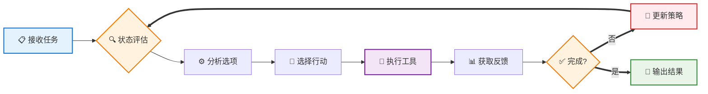

**Agent核心工作循环说明：**
1. **状态评估**：分析当前情况和已有信息
2. **策略规划**：基于目标和状态选择最佳行动
3. **工具执行**：调用相应的外部工具或API
4. **反馈处理**：解析执行结果并更新知识
5. **目标检查**：判断是否达成最终目标

---

## Agent vs Workflow：架构差异详解

理解Agent和Workflow的区别是构建智能系统的关键。两者都属于"智能系统"范畴，但在架构和行为上有本质差异。

### 核心架构对比

| 维度 | Workflow | Agent |
|------|----------|--------|
| **控制方式** | 预定义代码路径 | LLM动态决策 |
| **流程固定性** | 固定步骤序列 | 灵活的动态流程 |
| **决策主体** | 程序逻辑 | LLM推理 |
| **适应性** | 低（需重新编程） | 高（自动适应） |
| **可预测性** | 高 | 中等 |
| **复杂度** | 相对简单 | 相对复杂 |

#### 架构对比可视化

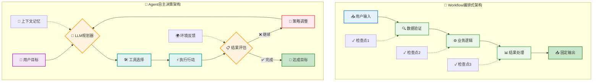

### Workflow：编排式系统

```
用户输入 → [步骤1] → [步骤2] → [步骤3] → 最终输出
            ↓         ↓         ↓
         检查点1   检查点2   检查点3
```

**特点：**
- 每个步骤都是预先定义的
- 执行路径固定不变
- 适合明确定义的任务
- 高度可控和可预测

### Agent：自主决策系统

```
用户目标 → [LLM规划] → [选择工具] → [执行行动] → [评估结果]
                ↑                                    ↓
                ←←←←←←← [调整策略] ←←←←←←←←←←←←←
```

**特点：**
- LLM在每个节点都要做决策
- 执行路径动态变化
- 适合开放性问题
- 需要更多信任和控制机制

### 详细对比分析

#### 1. 控制粒度

**Workflow示例：客户服务流程**
```python
def customer_service_workflow(query):
    # 步骤1：分类查询
    category = classify_query(query)
    
    # 步骤2：路由到专门处理器
    if category == "billing":
        return handle_billing(query)
    elif category == "technical":
        return handle_technical(query)
    else:
        return handle_general(query)
```

**Agent示例：客户服务Agent**
```python
def customer_service_agent(query):
    while not task_completed:
        # LLM决定下一步行动
        action = llm.decide_next_action(
            query=query,
            conversation_history=history,
            available_tools=tools
        )
        
        # 执行行动并获取反馈
        result = execute_action(action)
        
        # 基于结果调整策略
        strategy = llm.evaluate_and_adjust(result)
```

#### 2. 适用场景对比

**Workflow适用场景：**
- 文档处理流水线
- 数据ETL流程
- 审批工作流
- 标准化客服响应

**Agent适用场景：**
- 代码调试和修复
- 复杂问题研究
- 创意内容生成
- 开放式问题解决

#### 3. 成本与性能对比

| 方面 | Workflow | Agent |
|------|----------|--------|
| **开发成本** | 中等 | 高 |
| **运行成本** | 低 | 高（15倍Token消耗） |
| **维护成本** | 高（需重新编程） | 低（自动适应） |
| **响应速度** | 快 | 慢 |
| **准确性** | 高 | 中等到高 |

---

## 何时构建Agent：场景判断指南

### 决策框架

构建智能系统时，应该遵循"奥卡姆剃刀"原则：**寻找最简单的解决方案，只在必要时增加复杂性**。

#### 解决方案选择决策树

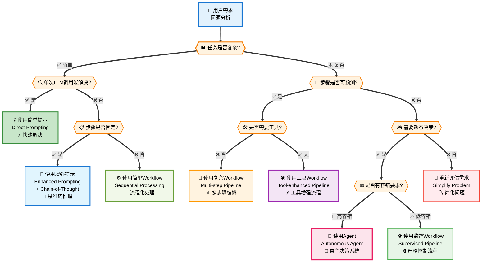

### Agent适用场景判断清单

#### ✅ 适合使用Agent的情况

1. **开放性问题**
   - 难以预测需要多少步骤
   - 无法硬编码固定路径
   - 需要创造性问题解决

2. **复杂决策需求**
   - 需要根据中间结果调整策略
   - 多种解决路径都可能有效
   - 需要权衡多个因素

3. **工具使用复杂**
   - 需要组合多个工具
   - 工具选择取决于上下文
   - 需要处理工具执行失败

4. **信任环境**
   - 可以承受一定的不确定性
   - 有适当的监控和控制机制
   - 错误成本可控

#### ❌ 不适合使用Agent的情况

1. **简单确定任务**
   - 步骤固定且明确
   - 只需要单次LLM调用
   - 输入输出关系明确

2. **高风险环境**
   - 对准确性要求极高
   - 错误代价巨大
   - 需要严格审计追踪

3. **成本敏感场景**
   - 预算紧张
   - 大量重复性任务
   - 对响应速度要求高

4. **简单自动化**
   - 传统RPA就能解决
   - 不需要AI能力
   - 逻辑规则已经很清晰

### 复杂度递增策略

#### 第一层：简单提示
```python
response = llm("请分析这个销售数据并给出建议")
```

**适用于：**
- 单次查询/分析
- 明确的输入输出
- 不需要外部工具

#### 第二层：增强提示（RAG + Few-shot）
```python
context = retrieve_relevant_docs(query)
examples = get_few_shot_examples()
response = llm(f"背景：{context}\n示例：{examples}\n问题：{query}")
```

**适用于：**
- 需要背景知识
- 需要特定格式输出
- 有成功案例可参考

#### 第三层：Workflow
```python
def analysis_workflow(data):
    cleaned_data = data_cleaning_step(data)
    analysis = analysis_step(cleaned_data)
    report = report_generation_step(analysis)
    return report
```

**适用于：**
- 多步骤处理
- 每步都相对独立
- 流程相对固定

#### 第四层：Agent
```python
class DataAnalysisAgent:
    def solve(self, problem):
        while not self.is_completed():
            action = self.llm.plan_next_action()
            result = self.execute_action(action)
            self.update_state(result)
        return self.final_result
```

**适用于：**
- 开放性问题
- 需要多轮交互
- 策略需要动态调整

### 实际判断示例

#### 示例1：数据分析任务

**需求：**"分析这个CSV文件的销售趋势"

**判断过程：**
1. 是否有固定步骤？ → 是（读取→清洗→分析→可视化）
2. 是否需要动态决策？ → 否
3. **结论：使用Workflow**

#### 示例2：代码调试任务

**需求：**"修复这个程序中的Bug"

**判断过程：**
1. 是否有固定步骤？ → 否（需要根据错误类型调整）
2. 是否需要多轮交互？ → 是（测试→诊断→修改→再测试）
3. 是否需要工具？ → 是（代码执行、测试运行）
4. **结论：使用Agent**

#### 示例3：文档翻译任务

**需求：**"将技术文档翻译成英文"

**判断过程：**
1. 是否复杂？ → 否（相对直接）
2. 是否需要多步？ → 可能（长文档需要分段）
3. 是否需要动态决策？ → 否
4. **结论：使用增强提示或简单Workflow**

---

## Agent构建方法论

### 增强型LLM：Agent的基础

所有Agent都构建在"增强型LLM"之上，这是一个具备额外能力的语言模型：

#### Agent核心组件架构

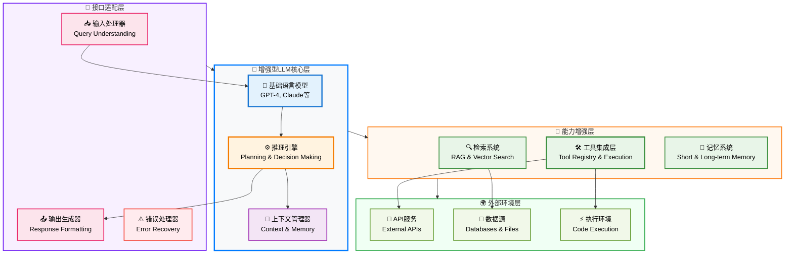

### Agent设计的三个核心原则

#### 1. 保持简洁性（Simplicity）
- 避免不必要的复杂性
- 优先使用简单明了的设计
- 每个组件都有明确的职责

#### 2. 确保透明性（Transparency）
- 明确显示Agent的规划步骤
- 记录决策过程和理由
- 提供可解释的行为

#### 3. 精心设计ACI（Agent-Computer Interface）
- 工具文档要清晰完善
- 接口设计要简单易用
- 充分测试工具交互

### Agent构建步骤

#### 步骤1：需求分析和任务分解

```python
class TaskAnalysis:
    def __init__(self, user_goal):
        self.goal = user_goal
        self.complexity = self.assess_complexity()
        self.tools_needed = self.identify_required_tools()
        self.success_criteria = self.define_success_criteria()
    
    def assess_complexity(self):
        # 评估任务复杂度
        factors = {
            'steps_predictable': False,  # 步骤是否可预测
            'tools_required': True,      # 是否需要工具
            'decision_points': 'many',   # 决策点数量
            'error_handling': True       # 是否需要错误处理
        }
        return 'high' if factors['decision_points'] == 'many' else 'low'
```

#### 步骤2：核心循环设计

```python
class AgentCore:
    def execute(self, goal):
        self.state = AgentState(goal)
        
        while not self.is_goal_achieved():
            # 1. 规划阶段
            plan = self.llm.generate_plan(
                goal=self.state.goal,
                current_state=self.state,
                available_tools=self.tools
            )
            
            # 2. 执行阶段
            action = self.select_next_action(plan)
            result = self.execute_action(action)
            
            # 3. 评估阶段
            self.state.update(result)
            
            # 4. 安全检查
            if self.should_stop():
                break
                
        return self.state.result
```

#### 步骤3：工具集设计

```python
class ToolRegistry:
    def __init__(self):
        self.tools = {}
    
    def register_tool(self, name, func, description, examples):
        """注册工具时提供充分的文档"""
        self.tools[name] = {
            'function': func,
            'description': description,
            'examples': examples,
            'error_handling': self.get_error_patterns(func)
        }
    
    def get_tool_documentation(self):
        """为LLM提供工具使用指南"""
        docs = []
        for name, tool in self.tools.items():
            docs.append(f"""
            工具名称: {name}
            功能描述: {tool['description']}
            使用示例: {tool['examples']}
            错误处理: {tool['error_handling']}
            """)
        return "\n".join(docs)
```

#### 步骤4：状态管理

```python
class AgentState:
    def __init__(self, goal):
        self.goal = goal
        self.step_count = 0
        self.max_steps = 50
        self.history = []
        self.current_context = {}
        self.success_achieved = False
        
    def update(self, action_result):
        self.step_count += 1
        self.history.append(action_result)
        self.current_context.update(action_result.context)
        
        # 评估是否达成目标
        self.success_achieved = self.evaluate_success()
    
    def should_continue(self):
        return (not self.success_achieved and 
                self.step_count < self.max_steps)
```

#### 步骤5：安全机制和控制

```python
class SafetyControls:
    def __init__(self):
        self.dangerous_actions = ['delete', 'format', 'rm -rf']
        self.cost_limit = 100  # 美元
        self.current_cost = 0
        
    def validate_action(self, action):
        # 安全检查
        if any(danger in action.command for danger in self.dangerous_actions):
            return False, "危险操作需要人类确认"
        
        # 成本检查
        estimated_cost = self.estimate_cost(action)
        if self.current_cost + estimated_cost > self.cost_limit:
            return False, "即将超出成本预算"
            
        return True, "操作安全"
    
    def require_human_approval(self, action):
        """需要人类确认的操作"""
        return input(f"Agent想要执行：{action}\n是否同意？(y/n): ") == 'y'
```

### Agent架构模式

#### 1. 反应式Agent（Reactive Agent）
```python
class ReactiveAgent:
    """简单的刺激-反应模式"""
    def process(self, input_stimulus):
        action = self.llm.react_to(input_stimulus)
        return self.execute_action(action)
```

#### 2. 计划式Agent（Planning Agent）
```python
class PlanningAgent:
    """先规划再执行的模式"""
    def process(self, goal):
        # 制定完整计划
        plan = self.llm.create_plan(goal)
        
        # 逐步执行计划
        for step in plan:
            result = self.execute_step(step)
            if not result.success:
                # 重新规划
                plan = self.llm.replan(goal, result, plan)
```

#### 3. 学习式Agent（Learning Agent）
```python
class LearningAgent:
    """从经验中学习改进的Agent"""
    def __init__(self):
        self.experience_db = ExperienceDatabase()
    
    def process(self, goal):
        # 查找相似经验
        similar_cases = self.experience_db.find_similar(goal)
        
        # 基于经验制定策略
        strategy = self.llm.create_strategy(goal, similar_cases)
        
        # 执行并记录经验
        result = self.execute_strategy(strategy)
        self.experience_db.record(goal, strategy, result)
        
        return result
```

---

## Workflow模式详解

虽然本文重点介绍Agent，但理解Workflow模式对于做出正确的架构选择至关重要。以下是常见的Workflow模式：

### 五种核心Workflow模式详解

#### 1. 提示链模式 (Prompt Chaining)

**顺序执行的线性处理模式**

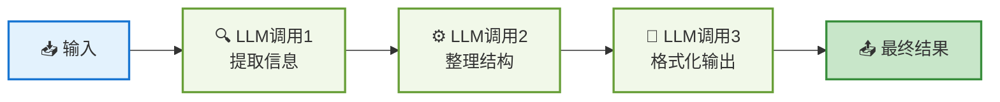

#### 2. 路由模式 (Routing)

**智能分流的专家处理模式**

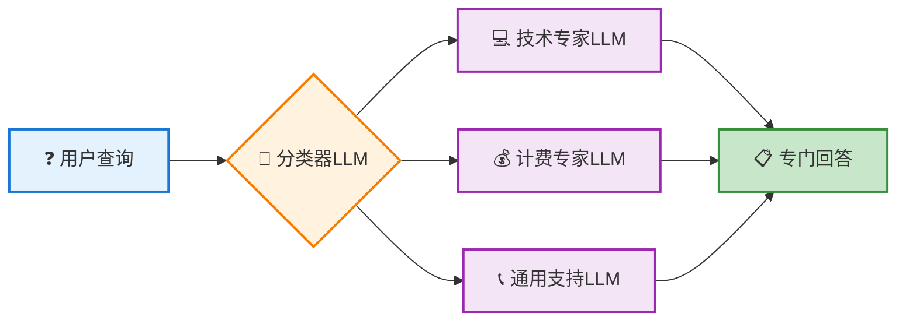

#### 3. 并行化模式 (Parallelization)

**同时执行的多任务处理模式**

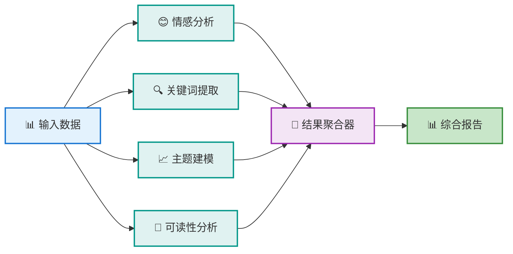

#### 4. 编排器-工作者模式 (Orchestrator-Workers)

**中央调度的分工协作模式**

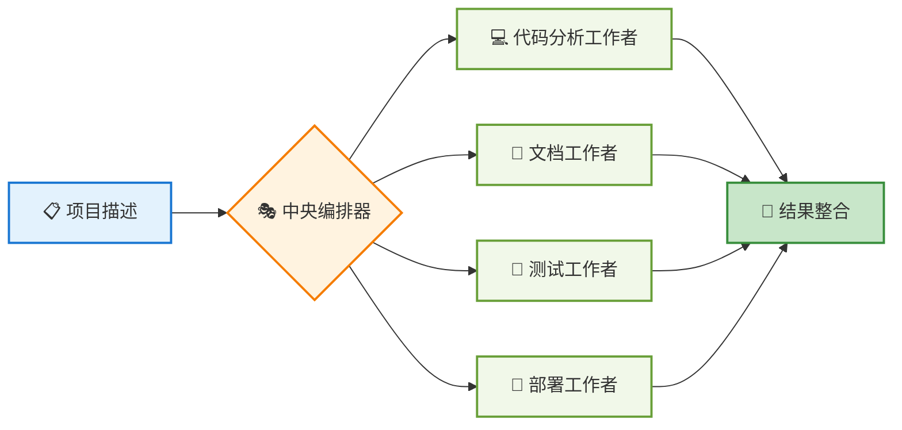

#### 5. 评估器-优化器模式 (Evaluator-Optimizer)

**迭代改进的反馈循环模式**

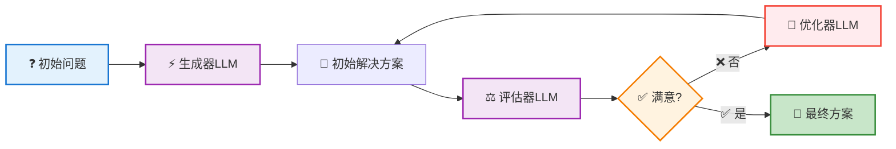

### 1. 提示链（Prompt Chaining）

将复杂任务分解为顺序执行的简单子任务。

```python
def document_processing_chain(raw_text):
    # 步骤1：内容提取
    extracted = llm_call_1("请从以下文本中提取关键信息：", raw_text)
    
    # 步骤2：信息整理
    organized = llm_call_2("请整理以下信息的结构：", extracted)
    
    # 步骤3：格式化输出
    formatted = llm_call_3("请将信息格式化为正式报告：", organized)
    
    return formatted
```

**适用场景：**
- 文档处理流水线
- 内容创作流程
- 数据分析管道

**优点：**
- 每一步都简单明确
- 容易调试和优化
- 结果可预测

**缺点：**
- 缺乏灵活性
- 无法处理异常情况
- 不能根据中间结果调整策略

### 2. 路由（Routing）

根据输入类型将任务分配给专门的处理器。

```python
def intelligent_routing(user_query):
    # 分类查询类型
    query_type = classifier_llm(f"请将以下查询分类：{user_query}")
    
    # 路由到专门处理器
    if query_type == "technical":
        return technical_expert_llm(user_query)
    elif query_type == "billing":
        return billing_expert_llm(user_query)
    elif query_type == "general":
        return general_support_llm(user_query)
    else:
        return fallback_handler(user_query)
```

**适用场景：**
- 客户服务系统
- 多领域问答系统
- 智能分流系统

### 3. 并行化（Parallelization）

同时执行多个任务，然后聚合结果。

```python
import asyncio

async def parallel_analysis(data):
    # 并行执行多种分析
    tasks = [
        sentiment_analysis(data),
        keyword_extraction(data),
        topic_modeling(data),
        readability_analysis(data)
    ]
    
    results = await asyncio.gather(*tasks)
    
    # 聚合结果
    final_report = aggregate_results(results)
    return final_report
```

**适用场景：**
- 多角度分析
- 性能优化
- 冗余验证

### 4. 编排器-工作者（Orchestrator-Workers）

中央编排器动态分配任务给多个工作者。

```python
class TaskOrchestrator:
    def __init__(self):
        self.workers = [
            CodeAnalysisWorker(),
            DocumentationWorker(),
            TestingWorker(),
            DeploymentWorker()
        ]
    
    def process_project(self, project_description):
        # 分析项目需求
        requirements = self.analyze_requirements(project_description)
        
        # 动态分配任务
        tasks = self.create_task_plan(requirements)
        
        # 协调工作者执行
        results = []
        for task in tasks:
            suitable_worker = self.select_worker(task)
            result = suitable_worker.execute(task)
            results.append(result)
        
        # 整合最终结果
        return self.integrate_results(results)
```

### 5. 评估器-优化器（Evaluator-Optimizer）

一个组件生成解决方案，另一个组件评估并优化。

```python
def iterative_improvement(initial_problem):
    current_solution = generator_llm(f"请为以下问题提供解决方案：{initial_problem}")
    
    for iteration in range(max_iterations):
        # 评估当前解决方案
        evaluation = evaluator_llm(f"""
        问题：{initial_problem}
        当前解决方案：{current_solution}
        请评估此解决方案并提出改进建议。
        """)
        
        if evaluation.is_satisfactory:
            break
            
        # 基于评估改进解决方案
        current_solution = optimizer_llm(f"""
        原问题：{initial_problem}
        当前方案：{current_solution}
        改进建议：{evaluation.suggestions}
        请提供改进后的解决方案。
        """)
    
    return current_solution
```

---

## Agent设计原则与最佳实践

### 系统性设计原则

#### 1. 模块化设计

```python
class ModularAgent:
    def __init__(self):
        self.perception = PerceptionModule()      # 感知模块
        self.reasoning = ReasoningModule()        # 推理模块
        self.planning = PlanningModule()          # 规划模块
        self.execution = ExecutionModule()        # 执行模块
        self.memory = MemoryModule()              # 记忆模块
    
    def run_cycle(self, input_data):
        # 感知环境
        perception_result = self.perception.process(input_data)
        
        # 推理分析
        analysis = self.reasoning.analyze(perception_result)
        
        # 制定计划
        plan = self.planning.create_plan(analysis)
        
        # 执行行动
        action_result = self.execution.execute(plan)
        
        # 更新记忆
        self.memory.update(perception_result, analysis, plan, action_result)
        
        return action_result
```

#### 2. 容错机制

```python
class RobustAgent:
    def __init__(self):
        self.max_retries = 3
        self.fallback_strategies = [
            self.strategy_a,
            self.strategy_b,
            self.human_intervention
        ]
    
    def execute_with_fallback(self, task):
        for strategy in self.fallback_strategies:
            try:
                result = self.attempt_execution(task, strategy)
                if self.validate_result(result):
                    return result
            except Exception as e:
                self.log_error(f"策略失败: {strategy.__name__}, 错误: {e}")
                continue
        
        raise Exception("所有策略都失败了")
    
    def attempt_execution(self, task, strategy):
        for attempt in range(self.max_retries):
            try:
                return strategy(task)
            except TemporaryError:
                if attempt < self.max_retries - 1:
                    time.sleep(2 ** attempt)  # 指数退避
                    continue
                raise
```

#### 3. 可观测性

```python
class ObservableAgent:
    def __init__(self):
        self.logger = StructuredLogger()
        self.metrics = MetricsCollector()
        self.tracer = ExecutionTracer()
    
    def execute_with_observability(self, task):
        trace_id = self.tracer.start_trace(task)
        
        try:
            # 记录开始状态
            self.logger.info("任务开始", {
                "task_id": task.id,
                "trace_id": trace_id,
                "task_type": task.type
            })
            
            # 执行任务
            start_time = time.time()
            result = self.core_execution(task)
            execution_time = time.time() - start_time
            
            # 记录成功指标
            self.metrics.record_success(task.type, execution_time)
            self.logger.info("任务完成", {
                "task_id": task.id,
                "execution_time": execution_time,
                "result_summary": result.summary
            })
            
            return result
            
        except Exception as e:
            # 记录失败指标
            self.metrics.record_failure(task.type, str(e))
            self.logger.error("任务失败", {
                "task_id": task.id,
                "error": str(e),
                "trace_id": trace_id
            })
            raise
        
        finally:
            self.tracer.end_trace(trace_id)
```

### 性能优化策略

#### 1. 提示优化

```python
class PromptOptimizer:
    def __init__(self):
        self.prompt_templates = {
            'analysis': """
作为专业分析师，请分析以下数据：

数据：{data}
分析目标：{goal}

请按以下结构回答：
1. 数据概览
2. 关键发现
3. 具体建议
4. 风险评估

确保回答简洁准确。
""",
            'coding': """
作为专业程序员，请帮助解决以下编程问题：

问题：{problem}
编程语言：{language}
已有代码：{existing_code}

请提供：
1. 问题分析
2. 解决方案
3. 完整代码
4. 测试用例

代码需要遵循最佳实践。
"""
        }
    
    def get_optimized_prompt(self, task_type, **kwargs):
        template = self.prompt_templates.get(task_type)
        if template:
            return template.format(**kwargs)
        return self.create_dynamic_prompt(task_type, kwargs)
```

#### 2. 缓存机制

```python
class AgentWithCaching:
    def __init__(self):
        self.cache = LRUCache(maxsize=1000)
        self.cache_hit_rate = 0
        self.total_requests = 0
    
    def execute_with_cache(self, task):
        self.total_requests += 1
        cache_key = self.generate_cache_key(task)
        
        # 检查缓存
        cached_result = self.cache.get(cache_key)
        if cached_result:
            self.cache_hit_rate = (self.cache_hit_rate * (self.total_requests - 1) + 1) / self.total_requests
            return cached_result
        
        # 执行任务
        result = self.execute_task(task)
        
        # 缓存结果
        if self.is_cacheable(result):
            self.cache.set(cache_key, result)
        
        return result
    
    def generate_cache_key(self, task):
        # 生成基于任务内容的缓存键
        content_hash = hashlib.md5(str(task).encode()).hexdigest()
        return f"{task.type}:{content_hash}"
```

#### 3. 资源管理

```python
class ResourceManagedAgent:
    def __init__(self):
        self.cpu_limit = 80  # CPU使用率限制
        self.memory_limit = 8 * 1024 * 1024 * 1024  # 8GB内存限制
        self.token_budget = 10000  # Token预算
        self.current_token_usage = 0
    
    def check_resources(self):
        cpu_usage = psutil.cpu_percent()
        memory_usage = psutil.virtual_memory().used
        
        if cpu_usage > self.cpu_limit:
            raise ResourceLimitError("CPU使用率过高")
        
        if memory_usage > self.memory_limit:
            raise ResourceLimitError("内存使用量过高")
        
        if self.current_token_usage > self.token_budget:
            raise ResourceLimitError("Token预算已耗尽")
    
    def execute_with_resource_check(self, task):
        self.check_resources()
        
        estimated_tokens = self.estimate_token_usage(task)
        if self.current_token_usage + estimated_tokens > self.token_budget:
            return self.use_lightweight_strategy(task)
        
        result = self.execute_full_strategy(task)
        self.current_token_usage += estimated_tokens
        
        return result
```

---

## 工具设计与提示工程

工具是Agent与外部世界交互的桥梁，其设计质量直接影响Agent的性能。

### 工具设计原则

#### 1. 清晰的接口定义

```python
class ToolInterface:
    def __init__(self, name, description, parameters, examples):
        self.name = name
        self.description = description
        self.parameters = parameters
        self.examples = examples
    
    def to_llm_documentation(self):
        return f"""
工具名称：{self.name}

功能描述：{self.description}

参数说明：
{self._format_parameters()}

使用示例：
{self._format_examples()}

错误处理：
{self._format_error_handling()}
"""

class FileEditorTool(ToolInterface):
    def __init__(self):
        super().__init__(
            name="file_editor",
            description="用于编辑文件内容，支持创建、修改、删除操作",
            parameters={
                "action": "操作类型：'create', 'read', 'update', 'delete'",
                "file_path": "文件路径（必须是绝对路径）",
                "content": "文件内容（仅用于create和update操作）",
                "line_numbers": "指定行号范围（仅用于update操作）"
            },
            examples=[
                {
                    "task": "创建新文件",
                    "call": "file_editor(action='create', file_path='/app/main.py', content='print(\"Hello World\")')",
                    "result": "文件已创建"
                },
                {
                    "task": "更新特定行",
                    "call": "file_editor(action='update', file_path='/app/main.py', content='print(\"Hello Python\")', line_numbers='1')",
                    "result": "第1行已更新"
                }
            ]
        )
```

#### 2. 防错设计（Poka-yoke）

```python
class SafeFileEditor:
    def __init__(self):
        self.dangerous_operations = ['.env', 'config', 'password']
        self.backup_enabled = True
    
    def edit_file(self, action, file_path, content=None, line_numbers=None):
        # 输入验证
        if not os.path.isabs(file_path):
            raise ValueError("必须使用绝对路径")
        
        # 安全检查
        if any(danger in file_path.lower() for danger in self.dangerous_operations):
            if not self.get_user_confirmation(f"即将修改敏感文件：{file_path}"):
                raise PermissionError("用户取消了敏感文件操作")
        
        # 备份原文件
        if action in ['update', 'delete'] and self.backup_enabled:
            self.create_backup(file_path)
        
        # 执行操作
        try:
            return self._execute_file_operation(action, file_path, content, line_numbers)
        except Exception as e:
            # 出错时恢复备份
            if self.backup_enabled:
                self.restore_backup(file_path)
            raise
```

#### 3. 格式友好性

```python
class OutputFormatter:
    """为Agent选择最适合的输出格式"""
    
    def choose_format(self, data_type, complexity):
        if data_type == "code":
            return "markdown"  # 更容易生成，无需转义
        elif data_type == "structured_data":
            if complexity == "simple":
                return "yaml"  # 比JSON更容易书写
            else:
                return "json"
        elif data_type == "diff":
            return "unified_diff"  # 标准格式，AI熟悉
        
    def format_code_output(self, code, language):
        # 使用markdown格式，避免JSON转义问题
        return f"""```{language}
{code}
```"""
    
    def format_diff_output(self, original, modified):
        # 使用AI友好的diff格式
        return f"""--- Original
+++ Modified
{self._generate_unified_diff(original, modified)}"""
```

### 提示工程最佳实践

#### 1. 工具文档模板

```python
TOOL_DOCUMENTATION_TEMPLATE = """
## 工具名称：{tool_name}

### 功能描述
{description}

### 使用场景
- 场景1：{scenario_1}
- 场景2：{scenario_2}
- 场景3：{scenario_3}

### 参数说明
{parameters_table}

### 使用示例
{examples}

### 错误处理
{error_handling}

### 注意事项
{important_notes}
"""

def generate_tool_docs(tool):
    return TOOL_DOCUMENTATION_TEMPLATE.format(
        tool_name=tool.name,
        description=tool.description,
        scenario_1=tool.scenarios[0],
        scenario_2=tool.scenarios[1],
        scenario_3=tool.scenarios[2],
        parameters_table=tool.format_parameters(),
        examples=tool.format_examples(),
        error_handling=tool.format_error_handling(),
        important_notes=tool.format_notes()
    )
```

#### 2. 上下文提示优化

```python
class ContextualPromptBuilder:
    def build_tool_prompt(self, task, available_tools, previous_attempts):
        base_prompt = f"""
你是一个专业的AI Agent，需要完成以下任务：
{task.description}

目标：{task.goal}
当前状态：{task.current_state}
"""
        
        # 添加工具信息
        if available_tools:
            tools_section = "可用工具：\n"
            for tool in available_tools:
                tools_section += f"- {tool.name}: {tool.brief_description}\n"
            base_prompt += tools_section
        
        # 添加历史经验
        if previous_attempts:
            history_section = "\n之前的尝试：\n"
            for attempt in previous_attempts[-3:]:  # 只保留最近3次
                history_section += f"- 尝试：{attempt.action} → 结果：{attempt.result}\n"
            base_prompt += history_section
        
        # 添加思考指导
        thinking_guide = """
请按以下步骤思考：
1. 分析当前情况和目标
2. 考虑可用的工具和方法
3. 选择最合适的行动
4. 预测可能的结果和风险

然后选择一个具体的行动。
"""
        base_prompt += thinking_guide
        
        return base_prompt
```

#### 3. 思维链（Chain of Thought）引导

```python
class ChainOfThoughtPrompt:
    def create_thinking_prompt(self, problem):
        return f"""
问题：{problem}

请按以下思维过程分析：

**第一步：理解问题**
- 这个问题的核心是什么？
- 有哪些关键信息？
- 有什么隐含的要求？

**第二步：分析可能的解决方案**
- 有哪些可能的方法？
- 每种方法的优缺点是什么？
- 哪种方法最合适？

**第三步：制定执行计划**
- 需要分几个步骤？
- 每一步的具体操作是什么？
- 可能遇到什么问题？

**第四步：开始执行**
基于以上分析，我选择的行动是：
"""
```

---

## 实际案例分析

### 两个典型Agent案例架构对比

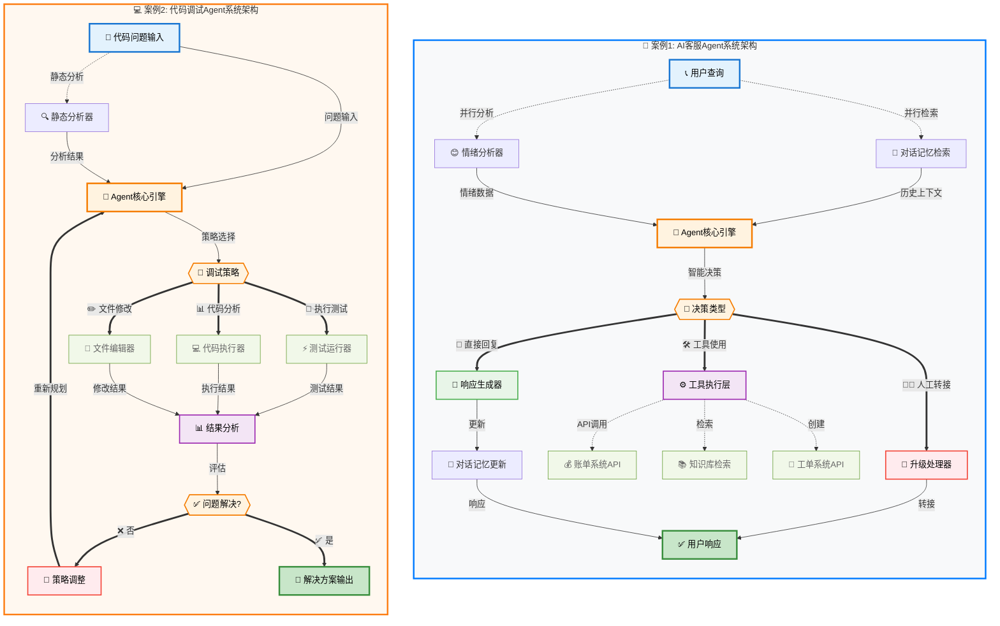

### 案例1：AI客服Agent

#### 业务需求
构建一个能够处理多种客服查询的智能Agent，包括账单问题、技术支持和一般咨询。

#### 系统设计

```python
class CustomerServiceAgent:
    def __init__(self):
        self.tools = {
            'billing_system': BillingSystemTool(),
            'knowledge_base': KnowledgeBaseTool(),
            'ticket_system': TicketSystemTool(),
            'escalation': EscalationTool()
        }
        self.conversation_memory = ConversationMemory()
        self.sentiment_analyzer = SentimentAnalyzer()
    
    def handle_query(self, user_query, user_id):
        # 分析用户情绪
        sentiment = self.sentiment_analyzer.analyze(user_query)
        
        # 检索对话历史
        context = self.conversation_memory.get_context(user_id)
        
        # 构建处理提示
        prompt = self.build_service_prompt(user_query, sentiment, context)
        
        # Agent推理和行动
        max_turns = 10
        for turn in range(max_turns):
            # LLM决策下一步行动
            action = self.llm.decide_action(prompt, self.tools.keys())
            
            # 执行行动
            if action.type == 'use_tool':
                result = self.execute_tool(action.tool, action.parameters)
                prompt += f"\n工具执行结果：{result}"
                
            elif action.type == 'respond':
                response = action.response
                # 更新对话记忆
                self.conversation_memory.update(user_id, user_query, response)
                return response
                
            elif action.type == 'escalate':
                return self.escalate_to_human(user_query, context, action.reason)
        
        # 防止无限循环
        return self.escalate_to_human(user_query, context, "处理时间过长")
    
    def build_service_prompt(self, query, sentiment, context):
        return f"""
你是一个专业的客服AI，需要帮助用户解决问题。

用户查询：{query}
用户情绪：{sentiment}
对话历史：{context}

可用工具：
- billing_system: 查询账单信息
- knowledge_base: 搜索解决方案
- ticket_system: 创建工单
- escalation: 转接人工

指导原则：
1. 优先尝试自己解决问题
2. 如果用户情绪不佳，要特别耐心
3. 无法解决时及时转接人工
4. 保持专业和友好的语调

请决定下一步行动。
"""
```

#### 成功因素分析

1. **多工具集成**：整合了账单系统、知识库等多个数据源
2. **情绪感知**：能够识别用户情绪并调整服务策略
3. **记忆机制**：维护对话上下文，提供连贯的服务体验
4. **人工介入**：适时转接人工，避免用户体验恶化

### 案例2：代码调试Agent

#### 业务需求
开发一个能够自动诊断和修复代码问题的Agent。

#### 系统设计

```python
class CodeDebuggingAgent:
    def __init__(self):
        self.tools = {
            'code_executor': CodeExecutorTool(),
            'test_runner': TestRunnerTool(),
            'static_analyzer': StaticAnalyzerTool(),
            'file_editor': FileEditorTool(),
            'documentation_search': DocumentationSearchTool()
        }
        self.debugging_strategies = [
            self.strategy_syntax_check,
            self.strategy_runtime_debugging,
            self.strategy_logic_analysis,
            self.strategy_performance_check
        ]
    
    def debug_code(self, code_path, error_description):
        # 初始状态分析
        initial_state = self.analyze_initial_state(code_path, error_description)
        
        # 逐步调试循环
        for iteration in range(10):  # 最多10轮调试
            # 分析当前问题
            current_analysis = self.analyze_current_state(code_path)
            
            # 选择调试策略
            strategy = self.select_strategy(current_analysis, error_description)
            
            # 执行调试策略
            debug_result = strategy(code_path, current_analysis)
            
            # 验证修复效果
            verification_result = self.verify_fix(code_path)
            
            if verification_result.is_fixed:
                return {
                    'status': 'success',
                    'iterations': iteration + 1,
                    'final_code': self.read_file(code_path),
                    'fix_summary': debug_result.summary
                }
            
            # 如果未修复，继续下一轮
            self.log_iteration(iteration, debug_result, verification_result)
        
        return {
            'status': 'failed',
            'iterations': 10,
            'last_error': verification_result.error,
            'suggestions': self.generate_human_suggestions()
        }
    
    def strategy_runtime_debugging(self, code_path, analysis):
        """运行时调试策略"""
        # 1. 运行代码并捕获错误
        execution_result = self.tools['code_executor'].run_with_debugging(code_path)
        
        if execution_result.has_error:
            # 2. 分析错误堆栈
            error_analysis = self.analyze_stack_trace(execution_result.stack_trace)
            
            # 3. 定位问题代码
            problematic_lines = error_analysis.problematic_lines
            
            # 4. 生成修复方案
            fix_prompt = f"""
代码错误分析：
错误类型：{execution_result.error_type}
错误信息：{execution_result.error_message}
问题位置：{problematic_lines}

请提供修复方案：
1. 分析错误原因
2. 提供具体的代码修改
3. 解释修复逻辑
"""
            
            fix_plan = self.llm.generate_fix(fix_prompt)
            
            # 5. 应用修复
            self.apply_fix(code_path, fix_plan)
            
            return DebugResult(
                strategy='runtime_debugging',
                changes_made=fix_plan.changes,
                summary=fix_plan.summary
            )
        
        return DebugResult(strategy='runtime_debugging', changes_made=[], summary="无运行时错误")
    
    def verify_fix(self, code_path):
        """验证修复效果"""
        # 1. 语法检查
        syntax_check = self.tools['static_analyzer'].check_syntax(code_path)
        if not syntax_check.is_valid:
            return VerificationResult(False, syntax_check.errors)
        
        # 2. 运行测试
        test_result = self.tools['test_runner'].run_tests(code_path)
        if not test_result.all_passed:
            return VerificationResult(False, test_result.failed_tests)
        
        # 3. 执行检查
        execution_result = self.tools['code_executor'].run(code_path)
        if execution_result.has_error:
            return VerificationResult(False, execution_result.error_message)
        
        return VerificationResult(True, "所有检查通过")
```

#### 关键设计要点

1. **多策略调试**：包含语法检查、运行时调试、逻辑分析等多种策略
2. **迭代式修复**：允许多轮调试，逐步改进代码
3. **验证机制**：每次修改后都进行全面验证
4. **工具链集成**：整合了代码执行、测试运行、静态分析等工具

### 案例3：内容创作Agent

#### 业务需求
创建一个能够生成高质量技术博客文章的Agent。

#### 系统设计

```python
class ContentCreationAgent:
    def __init__(self):
        self.research_tools = {
            'web_search': WebSearchTool(),
            'academic_search': AcademicSearchTool(),
            'code_examples': CodeExamplesTool()
        }
        self.writing_tools = {
            'grammar_checker': GrammarCheckerTool(),
            'readability_analyzer': ReadabilityAnalyzerTool(),
            'seo_optimizer': SEOOptimizerTool(),
            'plagiarism_checker': PlagiarismCheckerTool()
        }
        self.quality_standards = ContentQualityStandards()
    
    def create_article(self, topic, target_audience, word_count):
        # 阶段1：研究和规划
        research_phase = self.research_phase(topic, target_audience)
        
        # 阶段2：大纲创建
        outline_phase = self.outline_phase(research_phase, word_count)
        
        # 阶段3：内容创作
        writing_phase = self.writing_phase(outline_phase)
        
        # 阶段4：质量优化
        optimization_phase = self.optimization_phase(writing_phase)
        
        return optimization_phase.final_article
    
    def research_phase(self, topic, audience):
        """研究阶段：收集相关信息"""
        research_prompt = f"""
作为技术内容研究员，需要为"{topic}"主题收集信息。
目标读者：{audience}

请执行以下研究任务：
1. 搜索最新的技术发展
2. 查找权威资料和最佳实践
3. 收集实用的代码示例
4. 分析目标读者的知识水平和需求

基于研究结果，提供：
- 核心概念列表
- 关键技术点
- 实际应用场景
- 常见问题和解决方案
"""
        
        # 执行多种搜索
        web_results = self.research_tools['web_search'].search(topic)
        academic_results = self.research_tools['academic_search'].search(topic)
        code_examples = self.research_tools['code_examples'].find_examples(topic)
        
        # 整合研究结果
        research_data = self.llm.synthesize_research(
            research_prompt,
            web_results,
            academic_results,
            code_examples
        )
        
        return research_data
    
    def writing_phase(self, outline):
        """写作阶段：生成内容"""
        sections = []
        
        for section in outline.sections:
            section_prompt = f"""
写作任务：为技术博客创建"{section.title}"章节

章节要求：
- 字数：{section.target_words}字
- 难度：{section.difficulty_level}
- 包含要点：{section.key_points}

写作指导：
1. 开头要有吸引力
2. 使用清晰的例子说明概念
3. 包含实际代码示例
4. 结尾要有总结

参考资料：
{section.reference_materials}
"""
            
            section_content = self.llm.write_section(section_prompt)
            
            # 实时质量检查
            quality_check = self.check_section_quality(section_content)
            if not quality_check.meets_standards:
                section_content = self.improve_section(section_content, quality_check.issues)
            
            sections.append(section_content)
        
        # 整合所有章节
        full_article = self.combine_sections(sections, outline)
        return full_article
    
    def optimization_phase(self, draft_article):
        """优化阶段：提升质量"""
        current_article = draft_article
        
        # 多轮优化
        optimizations = [
            self.optimize_grammar_and_style,
            self.optimize_readability,
            self.optimize_seo,
            self.optimize_technical_accuracy
        ]
        
        for optimization in optimizations:
            optimization_result = optimization(current_article)
            if optimization_result.improved:
                current_article = optimization_result.optimized_content
        
        # 最终质量验证
        final_quality = self.quality_standards.evaluate(current_article)
        
        return ArticleResult(
            content=current_article,
            quality_score=final_quality.score,
            improvements_made=final_quality.improvements,
            meets_standards=final_quality.score >= 85
        )
```

---

## 框架选择指南

### 主流Agent框架对比

| 框架 | 优点 | 缺点 | 适用场景 |
|------|------|------|----------|
| **LangGraph** | 可视化设计，生态丰富 | 抽象层多，调试困难 | 复杂工作流，快速原型 |
| **AutoGPT** | 自主性强，社区活跃 | 成本高，不够稳定 | 研究实验，概念验证 |
| **Microsoft Semantic Kernel** | 企业级，集成度高 | 学习曲线陡峭 | 企业应用，微软生态 |
| **Anthropic MCP** | 工具标准化，轻量级 | 相对新颖，生态较小 | 工具集成，自定义Agent |

#### 框架能力对比分析

**学习成本 vs 定制性象限分布：**

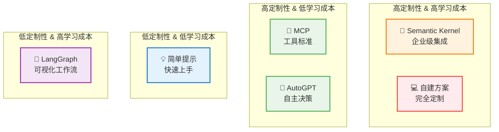

#### 框架技术路径演进

**从简单到复杂的技术演进路径：**

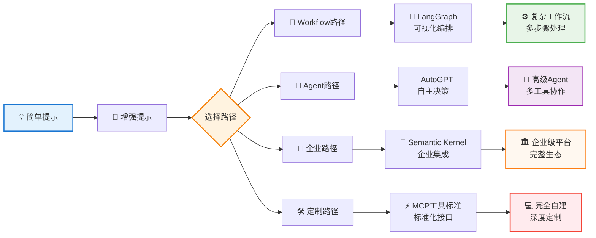

#### 框架选择建议表

| 使用场景 | 推荐框架 | 学习成本 | 定制程度 | 适用人群 |
|---------|---------|---------|---------|---------|
| 🎯 **快速原型** | LangGraph | 中等 | 中等 | 产品经理、算法工程师 |
| 🔬 **研究实验** | AutoGPT | 低 | 高 | 研究人员、技术爱好者 |
| 🏢 **企业应用** | Semantic Kernel | 高 | 中等 | 企业开发团队 |
| 🛠️ **工具集成** | MCP | 低 | 高 | 个人开发者、创业团队 |
| 💻 **深度定制** | 自建方案 | 很高 | 很高 | 资深工程师、技术团队 |

### 框架选择决策树

```
是否需要快速原型？
├─ 是 → 使用LangGraph或AutoGPT
└─ 否 ↓

是否需要企业级特性？
├─ 是 → 考虑Semantic Kernel
└─ 否 ↓

是否需要深度定制？
├─ 是 → 直接使用LLM API + MCP
└─ 否 → 选择最符合需求的框架
```

### 自建vs框架的选择标准

#### 选择框架的场景

```python
# 适合使用框架的情况
framework_scenarios = {
    'rapid_prototyping': '需要快速验证概念',
    'standard_patterns': '使用标准的Agent模式',
    'team_collaboration': '团队协作，需要统一工具',
    'learning_phase': '学习阶段，需要参考实现'
}
```

#### 自建系统的场景

```python
# 适合自建的情况
custom_build_scenarios = {
    'production_requirements': '生产环境，需要完全控制',
    'performance_critical': '性能要求极高',
    'specific_domain': '特定领域，框架不适用',
    'cost_optimization': '需要精确控制成本'
}
```

### 实际框架使用建议

#### 1. 学习阶段
```python
# 推荐：LangGraph（可视化，易理解）
from langgraph import Graph

def create_learning_agent():
    graph = Graph()
    graph.add_node("research", research_node)
    graph.add_node("analyze", analyze_node)
    graph.add_node("respond", respond_node)
    
    graph.add_edge("research", "analyze")
    graph.add_edge("analyze", "respond")
    
    return graph.compile()
```

#### 2. 生产环境
```python
# 推荐：自定义实现（完全控制）
class ProductionAgent:
    def __init__(self):
        self.llm = self.configure_llm()
        self.tools = self.configure_tools()
        self.monitoring = self.configure_monitoring()
    
    def process(self, request):
        with self.monitoring.trace("agent_execution"):
            try:
                return self.core_loop(request)
            except Exception as e:
                self.monitoring.record_error(e)
                raise
```

#### 3. 企业集成
```python
# 推荐：Semantic Kernel（企业特性）
import semantic_kernel as sk

def create_enterprise_agent():
    kernel = sk.Kernel()
    
    # 集成企业服务
    kernel.add_chat_service("enterprise_llm", enterprise_llm_service)
    kernel.add_memory_store("enterprise_vector_db", vector_db_service)
    
    # 定义技能
    skills = kernel.import_semantic_skill_from_directory("skills")
    
    return kernel
```

---

## 总结与建议

### 核心要点回顾

#### 1. Agent vs Workflow的选择
- **简单确定的任务** → Workflow
- **复杂开放的问题** → Agent
- **成本敏感的场景** → Workflow
- **需要灵活性的场景** → Agent

#### 2. 构建Agent的关键原则
- **简洁性**：避免不必要的复杂性
- **透明性**：确保行为可解释
- **可控性**：实现适当的监控和限制

#### 3. 工具设计的重要性
- 投入与HCI相等的精力在ACI设计上
- 提供清晰完整的文档和示例
- 实现防错机制和容错处理

#### 4. 性能优化策略
- 使用缓存减少重复计算
- 优化提示减少Token消耗
- 实现资源限制防止失控

### 实施建议

#### 阶段1：从简单开始
```python
# 第一步：验证基本可行性
simple_agent = SimpleAgent(
    llm=claude_3_5_sonnet,
    tools=[essential_tool_1, essential_tool_2],
    max_iterations=5
)

result = simple_agent.solve(simple_problem)
```

#### 阶段2：逐步增强
```python
# 第二步：增加必要的复杂性
enhanced_agent = EnhancedAgent(
    llm=claude_3_5_sonnet,
    tools=expanded_tool_set,
    memory=conversation_memory,
    safety_controls=basic_safety,
    max_iterations=10
)
```

#### 阶段3：生产优化
```python
# 第三步：生产级优化
production_agent = ProductionAgent(
    llm=optimized_llm_config,
    tools=production_tool_set,
    memory=persistent_memory,
    safety_controls=comprehensive_safety,
    monitoring=full_observability,
    caching=intelligent_cache,
    resource_limits=production_limits
)
```

### 最佳实践清单

#### 设计阶段
- [ ] 明确定义Agent的职责边界
- [ ] 选择合适的LLM模型
- [ ] 设计简洁清晰的工具接口
- [ ] 规划错误处理和恢复机制

#### 开发阶段
- [ ] 实现模块化的代码结构
- [ ] 编写全面的工具文档
- [ ] 添加详细的日志记录
- [ ] 实施安全控制机制

#### 测试阶段
- [ ] 在沙箱环境中充分测试
- [ ] 验证边界情况处理
- [ ] 测试错误恢复能力
- [ ] 评估性能和成本

#### 部署阶段
- [ ] 配置监控和告警
- [ ] 设置资源限制
- [ ] 准备应急预案
- [ ] 建立反馈收集机制

### 未来发展趋势

#### 技术发展方向
1. **模型能力提升**：更强的推理和规划能力
2. **工具生态完善**：标准化的工具接口和协议
3. **框架成熟化**：更稳定可靠的开发框架
4. **成本优化**：更高效的计算和更便宜的推理

#### 应用场景扩展
1. **企业自动化**：复杂业务流程的自动化
2. **科学研究**：自动化的实验设计和执行
3. **创意产业**：AI辅助的内容创作和设计
4. **教育领域**：个性化的智能导师系统

### 结语

AI Agent技术正在快速发展，但成功的关键不在于使用最先进的技术，而在于：

1. **选择合适的解决方案**：根据实际需求选择最简单有效的方法
2. **注重工程质量**：关注可维护性、可观测性和可控性
3. **持续优化改进**：基于实际使用效果不断迭代改进
4. **平衡各种因素**：在功能、性能、成本、风险之间找到平衡

记住：**最好的Agent是能够可靠解决实际问题的Agent，而不是最复杂的Agent。**

---

**文档版本**：v1.0  
**创建时间**：2025年1月15日  
**适用范围**：AI开发者、技术决策者、产品经理  
**参考资料**：Anthropic Building Effective Agents、PromptHub Agent Guide、相关技术文档