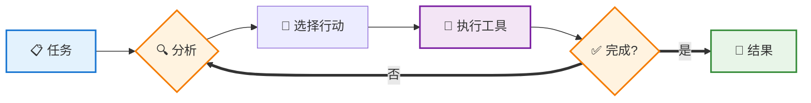
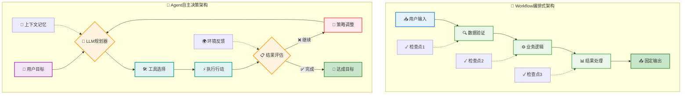
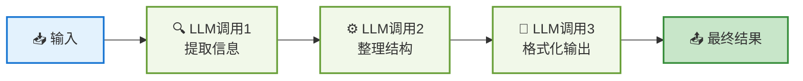
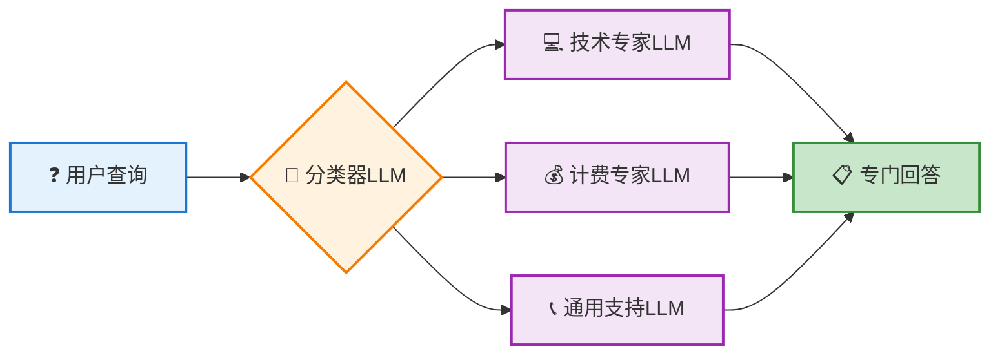
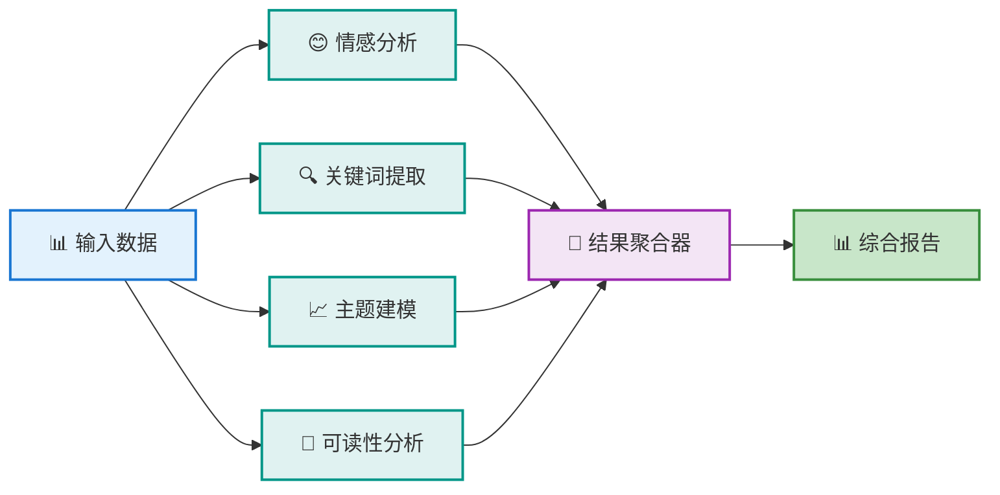
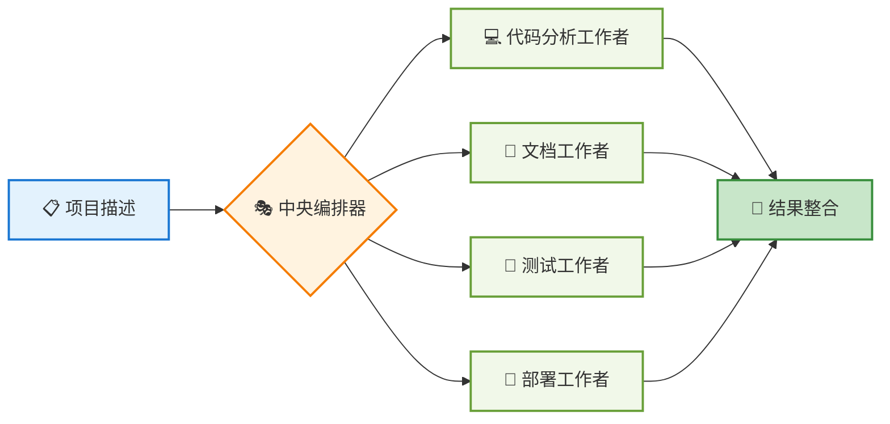
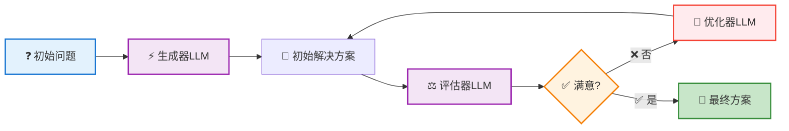
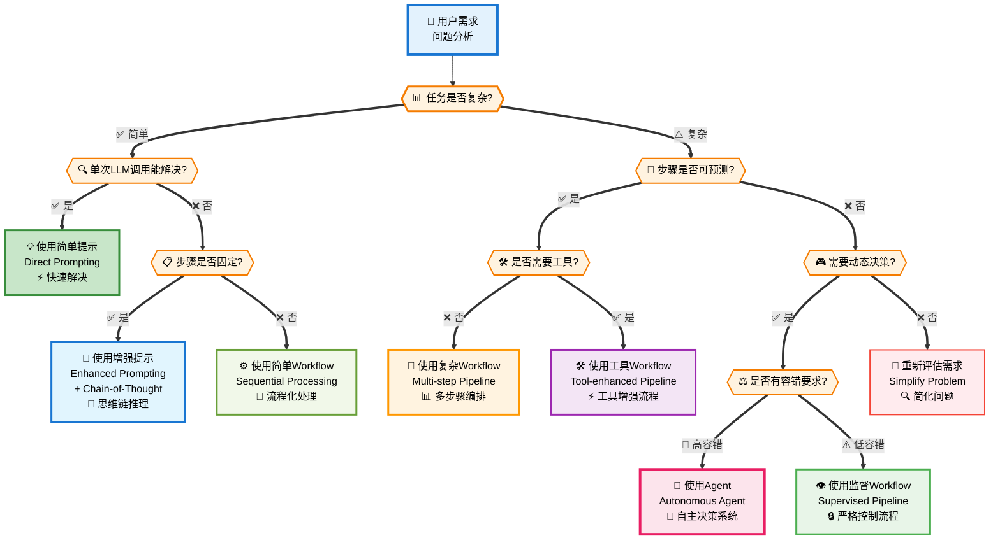
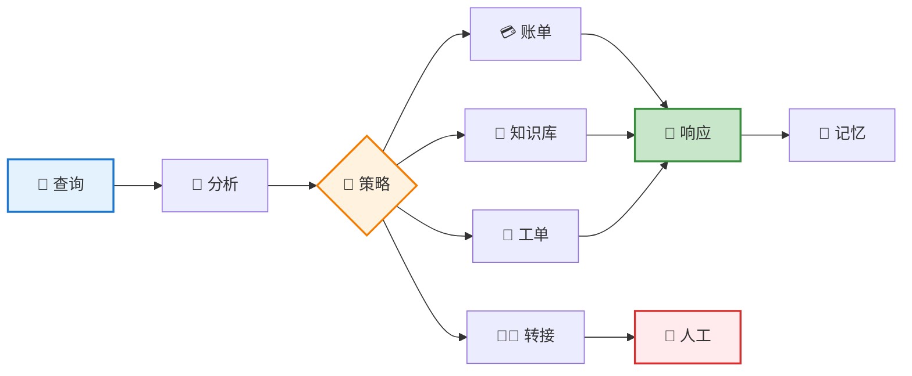
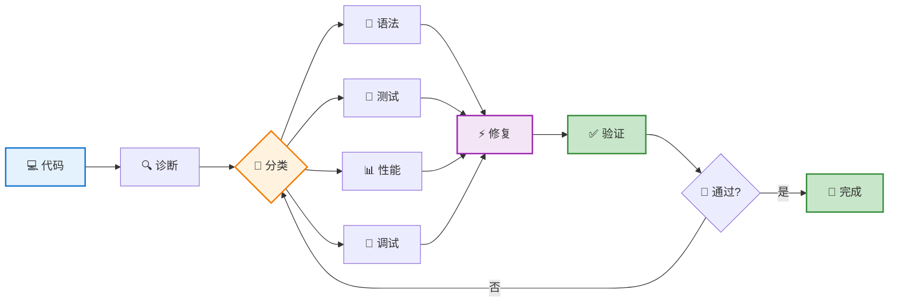

# AI Agent 完整入门指南

## 📖 目录
1. [什么是AI Agent](#什么是ai-agent)
2. [Agent vs Workflow：架构差异详解](#agent-vs-workflow架构差异详解)
3. [Workflow模式详解](#workflow模式详解)
4. [何时构建Agent：场景判断指南](#何时构建agent场景判断指南)
5. [实际案例分析](#实际案例分析)
6. [框架选择指南](#框架选择指南)
7. [总结与建议](#总结与建议)

---

## 什么是AI Agent

AI Agent（智能体）是一种能够**自主决策**的AI系统，不像传统程序按固定步骤执行，而是根据情况动态选择行动路径。

### 核心特征

- **自主决策**：根据当前状态选择下一步行动
- **工具使用**：调用各种外部工具完成任务  
- **反馈学习**：从执行结果中调整策略
- **目标导向**：始终朝着明确目标前进

### 工作原理



简单说，Agent就是"在循环中基于反馈选择工具的大模型"。关键在于这个反馈循环让它能处理复杂、不确定的任务。

---

## Agent vs Workflow：架构差异详解

### 重要概念澄清

**增强LLM (Augmented LLM)** = 基础LLM + Function Calling（工具调用能力）

简单说就是让ChatGPT、Claude这样的模型能够调用外部工具，比如搜索网页、执行代码、查询数据库等。

很多人容易混淆**增强LLM**和**Agent**，先澄清这个关键区别：

| 对比维度 | 增强LLM | Agent |
|---------|---------|--------|
| **交互方式** | 单次调用 | 多轮循环 |
| **工具使用** | 一次性调用 | 动态选择和组合 |
| **状态管理** | 无状态 | 维护记忆和上下文 |
| **决策能力** | 反应式响应 | 主动规划和调整 |

**简单判断方法：**
- 如果只是"调用工具返回结果" → 增强LLM
- 如果能"分析-决策-执行-反思-再决策" → Agent

澄清这个区别后，我们来看Agent和Workflow的核心差异：

### 核心架构对比

| 维度 | Workflow | Agent |
|------|----------|--------|
| **控制方式** | 预定义代码路径 | LLM动态决策 |
| **流程固定性** | 固定步骤序列 | 灵活的动态流程 |
| **决策主体** | 程序逻辑 | LLM推理 |
| **适应性** | 低（需重新编程） | 高（自动适应） |
| **可预测性** | 高 | 中等 |
| **复杂度** | 相对简单 | 相对复杂 |

#### 架构对比可视化



### Workflow：编排式系统

```
用户输入 → [步骤1] → [步骤2] → [步骤3] → 最终输出
            ↓         ↓         ↓
         检查点1   检查点2   检查点3
```

**特点：**
- 每个步骤都是预先定义的
- 执行路径固定不变
- 适合明确定义的任务
- 高度可控和可预测

### Agent：自主决策系统

```
用户目标 → [LLM规划] → [选择工具] → [执行行动] → [评估结果]
                ↑                                    ↓
                ←←←←←←← [调整策略] ←←←←←←←←←←←←←
```

**特点：**
- LLM在每个节点都要做决策
- 执行路径动态变化
- 适合开放性问题
- 需要更多信任和控制机制

### 详细对比分析

#### 1. 控制粒度

**Workflow示例：客户服务流程**
```python
def customer_service_workflow(query):
    # 步骤1：分类查询
    category = classify_query(query)
    
    # 步骤2：路由到专门处理器
    if category == "billing":
        return handle_billing(query)
    elif category == "technical":
        return handle_technical(query)
    else:
        return handle_general(query)
```

**Agent示例：客户服务Agent**
```python
def customer_service_agent(query):
    while not task_completed:
        # LLM决定下一步行动
        action = llm.decide_next_action(
            query=query,
            conversation_history=history,
            available_tools=tools
        )
        
        # 执行行动并获取反馈
        result = execute_action(action)
        
        # 基于结果调整策略
        strategy = llm.evaluate_and_adjust(result)
```

#### 2. 适用场景对比

**Workflow适用场景：**
- 文档处理流水线
- 数据ETL流程
- 审批工作流
- 标准化客服响应

**Agent适用场景：**
- 代码调试和修复
- 复杂问题研究
- 创意内容生成
- 开放式问题解决

#### 3. 成本与性能对比

| 方面 | Workflow | Agent |
|------|----------|--------|
| **开发成本** | 中等 | 高 |
| **运行成本** | 低 | 高（15倍Token消耗） |
| **维护成本** | 高（需重新编程） | 低（自动适应） |
| **响应速度** | 快 | 慢 |
| **准确性** | 高 | 中等到高 |

#### 4. 实际代码对比示例

**Workflow实现：数据分析任务**
```python
def data_analysis_workflow(dataset):
    """固定步骤的数据分析流程"""
    # 预定义的分析步骤
    step1 = clean_data(dataset)
    step2 = statistical_analysis(step1)
    step3 = generate_visualization(step2)
    step4 = create_report(step3)
    return step4

def clean_data(data):
    # 固定的数据清理逻辑
    return processed_data

def statistical_analysis(data):
    # 预设的统计分析方法
    return analysis_results
```

**Agent实现：数据分析任务**
```python
def data_analysis_agent(dataset, objective):
    """LLM驱动的自适应数据分析"""
    context = f"数据集：{dataset}, 目标：{objective}"
    
    while not is_objective_met():
        # LLM决定下一步分析策略
        next_action = llm.plan_next_step(
            context=context,
            available_tools=["pandas", "matplotlib", "seaborn", "scipy"],
            analysis_progress=current_progress
        )
        
        # 执行LLM选择的分析方法
        result = execute_analysis_tool(next_action)
        
        # LLM评估结果并调整策略
        evaluation = llm.evaluate_progress(result, objective)
        if evaluation.is_satisfactory:
            break
        else:
            context += f"上一步结果：{result}, 需改进：{evaluation.suggestions}"
    
    return llm.synthesize_final_report(all_results)
```

#### 5. 选择决策框架

通过以上对比分析，我们可以看到Workflow和Agent各有优势。在实际应用中：

- **选择Workflow**：当任务流程清晰、步骤固定、对成本和性能要求较高时
- **选择Agent**：当面对开放性问题、需要创造性解决方案、流程复杂多变时
- **混合架构**：在复杂系统中，往往将Workflow作为基础流程，在关键决策点引入Agent进行智能决策

### 深入学习Workflow模式

为了帮助你在实际项目中做出正确的架构选择，接下来我们将深入学习Workflow的5种核心模式。每种模式都有其独特的应用场景和技术特点，掌握这些模式将帮助你构建更高效、更可控的AI系统。

---

## Workflow模式详解

理解Workflow模式对于做出正确的架构选择至关重要。以下是5种常见的Workflow模式：

### 1. 提示链模式 (Prompt Chaining)

**顺序执行的线性处理模式**



将复杂任务分解为顺序执行的简单子任务。

```python
def document_processing_chain(raw_text):
    # 步骤1：内容提取
    extracted = llm_call_1("请从以下文本中提取关键信息：", raw_text)
    
    # 步骤2：信息整理
    organized = llm_call_2("请整理以下信息的结构：", extracted)
    
    # 步骤3：格式化输出
    formatted = llm_call_3("请将信息格式化为正式报告：", organized)
    
    return formatted
```

**适用场景：**
- 文档处理流水线
- 内容创作流程
- 数据分析管道

**优点：**
- 每一步都简单明确
- 容易调试和优化
- 结果可预测

**缺点：**
- 缺乏灵活性
- 无法处理异常情况
- 不能根据中间结果调整策略

### 2. 路由模式 (Routing)

**智能分流的专家处理模式**



根据输入类型将任务分配给专门的处理器。

```python
def intelligent_routing(user_query):
    # 分类查询类型
    query_type = classifier_llm(f"请将以下查询分类：{user_query}")
    
    # 路由到专门处理器
    if query_type == "technical":
        return technical_expert_llm(user_query)
    elif query_type == "billing":
        return billing_expert_llm(user_query)
    elif query_type == "general":
        return general_support_llm(user_query)
    else:
        return fallback_handler(user_query)
```

**适用场景：**
- 客户服务系统
- 多领域问答系统
- 智能分流系统

### 3. 并行化模式 (Parallelization)

**同时执行的多任务处理模式**



同时执行多个任务，然后聚合结果。

```python
import asyncio

async def parallel_analysis(data):
    # 并行执行多种分析
    tasks = [
        sentiment_analysis(data),
        keyword_extraction(data),
        topic_modeling(data),
        readability_analysis(data)
    ]
    
    results = await asyncio.gather(*tasks)
    
    # 聚合结果
    final_report = aggregate_results(results)
    return final_report
```

**适用场景：**
- 多角度分析
- 性能优化
- 冗余验证

### 4. 编排器-工作者模式 (Orchestrator-Workers)

**中央调度的分工协作模式**



中央编排器动态分配任务给多个工作者。

```python
class TaskOrchestrator:
    def __init__(self):
        self.workers = [
            CodeAnalysisWorker(),
            DocumentationWorker(),
            TestingWorker(),
            DeploymentWorker()
        ]
    
    def process_project(self, project_description):
        # 分析项目需求
        requirements = self.analyze_requirements(project_description)
        
        # 动态分配任务
        tasks = self.create_task_plan(requirements)
        
        # 协调工作者执行
        results = []
        for task in tasks:
            suitable_worker = self.select_worker(task)
            result = suitable_worker.execute(task)
            results.append(result)
        
        # 整合最终结果
        return self.integrate_results(results)
```

### 5. 评估器-优化器模式 (Evaluator-Optimizer)

**迭代改进的反馈循环模式**



一个组件生成解决方案，另一个组件评估并优化。

```python
def iterative_improvement(initial_problem):
    current_solution = generator_llm(f"请为以下问题提供解决方案：{initial_problem}")
    
    for iteration in range(max_iterations):
        # 评估当前解决方案
        evaluation = evaluator_llm(f"""
        问题：{initial_problem}
        当前解决方案：{current_solution}
        请评估此解决方案并提出改进建议。
        """)
        
        if evaluation.is_satisfactory:
            break
            
        # 基于评估改进解决方案
        current_solution = optimizer_llm(f"""
        原问题：{initial_problem}
        当前方案：{current_solution}
        改进建议：{evaluation.suggestions}
        请提供改进后的解决方案。
        """)
    
    return current_solution
```

**适用场景：**
- 复杂问题求解
- 内容质量优化
- 创意设计迭代

---

## 何时构建Agent：场景判断指南

### 决策框架

构建智能系统时，应该遵循"奥卡姆剃刀"原则：**寻找最简单的解决方案，只在必要时增加复杂性**。

#### 解决方案选择决策树



### Agent适用场景判断清单

#### ✅ 适合使用Agent的情况

1. **开放性问题**
   - 难以预测需要多少步骤
   - 无法硬编码固定路径
   - 需要创造性问题解决

2. **复杂决策需求**
   - 需要根据中间结果调整策略
   - 多种解决路径都可能有效
   - 需要权衡多个因素

3. **工具使用复杂**
   - 需要组合多个工具
   - 工具选择取决于上下文
   - 需要处理工具执行失败

4. **信任环境**
   - 可以承受一定的不确定性
   - 有适当的监控和控制机制
   - 错误成本可控

#### ❌ 不适合使用Agent的情况

1. **简单确定任务**
   - 步骤固定且明确
   - 只需要单次LLM调用
   - 输入输出关系明确

2. **高风险环境**
   - 对准确性要求极高
   - 错误代价巨大
   - 需要严格审计追踪

3. **成本敏感场景**
   - 预算紧张
   - 大量重复性任务
   - 对响应速度要求高

4. **简单自动化**
   - 传统RPA就能解决
   - 不需要AI能力
   - 逻辑规则已经很清晰

### 复杂度递增策略

#### 第一层：简单提示
```python
response = llm("请分析这个销售数据并给出建议")
```

**适用于：**
- 单次查询/分析
- 明确的输入输出
- 不需要外部工具

#### 第二层：增强提示（RAG + Few-shot）
```python
context = retrieve_relevant_docs(query)
examples = get_few_shot_examples()
response = llm(f"背景：{context}\n示例：{examples}\n问题：{query}")
```

**适用于：**
- 需要背景知识
- 需要特定格式输出
- 有成功案例可参考

#### 第三层：Workflow
```python
def analysis_workflow(data):
    cleaned_data = data_cleaning_step(data)
    analysis = analysis_step(cleaned_data)
    report = report_generation_step(analysis)
    return report
```

**适用于：**
- 多步骤处理
- 每步都相对独立
- 流程相对固定

#### 第四层：Agent
```python
class DataAnalysisAgent:
    def solve(self, problem):
        while not self.is_completed():
            action = self.llm.plan_next_action()
            result = self.execute_action(action)
            self.update_state(result)
        return self.final_result
```

**适用于：**
- 开放性问题
- 需要多轮交互
- 策略需要动态调整

### 实际判断示例

#### 示例1：数据分析任务

**需求：**"分析这个CSV文件的销售趋势"

**判断过程：**
1. 是否有固定步骤？ → 是（读取→清洗→分析→可视化）
2. 是否需要动态决策？ → 否
3. **结论：使用Workflow**

#### 示例2：代码调试任务

**需求：**"修复这个程序中的Bug"

**判断过程：**
1. 是否有固定步骤？ → 否（需要根据错误类型调整）
2. 是否需要多轮交互？ → 是（测试→诊断→修改→再测试）
3. 是否需要工具？ → 是（代码执行、测试运行）
4. **结论：使用Agent**

#### 示例3：文档翻译任务

**需求：**"将技术文档翻译成英文"

**判断过程：**
1. 是否复杂？ → 否（相对直接）
2. 是否需要多步？ → 可能（长文档需要分段）
3. 是否需要动态决策？ → 否
4. **结论：使用增强提示或简单Workflow**

---

## 实际案例分析

### 案例1：AI客服Agent

#### 业务需求
构建一个能够处理多种客服查询的智能Agent，包括账单问题、技术支持和一般咨询。

#### 核心能力
- **情绪感知**：识别用户情绪并调整服务策略
- **多工具集成**：账单系统、知识库、工单系统等
- **记忆机制**：维护对话上下文，提供连贯体验
- **智能转接**：必要时转接人工客服

#### 架构图



#### 工作流程
1. 接收用户查询 → 分析情绪和历史
2. 选择处理策略 → 使用工具或直接回答
3. 生成响应 → 更新记忆或转接人工

### 案例2：代码调试Agent

#### 业务需求
开发一个能够自动诊断和修复代码问题的Agent。

#### 核心能力
- **多策略调试**：语法检查、运行时调试、逻辑分析等
- **迭代式修复**：允许多轮调试，逐步改进代码
- **验证机制**：每次修改后都进行全面验证
- **工具链集成**：代码执行、测试运行、静态分析等

#### 架构图



#### 工作流程
1. 初始诊断 → 分析代码问题和错误信息
2. 策略选择 → 根据问题类型选择调试方法
3. 修复验证 → 应用修复并验证效果，必要时重复

### 关键成功要素

通过这两个案例，我们可以看到Agent成功的关键要素：

1. **明确的问题域**：专注于特定类型的问题
2. **丰富的工具集**：提供足够的能力支撑
3. **智能决策逻辑**：根据情况动态选择策略
4. **反馈循环**：能够从结果中学习和调整
5. **失败处理**：有合适的降级和转接机制

---

## 框架选择指南

### 主流Agent框架对比

| 框架 | 优点 | 缺点 | 适用场景 |
|------|------|------|----------|
| **LangGraph** | 可视化设计，生态丰富 | 抽象层多，调试困难 | 复杂工作流，快速原型 |
| **AutoGPT** | 自主性强，社区活跃 | 成本高，不够稳定 | 研究实验，概念验证 |
| **Microsoft Semantic Kernel** | 企业级，集成度高 | 学习曲线陡峭 | 企业应用，微软生态 |
| **Anthropic MCP** | 工具标准化，轻量级 | 相对新颖，生态较小 | 工具集成，自定义Agent |

### 选择建议

**新手推荐路径：**
1. **概念理解** → 从简单提示和Workflow开始
2. **实践基础** → 使用LangGraph或MCP进行实验  
3. **深度应用** → 根据具体需求选择企业级框架

---

## 总结与建议

### 核心要点回顾

#### 1. Agent vs Workflow的选择
- **简单确定的任务** → Workflow
- **复杂开放的问题** → Agent
- **成本敏感的场景** → Workflow
- **需要灵活性的场景** → Agent

#### 2. 学习路径建议
- **第1步**：理解基本概念和架构差异
- **第2步**：掌握5种Workflow模式
- **第3步**：学会场景判断和选择决策
- **第4步**：从简单案例开始实践

#### 3. 实施原则
- **奥卡姆剃刀**：始终选择最简单的有效解决方案
- **渐进式复杂度**：从简单提示逐步升级到Agent
- **明确边界**：清楚定义问题域和能力范围
- **失败处理**：设计合适的降级和转接机制

### 最佳实践总结

1. **开始前先问自己**：
   - 这个问题真的需要Agent吗？
   - Workflow能解决吗？
   - 复杂度和收益是否匹配？

2. **选择合适的方案**：
   - 简单任务 → 直接提示
   - 固定流程 → Workflow
   - 开放问题 → Agent

3. **关注实际价值**：
   - 解决真实问题比使用先进技术更重要
   - 可靠性比复杂性更重要
   - 用户体验比技术炫酷更重要

### 结语

AI Agent是一个强大的技术，但不是万能的解决方案。成功的关键在于：

**选择合适的工具解决合适的问题，而不是为了使用新技术而使用新技术。**

记住：最好的Agent是用户感觉不到它存在，但问题被完美解决的Agent。

---

**文档定位**：面向一般用户的AI Agent入门指南  
**适用人群**：产品经理、技术决策者、AI爱好者  
**版本**：v2.0 (简化版)  
**创建时间**：2025年1月  
