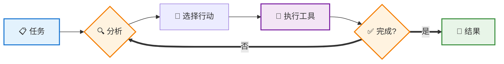
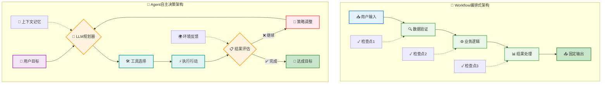
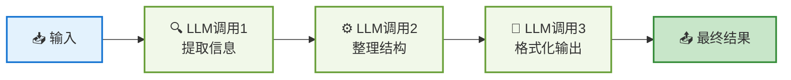
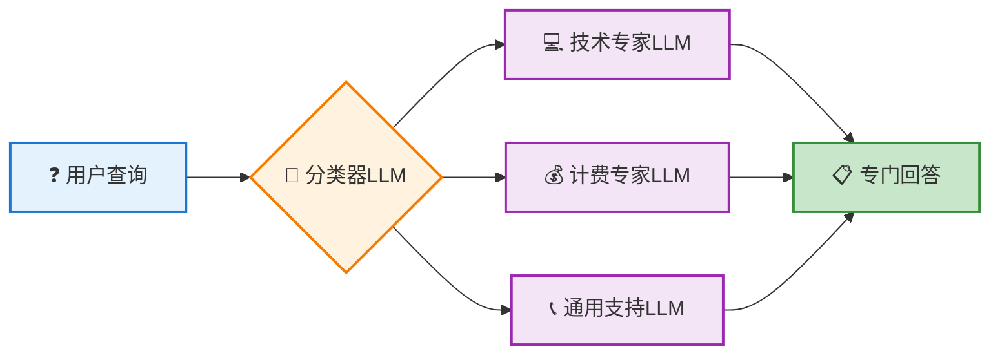
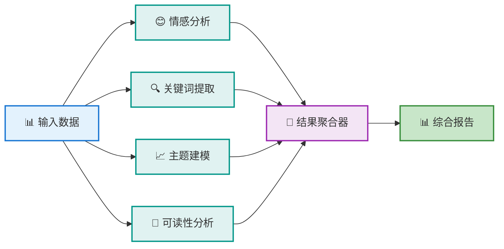
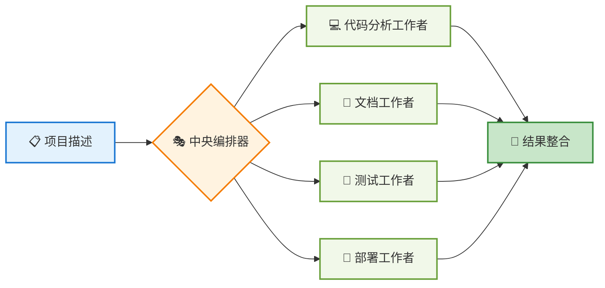
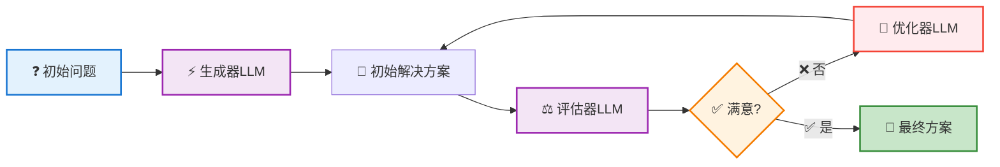
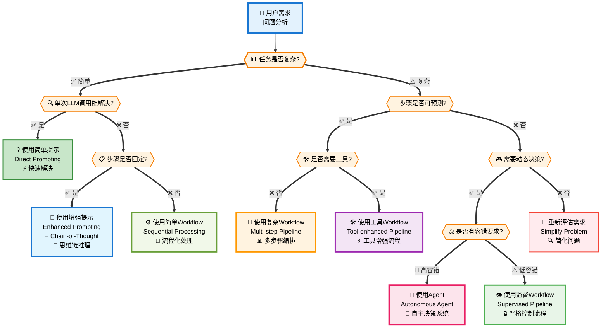

# AI Agent 完整入门指南

## 📖 目录
1. [什么是AI Agent](#什么是ai-agent)
2. [Agent vs Workflow：架构差异详解](#agent-vs-workflow架构差异详解)
3. [Workflow模式详解](#workflow模式详解)
4. [何时构建Agent：场景判断指南](#何时构建agent场景判断指南)
5. [典型应用场景](#典型应用场景)
6. [框架选择指南](#框架选择指南)
7. [总结与建议](#总结与建议)

---

## 什么是AI Agent

AI Agent（智能体）是一种能够**自主决策**的AI系统，不像传统程序按固定步骤执行，而是根据情况动态选择行动路径。

### 核心特征

- **自主决策**：根据当前状态选择下一步行动
- **工具使用**：调用各种外部工具完成任务  
- **反馈学习**：从执行结果中调整策略
- **目标导向**：始终朝着明确目标前进

### 工作原理

<div style="width: 50%; margin: 0 auto;">



</div>

简单说，Agent就是"在循环中基于反馈选择工具的大模型"。关键在于这个反馈循环让它能处理复杂、不确定的任务。

---

## Agent vs Workflow：架构差异详解

### 增强LLM：共同基础

**增强LLM** = 基础LLM + 增强能力（检索、工具、记忆），是所有agentic系统的基础构建块。

基于这个基础，可以构建两种不同的系统：

### 核心架构差异

#### Workflow：编排式系统
通过预定义代码路径编排LLM和工具，执行固定的步骤序列。

**特点：**
- 代码逻辑控制执行流程
- 每个步骤都是预先定义的
- 高度可控和可预测
- 适合明确定义的任务

#### Agent：自主决策系统  
LLM动态指导自己的流程和工具使用，保持对任务完成方式的控制。

**特点：**
- LLM控制执行路径
- 基于反馈动态调整策略
- 具备记忆和上下文管理
- 适合开放性问题

### 适用场景对比

| 场景类型 | 选择Workflow | 选择Agent |
|---------|-------------|----------|
| **任务特征** | 步骤清晰、流程固定 | 开放性、需要探索 |
| **典型应用** | 数据处理、文档审批、内容翻译 | 客服对话、代码调试、研究分析 |
| **主要优势** | 可预测、稳定、成本低 | 灵活、智能、适应性强 |
| **成本考虑** | Token消耗低 | Token消耗高（3-5倍） |
| **响应时间** | 快速响应 | 相对较慢 |

### 架构对比图解



### 实际代码对比

**Workflow：预定义路径**
```python
def document_workflow(doc):
    # 固定的3步流程
    step1 = extract_text(doc)
    step2 = translate(step1, target="en") 
    step3 = format_output(step2)
    return step3
```

**Agent：动态决策**
```python
def document_agent(doc, goal):
    while not goal_achieved:
        # LLM决定下一步
        action = llm.plan_next_action(doc, goal, context)
        result = execute_action(action)
        goal_achieved = llm.evaluate_progress(result)
    return result
```

理解了这些差异后，接下来我们探讨Workflow的5种常见模式，以及如何判断何时使用Agent。

---

## Workflow模式详解

理解Workflow模式对于做出正确的架构选择至关重要。以下是5种常见的Workflow模式：

### 1. 提示链模式 (Prompt Chaining)

**顺序执行的线性处理模式**

将复杂任务分解为顺序执行的简单子任务，每个LLM调用处理前一步的输出。

<div style="width: 50%; margin: 0 auto;">



</div>

**适用场景：**
- 文档处理流水线
- 内容创作流程
- 数据分析管道

```python
def document_processing_chain(raw_text):
    # 步骤1：内容提取
    extracted = llm_call_1("请从以下文本中提取关键信息：", raw_text)
    
    # 步骤2：信息整理
    organized = llm_call_2("请整理以下信息的结构：", extracted)
    
    # 步骤3：格式化输出
    formatted = llm_call_3("请将信息格式化为正式报告：", organized)
    
    return formatted
```

### 2. 路由模式 (Routing)

**智能分流的专家处理模式**

根据输入类型将任务分配给专门的处理器，实现分工协作。

<div style="width: 50%; margin: 0 auto;">



</div>

**适用场景：**
- 客户服务系统
- 多领域问答系统
- 智能分流系统

```python
def intelligent_routing(user_query):
    # 分类查询类型
    query_type = classifier_llm(f"请将以下查询分类：{user_query}")
    
    # 路由到专门处理器
    if query_type == "technical":
        return technical_expert_llm(user_query)
    elif query_type == "billing":
        return billing_expert_llm(user_query)
    elif query_type == "general":
        return general_support_llm(user_query)
    else:
        return fallback_handler(user_query)
```

### 3. 并行化模式 (Parallelization)

**同时执行的多任务处理模式**

同时执行多个独立任务，然后聚合结果，提升处理效率。

<div style="width: 50%; margin: 0 auto;">



</div>

**适用场景：**
- 多角度分析
- 性能优化
- 冗余验证

```python
import asyncio

async def parallel_analysis(data):
    # 并行执行多种分析
    tasks = [
        sentiment_analysis(data),
        keyword_extraction(data),
        topic_modeling(data),
        readability_analysis(data)
    ]
    
    results = await asyncio.gather(*tasks)
    
    # 聚合结果
    final_report = aggregate_results(results)
    return final_report
```

### 4. 编排器-工作者模式 (Orchestrator-Workers)

**中央调度的分工协作模式**

<div style="width: 50%; margin: 0 auto;">



</div>

**使用场景：**
- 大型项目分工
- 多领域专家协作
- 并行处理复杂任务
- 团队工作流自动化

中央编排器动态分配任务给多个工作者。

```python
class TaskOrchestrator:
    def __init__(self):
        self.workers = [
            CodeAnalysisWorker(),
            DocumentationWorker(),
            TestingWorker(),
            DeploymentWorker()
        ]
    
    def process_project(self, project_description):
        # 分析项目需求
        requirements = self.analyze_requirements(project_description)
        
        # 动态分配任务
        tasks = self.create_task_plan(requirements)
        
        # 协调工作者执行
        results = []
        for task in tasks:
            suitable_worker = self.select_worker(task)
            result = suitable_worker.execute(task)
            results.append(result)
        
        # 整合最终结果
        return self.integrate_results(results)
```

### 5. 评估器-优化器模式 (Evaluator-Optimizer)

**迭代改进的反馈循环模式**

<div style="width: 50%; margin: 0 auto;">



</div>

**使用场景：**
- 复杂问题求解
- 内容质量优化
- 创意设计迭代
- 代码审查和改进

一个组件生成解决方案，另一个组件评估并优化。

```python
def iterative_improvement(initial_problem):
    current_solution = generator_llm(f"请为以下问题提供解决方案：{initial_problem}")
    
    for iteration in range(max_iterations):
        # 评估当前解决方案
        evaluation = evaluator_llm(f"""
        问题：{initial_problem}
        当前解决方案：{current_solution}
        请评估此解决方案并提出改进建议。
        """)
        
        if evaluation.is_satisfactory:
            break
            
        # 基于评估改进解决方案
        current_solution = optimizer_llm(f"""
        原问题：{initial_problem}
        当前方案：{current_solution}
        改进建议：{evaluation.suggestions}
        请提供改进后的解决方案。
        """)
    
    return current_solution
```

---

## 何时构建Agent：场景判断指南

了解了Workflow的各种模式后，关键问题是：**什么时候应该选择Agent而不是Workflow？**

### 决策框架

构建智能系统时，应该遵循"奥卡姆剃刀"原则：**寻找最简单的解决方案，只在必要时增加复杂性**。

#### 解决方案选择决策树

<div style="width: 45%; margin: 0 auto;">



</div>

### 递增复杂度策略

遵循"最小复杂度"原则，从简单到复杂逐步选择：

1. **简单提示** → 单次LLM调用解决
2. **增强提示** → 添加背景知识和示例  
3. **Workflow** → 多步骤固定流程
4. **Agent** → 动态决策和工具使用

### Agent适用场景判断清单

| 场景类型 | ✅ 适合使用Agent | ❌ 不适合使用Agent |
|---------|----------------|------------------|
| **问题复杂度** | 开放性问题、创造性解决、难以预测步骤 | 简单确定任务、步骤固定明确、单次调用 |
| **决策需求** | 根据中间结果调整策略、多路径选择 | 输入输出关系明确、逻辑规则清晰 |
| **工具使用** | 组合多个工具、动态工具选择、处理失败 | 传统RPA可解决、不需要AI能力 |
| **环境要求** | 可承受不确定性、有监控机制、错误可控 | 高风险环境、准确性要求极高、严格审计 |
| **成本考虑** | 价值高于成本、复杂度合理 | 预算紧张、大量重复任务、速度优先 |


---

## 典型应用场景

基于前面的判断框架，以下是Agent在实际应用中表现出色的典型场景：

### Agent最佳应用
- **AI客服**：多轮对话、情绪感知、智能转接
- **代码调试**：多策略诊断、迭代修复、验证反馈
- **数据分析**：探索性分析、动态图表生成
- **内容创作**：多轮优化、风格调整、质量评估

### 关键成功要素
1. **明确问题域** - 专注特定类型问题
2. **工具集成** - 提供充足能力支撑  
3. **智能决策** - 动态选择最佳策略
4. **失败处理** - 合适的降级机制

---

## 框架选择指南

### 主流Agent框架对比

| 框架 | 优点 | 缺点 | 适用场景 |
|------|------|------|----------|
| **LangGraph** | 可视化设计，生态丰富 | 抽象层多，调试困难 | 复杂工作流，快速原型 |
| **AutoGPT** | 自主性强，社区活跃 | 成本高，不够稳定 | 研究实验，概念验证 |
| **Microsoft Semantic Kernel** | 企业级，集成度高 | 学习曲线陡峭 | 企业应用，微软生态 |
| **Anthropic MCP** | 工具标准化，轻量级 | 相对新颖，生态较小 | 工具集成，自定义Agent |

### 选择建议

**新手推荐路径：**
1. **概念理解** → 从简单提示和Workflow开始
2. **实践基础** → 使用LangGraph或MCP进行实验  
3. **深度应用** → 根据具体需求选择企业级框架

---

## 总结与建议

### 核心要点

#### 选择原则
- **简单任务** → Workflow
- **开放问题** → Agent  
- **成本敏感** → Workflow
- **需要灵活性** → Agent

#### 实施建议
- **奥卡姆剃刀**：始终选择最简单的有效解决方案
- **渐进复杂度**：从简单提示逐步升级
- **明确边界**：清楚定义问题域和能力范围

### 最佳实践

1. **开始前思考**：这个问题真的需要Agent吗？
2. **选择方案**：简单提示→增强提示→Workflow→Agent（按复杂度递增）
3. **关注价值**：解决真实问题比技术炫酷更重要

记住：**最好的Agent是用户感觉不到它存在，但问题被完美解决的Agent。**

---

**文档定位**：面向一般用户的AI Agent入门指南  
**适用人群**：产品经理、技术决策者、AI爱好者  
**版本**：v2.0 (简化版)  
**创建时间**：2025年1月  
