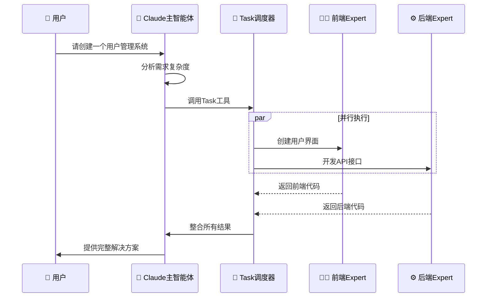
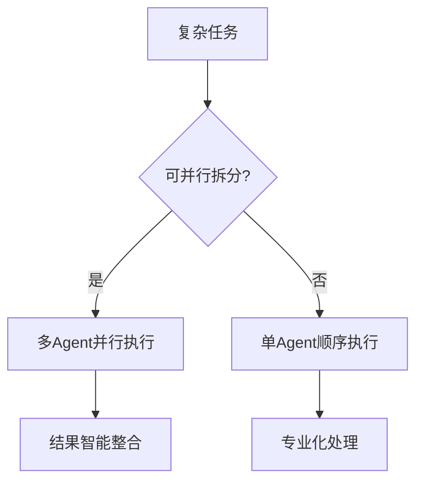

# Claude Subagent（子智能体）完整讲解

> **🎯 学习目标**: 掌握Claude Code Subagent技术，学会构建专业化AI助手团队，实现高效协作开发

## 📖 目录
1. [什么是Claude Subagent](#什么是claude-subagent)
2. [核心架构设计](#核心架构设计)
3. [SubAgent vs 并行Workflow](#subagent-vs-并行workflow) ⭐ **关键区别**
4. [配置指南](#配置指南)
5. [有效使用SubAgent](#有效使用subagent)
6. [常用Agent模板](#常用agent模板)
7. [最佳实践与总结](#最佳实践与总结)

---

## 什么是Claude Subagent

### 基本定义
Claude Subagent是Anthropic在Claude Code平台上推出的专门化AI助手功能。**Claude是主Agent，SubAgent是它的专业助手团队**。

### 核心概念
- **专业化分工**：每个SubAgent专注特定领域（如前端、后端、测试）
- **独立上下文**：拥有独立的工作记忆，避免任务间干扰
- **并行协作**：多个SubAgent可同时工作，效率提升数倍
- **智能调度**：Claude主智能体负责任务分析和分配

### 发展背景
Anthropic在2025年7月正式发布Subagent功能，标志着AI助手从"一人多能"向"专业团队协作"的革命性转变。

### 🌟 Subagent的核心价值
- **专业化深度**: 每个Subagent在特定领域达到专家级水平
- **团队化协作**: 模拟真实开发团队的分工合作模式
- **并行化处理**: 50+Agent可同时工作，效率提升数十倍
- **成本效益**: 替代传统10+人团队，显著降低人力成本

---

## 核心架构设计

### 🎯 Claude Code架构
```
Claude主智能体 (Lead Agent)
├── 分析用户需求
├── 制定执行计划  
├── 协调SubAgent工作
└── 整合最终结果

SubAgent专业团队
├── 前端开发专家 (.claude/agents/frontend-developer.md)
├── 后端架构师 (.claude/agents/backend-architect.md)
├── 数据库专家 (.claude/agents/sql-optimizer.md)
└── 测试专家 (.claude/agents/test-expert.md)
```

### 🔄 工作流程


---

## SubAgent vs 并行Workflow

### 🔍 关键区别分析

虽然都是"多个任务同时执行"，但本质完全不同：

| 维度 | 并行Workflow | SubAgent系统 |
|------|-------------|-------------|
| **决策权** | 代码预设分配 | Claude动态选择 |
| **任务分解** | 程序化拆分 | AI智能分析 |
| **专业能力** | 功能性处理 | 专家级思考 |
| **错误处理** | 简单重试/失败 | 专家级诊断 |
| **结果整合** | 程序化合并 | 智能协调整合 |

---

## 配置指南

### 📁 文件存储位置

| 类型 | 路径 | 作用范围 | 优先级 | 说明 |
|------|------|----------|--------|------|
| 项目级 | `.claude/agents/` | 当前项目 | **最高** | 项目特定配置，覆盖用户级配置 |
| 用户级 | `~/.claude/agents/` | 所有项目 | 较低 | 全局配置，跨项目共享 |

> **冲突处理**：当subagent名称冲突时，项目级配置优先于用户级配置

### 📋 配置文件结构

每个SubAgent定义为带有YAML前置元数据的Markdown文件：

```markdown
---
name: your-agent-name          # 必需：唯一标识符（小写字母+连字符）
description: 功能描述和调用时机  # 必需：自然语言描述，决定自动调用时机
tools: tool1, tool2, tool3     # 可选：工具权限配置（逗号分隔）
---

# Agent的系统提示词
你是一个专业的XXX专家，擅长：
- 技能1：具体能力描述
- 技能2：应用场景说明
- 技能3：输出标准要求

## 🎯 工作原则
1. **专业性**：始终保持专业水准
2. **准确性**：确保信息准确可靠
3. **高效性**：快速响应，精准解决

## 📋 工作流程
1. **需求分析**：深入理解任务要求
2. **方案设计**：制定最优解决方案
3. **执行实施**：高质量完成任务
4. **结果验证**：确保达到预期效果

## 📤 输出格式
- **结构化**：使用清晰的层次结构
- **可操作**：提供具体可执行的建议
- **完整性**：覆盖所有关键要点
```

### 🛠️ 工具权限配置详解

#### 方式1：继承所有工具（推荐）
```yaml
---
name: full-stack-developer
description: 全栈开发专家，处理前后端开发任务
# 省略tools字段 = 继承主线程所有工具，包括MCP工具
---
```
**特点**：
- ✅ 自动获得所有可用工具
- ✅ 包含MCP工具支持
- ✅ 功能最全面，适合通用场景

#### 方式2：精确工具控制（安全）
```yaml
---
name: security-auditor
description: 安全审计专家，只进行代码安全分析
tools: Read, Grep, WebFetch
---
```
**特点**：
- 🔒 只能使用指定工具
- 🛡️ 安全性更高
- 🎯 专注特定功能

### 🔧 可用工具清单

根据官方文档，SubAgent可以使用以下工具类别：

#### 核心工具
- **Read**：读取文件
- **Write**：创建/覆盖文件
- **Edit**：编辑现有文件
- **Bash**：执行命令行操作
- **Grep**：搜索文件内容
- **Glob**：文件模式匹配

#### 网络工具
- **WebFetch**：获取网页内容
- **Task**：调用其他SubAgent

#### MCP工具
- **自动继承**：当省略tools字段时，自动获得所有已配置的MCP工具
- **手动指定**：可在tools字段中明确列出需要的MCP工具

### ⚙️ 高级配置选项

#### 1. 智能调用配置
```yaml
---
name: react-expert
description: React开发专家。当用户需要创建React组件、状态管理、性能优化、JSX语法问题时自动调用
tools: Read, Write, Edit, Bash
---
```
**关键点**：description字段越具体，Claude自动调用越精准

#### 2. 安全限制配置
```yaml
---
name: code-reviewer
description: 代码审查专家，只进行代码质量分析
tools: Read, Grep  # 只读权限，确保安全
---
```

#### 3. 专业工具链配置
```yaml
---
name: database-expert
description: 数据库优化专家
tools: Read, Edit, Bash, mcp__postgresql__query, mcp__redis__client
---
```

### 📋 配置模板库

#### 通用开发专家
```markdown
---
name: general-developer
description: 通用开发专家，处理多种编程语言和框架的开发任务
---

# 通用开发专家

## 🎯 技术覆盖
- **前端**: React, Vue, Angular, TypeScript
- **后端**: Node.js, Python, Java, Go
- **数据库**: MySQL, PostgreSQL, MongoDB
- **DevOps**: Docker, Kubernetes, CI/CD

## 📋 标准流程
1. 分析技术需求和约束条件
2. 选择最适合的技术栈
3. 设计架构和实现方案
4. 编写高质量代码
5. 提供测试和部署建议
```

#### 专业安全专家
```markdown
---
name: security-expert
description: 网络安全专家，专门处理安全审计、漏洞分析、安全加固相关任务
tools: Read, Grep, WebFetch
---

# 网络安全专家

## 🔒 专业领域
- **漏洞扫描**: 代码安全审计
- **风险评估**: 安全威胁分析  
- **加固建议**: 安全防护方案
- **合规检查**: 安全标准验证

## 🛡️ 审计标准
- OWASP Top 10漏洞检测
- SQL注入和XSS防护
- 身份认证和访问控制
- 数据加密和传输安全
```

### 🎛️ 管理命令

#### 使用/agents命令（推荐）
```bash
/agents  # 打开交互式管理界面
```
**功能包括**：
- 📋 查看所有可用subagent
- ➕ 创建新subagent（引导式设置）
- ✏️ 编辑现有subagent
- 🗑️ 删除自定义subagent
- 🔍 查看活跃的subagent
- 🛠️ 管理工具权限

#### 直接文件管理
```bash
# 创建项目级subagent
mkdir -p .claude/agents
echo "---
name: my-expert
description: 我的专业助手
---
# 系统提示词内容" > .claude/agents/my-expert.md

# 创建用户级subagent
mkdir -p ~/.claude/agents
echo "配置内容" > ~/.claude/agents/global-expert.md
```

---

## 有效使用SubAgent

### 🎯 自动调用机制

Claude根据以下因素智能选择SubAgent：

#### 1. 任务描述匹配
```
用户输入: "帮我优化这个SQL查询的性能"
↓
Claude分析: 这是数据库优化任务
↓  
自动调用: sql-optimizer SubAgent
```

#### 2. 上下文分析
- **代码库分析**：检测项目类型和技术栈
- **文件扩展名**：`.sql`文件 → 数据库专家
- **当前任务**：正在进行React开发 → 前端专家

#### 3. 关键词识别
| 关键词 | 自动调用的SubAgent |
|--------|-------------------|
| "React组件" "JSX" "状态管理" | react-expert |
| "SQL优化" "查询性能" "索引" | sql-optimizer |
| "安全审计" "漏洞检测" | security-expert |
| "代码审查" "代码质量" | code-reviewer |

### 🔧 手动调用方式

#### 明确指定SubAgent
```
请使用react-expert来创建一个用户登录组件
```

#### 任务分配语法
```
@frontend-developer 请创建登录页面
@backend-architect 请设计API接口
@database-expert 请优化用户表结构
```

### ⚡ 并行执行策略

#### 任务分解原则


#### 适合并行的任务类型
- ✅ **功能独立**：前端+后端+数据库
- ✅ **技术栈不同**：React+Node.js+Docker
- ✅ **专业领域**：开发+测试+安全审计
- ❌ **强依赖关系**：必须先A再B的任务

### 🎚️ 性能优化技巧

#### 1. 精准描述配置
```yaml
# ❌ 模糊描述
description: 前端开发

# ✅ 精准描述  
description: React/TypeScript前端开发专家。当需要创建React组件、状态管理、性能优化、JSX语法问题时自动调用
```

#### 2. 合理工具权限
```yaml
# ❌ 过度权限
tools: Read, Write, Edit, Bash, WebFetch, Grep, Glob

# ✅ 按需权限
tools: Read, Edit, Bash  # 只给必需的工具
```

#### 3. 上下文预热
```
// 告诉Claude当前项目背景
这是一个React + Node.js的电商项目，请帮我优化购物车组件的性能
```

### 📊 监控和调试

#### 检查SubAgent状态
```bash
/agents  # 查看所有可用SubAgent
```

#### 调试SubAgent配置
1. **测试自动调用**：使用特定关键词验证是否正确调用
2. **验证工具权限**：确认SubAgent可以使用所需工具
3. **监控响应质量**：评估SubAgent输出是否符合期望

#### 常见问题排查
| 问题 | 原因 | 解决方案 |
|------|------|----------|
| SubAgent未被调用 | description不够具体 | 优化描述字段 |
| 权限不足错误 | tools配置限制过严 | 添加必需工具 |
| 输出质量不佳 | 系统提示词不够详细 | 完善提示词内容 |

---

## 常用Agent模板

### 👨‍💻 全栈开发专家
```markdown
---
name: full-stack-developer
description: 全栈Web应用开发专家，精通前后端技术栈。当需要完整的Web应用开发、前后端集成、全栈架构设计时优先使用。
tools: Read, Write, Edit, Bash, WebFetch
---

# 全栈开发专家

## 🎯 专业技能
### 前端开发
- React/Vue/Angular等现代框架
- TypeScript/JavaScript ES6+
- CSS3/SASS/Tailwind CSS
- 响应式设计和移动端适配

### 后端开发
- Node.js/Python/Java/Go
- RESTful API和GraphQL设计
- 数据库设计和优化（SQL/NoSQL）
- 微服务架构

### DevOps技能
- Docker容器化
- CI/CD流水线
- 云服务（AWS/Azure/GCP）

## 📋 工作流程
1. **需求分析**: 深入理解业务需求和技术约束
2. **架构设计**: 设计可扩展的系统架构
3. **技术选型**: 选择最适合的技术栈
4. **开发实现**: 高质量代码实现
5. **测试验证**: 完整的测试覆盖
6. **部署上线**: 生产环境部署

## ✅ 代码标准
- 遵循最佳实践和编码规范
- 代码可读性和可维护性优先
- 完善的错误处理和日志记录
- 安全性考虑（防XSS、SQL注入等）
```

### ⚛️ React专家
```markdown
---
name: react-expert
description: React前端开发专家，精通React生态系统。当需要React组件开发、状态管理、性能优化、React Native移动开发时必须使用。
tools: Read, Write, Edit, Bash, WebFetch
---

# React开发专家

## 🎯 核心专长
- React 18+ Hooks和函数组件
- Redux/Zustand/Context状态管理
- Next.js/Gatsby框架开发
- React Native跨平台应用
- React Testing Library测试
- 性能优化（memo, useMemo, useCallback）

## 🛠️ 技术栈
- TypeScript集成开发
- Styled-components/Emotion CSS-in-JS
- Material-UI/Ant Design组件库
- React Router路由管理
- React Query/SWR数据获取

## 📱 开发原则
1. **组件化设计**: 可复用、可测试的组件
2. **性能优先**: 避免不必要的重渲染
3. **类型安全**: 完整的TypeScript类型定义
4. **用户体验**: 响应式设计和交互优化
5. **代码质量**: ESLint/Prettier代码规范
```

### 📊 SQL优化专家
```markdown
---
name: sql-optimizer
description: 数据库查询优化专家，专门处理SQL性能问题。当遇到慢查询、数据库性能瓶颈、索引优化、查询计划分析时必须使用。
tools: Read, Edit, Bash
---

# SQL查询优化专家

## 🎯 专业领域
- 慢查询分析和优化
- 索引设计和调优
- 查询执行计划分析
- 数据库性能监控
- SQL重构和优化

## 🔍 优化流程
1. **性能诊断**
   - 分析慢查询日志
   - 检查执行计划
   - 识别性能瓶颈

2. **索引优化**
   - 分析现有索引使用情况
   - 设计最优索引策略
   - 清理冗余索引

3. **查询重构**
   - 重写低效查询
   - 优化JOIN操作
   - 减少子查询复杂度

4. **性能验证**
   - 对比优化前后性能
   - 压力测试验证
   - 监控生产环境表现

## 📈 优化技巧
- 使用EXPLAIN分析查询计划
- 避免SELECT *，明确指定字段
- 合理使用索引覆盖查询
- 分页查询优化（LIMIT/OFFSET）
- 批量操作替代逐条操作
```

---

## 最佳实践与总结

### 🔍 设计原则

1. **明确专业分工**
   - 为每个SubAgent定义清晰的职责边界
   - 避免功能重叠和冲突
   - 确保专业领域的深度和广度平衡

2. **优化配置策略**
   - 使用Claude生成初始SubAgent配置
   - 根据实际使用情况迭代优化
   - 建立配置版本控制和管理流程

3. **监控和优化**
   - 定期评估SubAgent的性能表现
   - 收集用户反馈并持续改进
   - 监控token使用和成本效益

### 💡 实施建议

1. **从简单开始**
   - 先创建2-3个核心SubAgent
   - 验证多Agent工作流程
   - 逐步扩展到更多专业领域

2. **建立标准化流程**
   - 制定SubAgent命名和组织规范
   - 建立配置模板和最佳实践文档
   - 确保团队成员的一致使用方式

3. **成本控制**
   - 监控token使用情况
   - 优化SubAgent调用策略
   - 平衡性能和成本效益

### ⚖️ 优势与局限

**主要优势**:
- ✅ **效率提升**: 并行处理，显著减少总体时间
- ✅ **质量改善**: 专业化处理，避免上下文干扰
- ✅ **可扩展性**: 模块化设计，轻松添加新专业领域

**主要局限**:
- ❌ **资源消耗**: Token使用约为普通聊天的15倍
- ❌ **复杂性增加**: 需要维护多个SubAgent配置
- ❌ **协调开销**: Agent间信息交换需要额外成本

### 🎯 选择指南

**适合使用SubAgent**:
- ✅ 需要多专业领域协作的复杂项目
- ✅ 对结果质量有较高要求
- ✅ 可承受较高的token成本
- ✅ 任务可以有效拆分为并行子任务

**不适合使用SubAgent**:
- ❌ 简单的单一技能任务
- ❌ 对成本极度敏感的场景
- ❌ 需要极快响应的紧急任务
- ❌ 高风险环境，要求100%准确性

### 📚 关键要点回顾
1. **专业化分工**：每个SubAgent专注于特定领域，避免能力泛化
2. **智能调度**：Claude主智能体负责任务分析和分配决策  
3. **并行协作**：多Agent同时工作，显著提升整体效率
4. **上下文隔离**：独立工作记忆，避免任务间信息干扰
5. **灵活配置**：支持项目和用户级别的个性化定制

### ✨ 核心价值
Claude Subagent将AI助手从"一人多能"升级为"专业团队协作"模式，通过合理的架构设计和配置管理，可以：
- 🚀 **效率提升3-5倍**：并行处理复杂任务
- 🎯 **质量显著改善**：专业化处理避免能力稀释  
- 💡 **成本效益优化**：替代传统多人团队模式

**设计理念**：让用户感觉拥有了一个专业团队，但操作起来像使用单一助手一样简单。

---

**文档版本**：v3.0  
**创建时间**：2025年8月30日  
**更新时间**：2025年9月3日  
**适用范围**：Claude Code用户、AI技术研究者、企业决策者