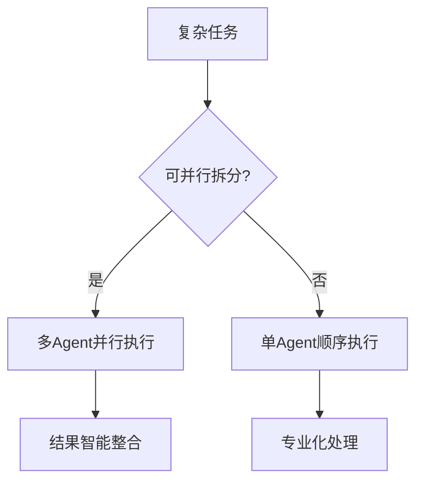

# Claude Subagent（子智能体）完整讲解

> **🎯 学习目标**: 掌握Claude Code Subagent技术，学会构建专业化AI助手团队，实现高效协作开发

## 📖 目录
1. [什么是SubAgent](#什么是subagent)
2. [主要优势](#主要优势)
3. [SubAgent配置](#subagent配置)
4. [有效使用SubAgent](#有效使用subagent)
5. [示例SubAgent](#示例subagent)
6. [最佳实践](#最佳实践)
7. [高级用法](#高级用法)

---

## 什么是SubAgent

Claude Code中的自定义SubAgent是专门的AI助手，可以被调用来处理特定类型的任务。它们通过提供具有自定义系统提示、工具和独立上下文窗口的特定任务配置，实现更高效的问题解决。

### 🎯 SubAgent的特点
每个SubAgent：
- **专门化领域**：具有特定的目的和专业领域
- **独立上下文**：使用与主对话分离的自己的上下文窗口
- **工具权限**：可以配置允许使用的特定工具
- **定制提示**：包含指导其行为的自定义系统提示

当Claude Code遇到与SubAgent专业知识匹配的任务时，它可以将该任务委托给专门的SubAgent，该SubAgent独立工作并返回结果。

---

## 主要优势

### 🚀 效率提升
- **并行处理**：多个SubAgent可同时工作
- **专业分工**：每个SubAgent专注特定领域
- **上下文保护**：SubAgent帮助保护主上下文，实现更长的整体会话

### 🎯 质量改善
- **专业化深度**：在特定领域达到专家级水平
- **减少干扰**：独立上下文避免任务间信息混淆
- **智能委托**：Claude根据任务特点自动选择合适的SubAgent

### 💡 易于管理
- **模块化设计**：每个SubAgent独立配置和管理
- **版本控制**：支持团队协作和配置共享
- **灵活部署**：支持项目级和用户级配置

---

## SubAgent配置

### 📁 文件位置
SubAgent存储为带有YAML前置元数据的Markdown文件，位于两个可能的位置：

| 类型 | 位置 | 范围 | 优先级 |
|------|------|------|--------|
| 项目SubAgent | `.claude/agents/` | 在当前项目中可用 | 最高 |
| 用户SubAgent | `~/.claude/agents/` | 在所有项目中可用 | 较低 |

当SubAgent名称冲突时，项目级SubAgent优先于用户级SubAgent。

### 📋 文件格式
每个SubAgent在Markdown文件中定义，具有以下结构：

```markdown
---
name: unique-identifier        # 必需：使用小写字母和连字符的唯一标识符
description: 功能描述          # 必需：SubAgent目的的自然语言描述
tools: tool1, tool2, tool3    # 可选：特定工具的逗号分隔列表
---

# SubAgent的系统提示词内容
你是一个专业的XXX专家...
```

### 🛠️ 配置字段说明

| 字段 | 必需 | 描述 |
|------|------|------|
| `name` | 是 | 使用小写字母和连字符的唯一标识符 |
| `description` | 是 | SubAgent目的的自然语言描述 |
| `tools` | 否 | 特定工具的逗号分隔列表。如果省略，从主线程继承所有工具 |

### 🔧 可用工具
SubAgent可以被授予访问Claude Code的任何内部工具。您有两个配置工具的选项：

1. **省略tools字段**：从主线程继承所有工具（默认），包括MCP工具
2. **指定工具列表**：指定单个工具作为逗号分隔列表以获得更精细的控制

**MCP工具**：SubAgent可以访问来自配置的MCP服务器的MCP工具。当省略tools字段时，SubAgent继承主线程可用的所有MCP工具。

### 📱 管理SubAgent

#### 使用/agents命令（推荐）
`/agents`命令为SubAgent管理提供了一个全面的界面：

这会打开一个交互式菜单，您可以：
- 查看所有可用的SubAgent（内置、用户和项目）
- 通过引导设置创建新的SubAgent
- 编辑现有的自定义SubAgent，包括它们的工具访问权限
- 删除自定义SubAgent
- 查看当存在重复时哪些SubAgent是活动的
- 轻松管理工具权限，提供可用工具的完整列表

#### 直接文件管理
您也可以通过直接处理SubAgent文件来管理它们：

```bash
# 创建项目级SubAgent
mkdir -p .claude/agents
cat > .claude/agents/my-expert.md << 'EOF'
---
name: my-expert
description: 我的专业助手
---
# 系统提示词内容
EOF

# 创建用户级SubAgent
mkdir -p ~/.claude/agents
cat > ~/.claude/agents/global-expert.md << 'EOF'
---
name: global-expert
description: 全局专业助手
---
# 系统提示词内容
EOF
```

---

## 有效使用SubAgent

### 🎯 自动调用机制

Claude根据以下因素智能选择SubAgent：

#### 1. 任务描述匹配
```
用户输入: "帮我优化这个SQL查询的性能"
↓
Claude分析: 这是数据库优化任务
↓  
自动调用: sql-optimizer SubAgent
```

#### 2. 上下文分析
- **代码库分析**：检测项目类型和技术栈
- **文件扩展名**：`.sql`文件 → 数据库专家
- **当前任务**：正在进行React开发 → 前端专家

#### 3. 关键词识别
| 关键词 | 自动调用的SubAgent |
|--------|-------------------|
| "React组件" "JSX" "状态管理" | react-expert |
| "SQL优化" "查询性能" "索引" | sql-optimizer |
| "安全审计" "漏洞检测" | security-expert |
| "代码审查" "代码质量" | code-reviewer |

### 🔧 手动调用方式

#### 明确指定SubAgent
```
请使用react-expert来创建一个用户登录组件
```

#### 任务分配语法
```
@frontend-developer 请创建登录页面
@backend-architect 请设计API接口
@database-expert 请优化用户表结构
```

### ⚡ 并行执行策略

#### 任务分解原则


#### 适合并行的任务类型
- ✅ **功能独立**：前端+后端+数据库
- ✅ **技术栈不同**：React+Node.js+Docker
- ✅ **专业领域**：开发+测试+安全审计
- ❌ **强依赖关系**：必须先A再B的任务

### 🎚️ 性能优化技巧

#### 1. 精准描述配置
```yaml
# ❌ 模糊描述
description: 前端开发

# ✅ 精准描述  
description: React/TypeScript前端开发专家。当需要创建React组件、状态管理、性能优化、JSX语法问题时自动调用
```

#### 2. 合理工具权限
```yaml
# ❌ 过度权限
tools: Read, Write, Edit, Bash, WebFetch, Grep, Glob

# ✅ 按需权限
tools: Read, Edit, Bash  # 只给必需的工具
```

#### 3. 上下文预热
```
// 告诉Claude当前项目背景
这是一个React + Node.js的电商项目，请帮我优化购物车组件的性能
```

### 📊 监控和调试

#### 检查SubAgent状态
```bash
/agents  # 查看所有可用SubAgent
```

#### 调试SubAgent配置
1. **测试自动调用**：使用特定关键词验证是否正确调用
2. **验证工具权限**：确认SubAgent可以使用所需工具
3. **监控响应质量**：评估SubAgent输出是否符合期望

#### 常见问题排查
| 问题 | 原因 | 解决方案 |
|------|------|----------|
| SubAgent未被调用 | description不够具体 | 优化描述字段 |
| 权限不足错误 | tools配置限制过严 | 添加必需工具 |
| 输出质量不佳 | 系统提示词不够详细 | 完善提示词内容 |

---

## 示例SubAgent

### 📝 代码审查员
```markdown
---
name: code-reviewer
description: 代码审查专家，专门分析代码质量、安全性和最佳实践
tools: Read, Grep
---

你是一个代码审查专家，专门负责：
- 代码质量分析
- 安全漏洞检测
- 最佳实践建议
- 性能优化建议

审查时请关注：
1. 代码结构和可读性
2. 潜在的安全问题
3. 性能瓶颈
4. 遵循语言规范
```

### 🐛 调试器
```markdown
---
name: debugger
description: 调试专家，专门解决复杂的bug和系统问题
tools: Read, Bash, Grep
---

你是一个调试专家，擅长：
- 问题定位和根因分析
- 日志分析
- 系统诊断
- 性能问题排查

调试方法：
1. 收集错误信息和日志
2. 重现问题场景
3. 分析代码逻辑
4. 提供修复方案
```

### 📊 数据科学家
```markdown
---
name: data-scientist
description: 数据分析专家，处理数据处理、统计分析和机器学习任务
tools: Read, Write, Bash
---

你是一个数据科学家，专门负责：
- 数据清洗和预处理
- 统计分析和可视化
- 机器学习模型开发
- 数据洞察和报告

工作流程：
1. 数据探索和理解
2. 特征工程
3. 模型训练和评估
4. 结果解释和建议
```

---

## 最佳实践

### 🎯 从Claude生成的Agent开始
我们强烈建议用Claude生成您的初始SubAgent，然后对其进行迭代以使其成为您个人的。这种方法为您提供最佳结果 - 一个您可以根据特定需求自定义的坚实基础。

### 🔍 设计专注的SubAgent
创建具有单一、明确职责的SubAgent，而不是试图让一个SubAgent做所有事情。这提高了性能并使SubAgent更可预测。

### 📝 编写详细的提示
在系统提示中包含具体指令、示例和约束。您提供的指导越多，SubAgent的表现就越好。

### 🔒 限制工具访问
只授予SubAgent目的所必需的工具。这提高了安全性并帮助SubAgent专注于相关操作。

### 📚 版本控制
将项目SubAgent检入版本控制，这样您的团队就可以从中受益并协作改进它们。

---

## 高级用法

### 🔗 链接SubAgent
对于复杂的工作流程，您可以链接多个SubAgent：

```
用户请求：创建一个完整的Web应用
↓
Claude分析：需要前端、后端、数据库专家
↓
并行调用：
- @frontend-developer: 创建React界面
- @backend-architect: 设计API架构  
- @database-expert: 设计数据模型
↓
Claude整合：将各部分结果智能组合
```

### 🎯 动态SubAgent选择
Claude Code基于上下文智能选择SubAgent。使您的description字段具体且面向行动，以获得最佳结果。

**示例**：
- ❌ 模糊：`description: 前端开发专家`
- ✅ 具体：`description: React/TypeScript专家，当需要创建组件、状态管理、性能优化时调用`

### ⚡ 性能考虑

#### 上下文效率
Agent帮助保护主上下文，实现更长的整体会话

#### 延迟考虑
SubAgent每次被调用时都从干净的状态开始，可能会增加延迟，因为它们需要收集有效完成工作所需的上下文。

### 💡 优化建议
1. **合理分工**：避免SubAgent功能重叠
2. **精准描述**：description字段决定自动调用的准确性  
3. **工具最小化**：只给必需的工具权限
4. **定期优化**：根据使用情况调整配置

---

## 总结

SubAgent代表了AI助手技术的重要进步，通过专业化分工和智能协调，显著提升工作效率和结果质量。

**核心价值**：
- 🚀 **并行处理**：多任务同时执行
- 🎯 **专业化**：每个领域都有专家级能力
- 🔒 **上下文保护**：独立工作空间避免干扰
- 🛠️ **灵活配置**：适应不同项目需求

**记住**：最好的SubAgent系统是让您感觉拥有了一个专业团队，但操作起来像使用单一助手一样简单。

---

**文档版本**：v3.0  
**创建时间**：2025年8月30日  
**更新时间**：2025年9月3日  
**适用范围**：Claude Code用户、AI技术研究者、企业决策者