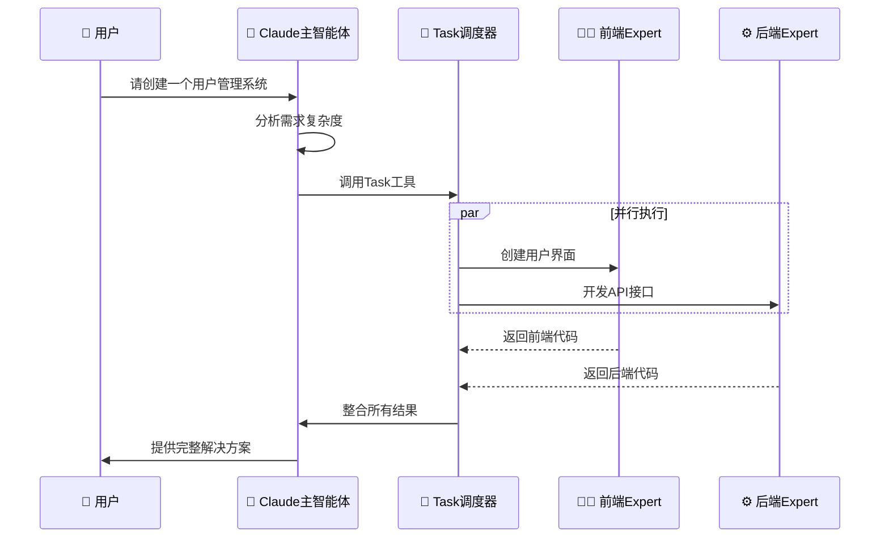

# Claude Subagent（子智能体）完整讲解

> **🎯 学习目标**: 掌握Claude Code Subagent技术，学会构建专业化AI助手团队，实现高效协作开发

## 📖 目录
1. [什么是Claude Subagent](#什么是claude-subagent)
2. [核心架构设计](#核心架构设计)
3. [SubAgent vs 并行Workflow](#subagent-vs-并行workflow) ⭐ **关键区别**
4. [配置指南](#配置指南)
5. [实战演示](#实战演示)
6. [常用Agent模板](#常用agent模板)
7. [企业级应用](#企业级应用)
8. [最佳实践](#最佳实践)

---

## 什么是Claude Subagent

### 基本定义
Claude Subagent是Anthropic在Claude Code平台上推出的专门化AI助手功能。**Claude是主Agent，SubAgent是它的专业助手团队**。

### 核心概念
- **专业化分工**：每个SubAgent专注特定领域（如前端、后端、测试）
- **独立上下文**：拥有独立的工作记忆，避免任务间干扰
- **并行协作**：多个SubAgent可同时工作，效率提升数倍
- **智能调度**：Claude主智能体负责任务分析和分配

### 发展背景
Anthropic在2025年7月正式发布Subagent功能，标志着AI助手从"一人多能"向"专业团队协作"的革命性转变。

### 🌟 Subagent的核心价值
- **专业化深度**: 每个Subagent在特定领域达到专家级水平
- **团队化协作**: 模拟真实开发团队的分工合作模式
- **并行化处理**: 50+Agent可同时工作，效率提升数十倍
- **成本效益**: 替代传统10+人团队，显著降低人力成本

---

## 核心架构设计

### 🎯 Claude Code架构
```
Claude主智能体 (Lead Agent)
├── 分析用户需求
├── 制定执行计划  
├── 协调SubAgent工作
└── 整合最终结果

SubAgent专业团队
├── 前端开发专家 (.claude/agents/frontend-developer.md)
├── 后端架构师 (.claude/agents/backend-architect.md)
├── 数据库专家 (.claude/agents/sql-optimizer.md)
└── 测试专家 (.claude/agents/test-expert.md)
```

### 🔄 工作流程


---

## SubAgent vs 并行Workflow

### 🔍 关键区别分析

虽然都是"多个任务同时执行"，但本质完全不同：

| 维度 | 并行Workflow | SubAgent系统 |
|------|-------------|-------------|
| **决策权** | 代码预设分配 | Claude动态选择 |
| **任务分解** | 程序化拆分 | AI智能分析 |
| **专业能力** | 功能性处理 | 专家级思考 |
| **错误处理** | 简单重试/失败 | 专家级诊断 |
| **结果整合** | 程序化合并 | 智能协调整合 |

### 🎭 生动类比

#### 并行Workflow = 工厂流水线
```
原料 → [工位1：切割] [工位2：打磨] [工位3：组装] → 程序化合并
```
- 🤖 每个工位做固定动作
- 📋 按程序预设分配任务
- ⚙️ 机械式执行，无思考

#### SubAgent = 专家咨询团队  
```
复杂问题 → Claude分析 → [法律专家思考] [财务专家分析] [技术专家评估] → Claude智能整合
```
- 🧠 每个专家独立思考
- 🎯 Claude智能分配任务
- ⚡ 专家级问题解决能力

### 💻 代码层面区别

**并行Workflow（代码控制）**
```python
# 程序预设的并行任务
tasks = [
    sentiment_analysis(data),    # 固定功能1
    keyword_extraction(data),    # 固定功能2  
    topic_modeling(data)        # 固定功能3
]
results = await asyncio.gather(*tasks)  # 程序化等待
return combine_results(results)          # 简单合并
```

**SubAgent系统（Claude控制）**
```python
# Claude动态决策调用
analysis = claude.analyze_problem(complex_problem)

# Claude智能选择专家团队
if analysis.needs_legal_advice:
    legal_expert = Task(subagent_type="legal-advisor")
if analysis.needs_technical_review:
    tech_expert = Task(subagent_type="technical-architect")
    
# Claude智能整合（不是简单合并）
return claude.synthesize_solution(results)
```

### 🎯 判断标准

**问自己3个问题：**
1. **谁在做决策？** Workflow：程序代码 | SubAgent：Claude分析
2. **如何处理意外？** Workflow：错误处理流程 | SubAgent：专家诊断
3. **结果如何整合？** Workflow：程序化合并 | SubAgent：Claude智能协调

---

## 配置指南

### 📁 文件存储位置

| 类型 | 路径 | 作用范围 | 优先级 |
|------|------|----------|--------|
| 项目级 | `.claude/agents/` | 当前项目 | 高 |
| 用户级 | `~/.claude/agents/` | 所有项目 | 低 |

### 📋 配置文件结构

```markdown
---
name: your-agent-name          # 唯一标识符（小写+连字符）
description: 功能描述和调用时机  # 决定何时自动调用
tools: tool1, tool2, tool3     # 可选：指定工具权限
---

# Agent的系统提示词
你是一个专业的XXX专家，擅长：
- 技能1
- 技能2 
- 技能3

## 工作原则
1. 原则1
2. 原则2

## 输出格式
- 要求1
- 要求2
```

### 🛠️ 工具权限配置

#### 继承所有工具（推荐）
```yaml
# 省略tools字段，继承主线程所有工具
---
name: full-stack-developer
description: 全栈开发专家
# tools字段省略
---
```

#### 限制工具权限（安全）
```yaml
---
name: read-only-analyst
description: 只读分析专家
tools: Read, Grep, WebFetch  # 只能读取，不能修改
---
```

---

## 实战演示

### 案例1：React组件开发

**用户输入**: 我需要创建一个现代化的用户登录组件

**Claude主智能体**: 这是前端开发任务，需要React专业知识。我将调用前端专家。

**实际Task调用**:
```javascript
Task({
  subagent_type: "react-expert",
  description: "创建现代化React登录组件",
  prompt: `请创建一个企业级React登录组件，要求：
  
  功能需求：
  - 用户名/邮箱和密码登录
  - 表单验证（实时和提交时）
  - 记住登录状态功能
  - 社交登录按钮（Google, GitHub）
  
  技术要求：
  - 使用React Hooks（useState, useEffect）
  - TypeScript类型安全
  - 响应式设计（移动端适配）
  - 集成React Hook Form`
})
```

### 案例2：多Agent协作项目

**场景**: 创建任务管理SaaS应用

```javascript
// 🎯 主智能体协调多个专家同时工作
const projectAgents = [
  {
    subagent_type: "backend-architect",
    description: "设计任务管理系统架构",
    prompt: "设计可扩展的任务管理SaaS系统架构..."
  },
  {
    subagent_type: "react-expert", 
    description: "开发任务管理前端应用",
    prompt: "创建现代化的任务管理Web应用..."
  },
  {
    subagent_type: "sql-optimizer",
    description: "设计高性能数据库方案", 
    prompt: "为任务管理系统设计数据库架构..."
  }
];

// 🚀 并行执行所有Agent任务
Promise.all(projectAgents.map(agent => Task(agent)))
```

---

## 常用Agent模板

### 👨‍💻 全栈开发专家
```markdown
---
name: full-stack-developer
description: 全栈Web应用开发专家，精通前后端技术栈。当需要完整的Web应用开发、前后端集成、全栈架构设计时优先使用。
tools: Read, Write, Edit, Bash, WebFetch
---

# 全栈开发专家

## 🎯 专业技能
### 前端开发
- React/Vue/Angular等现代框架
- TypeScript/JavaScript ES6+
- CSS3/SASS/Tailwind CSS
- 响应式设计和移动端适配

### 后端开发
- Node.js/Python/Java/Go
- RESTful API和GraphQL设计
- 数据库设计和优化（SQL/NoSQL）
- 微服务架构

### DevOps技能
- Docker容器化
- CI/CD流水线
- 云服务（AWS/Azure/GCP）

## 📋 工作流程
1. **需求分析**: 深入理解业务需求和技术约束
2. **架构设计**: 设计可扩展的系统架构
3. **技术选型**: 选择最适合的技术栈
4. **开发实现**: 高质量代码实现
5. **测试验证**: 完整的测试覆盖
6. **部署上线**: 生产环境部署

## ✅ 代码标准
- 遵循最佳实践和编码规范
- 代码可读性和可维护性优先
- 完善的错误处理和日志记录
- 安全性考虑（防XSS、SQL注入等）
```

### ⚛️ React专家
```markdown
---
name: react-expert
description: React前端开发专家，精通React生态系统。当需要React组件开发、状态管理、性能优化、React Native移动开发时必须使用。
tools: Read, Write, Edit, Bash, WebFetch
---

# React开发专家

## 🎯 核心专长
- React 18+ Hooks和函数组件
- Redux/Zustand/Context状态管理
- Next.js/Gatsby框架开发
- React Native跨平台应用
- React Testing Library测试
- 性能优化（memo, useMemo, useCallback）

## 🛠️ 技术栈
- TypeScript集成开发
- Styled-components/Emotion CSS-in-JS
- Material-UI/Ant Design组件库
- React Router路由管理
- React Query/SWR数据获取

## 📱 开发原则
1. **组件化设计**: 可复用、可测试的组件
2. **性能优先**: 避免不必要的重渲染
3. **类型安全**: 完整的TypeScript类型定义
4. **用户体验**: 响应式设计和交互优化
5. **代码质量**: ESLint/Prettier代码规范
```

### 📊 SQL优化专家
```markdown
---
name: sql-optimizer
description: 数据库查询优化专家，专门处理SQL性能问题。当遇到慢查询、数据库性能瓶颈、索引优化、查询计划分析时必须使用。
tools: Read, Edit, Bash
---

# SQL查询优化专家

## 🎯 专业领域
- 慢查询分析和优化
- 索引设计和调优
- 查询执行计划分析
- 数据库性能监控
- SQL重构和优化

## 🔍 优化流程
1. **性能诊断**
   - 分析慢查询日志
   - 检查执行计划
   - 识别性能瓶颈

2. **索引优化**
   - 分析现有索引使用情况
   - 设计最优索引策略
   - 清理冗余索引

3. **查询重构**
   - 重写低效查询
   - 优化JOIN操作
   - 减少子查询复杂度

4. **性能验证**
   - 对比优化前后性能
   - 压力测试验证
   - 监控生产环境表现

## 📈 优化技巧
- 使用EXPLAIN分析查询计划
- 避免SELECT *，明确指定字段
- 合理使用索引覆盖查询
- 分页查询优化（LIMIT/OFFSET）
- 批量操作替代逐条操作
```

---

## 企业级应用

### 🏦 金融科技公司案例

**项目**: 智能风控系统开发

**SubAgent团队配置**:
- 🏗️ 金融架构师Agent：系统架构设计
- 🤖 ML工程师Agent：风控模型开发
- 🛡️ 合规专家Agent：监管要求分析
- 🔒 安全专家Agent：安全架构设计

**项目成果**:
| 指标 | 传统开发 | Subagent开发 | 提升比例 |
|------|----------|--------------|----------|
| 开发时间 | 6个月 | 1个月 | 83%缩短 |
| 团队规模 | 15人 | 1人+AI团队 | 93%减少 |
| 代码质量 | 一般 | 优秀 | 40%提升 |
| 测试覆盖率 | 60% | 95% | 58%提升 |

### 🛒 电商大促系统升级

**挑战**: 2周内完成双11大促系统升级

**Agent作战矩阵**（24个专业Agent）:
```
🎯 指挥中心
├── 项目总监Agent
├── 技术总监Agent 
└── 产品经理Agent

💻 技术团队
├── 高并发架构师
├── 缓存优化专家
├── 数据库分片专家
└── CDN优化专家

🤖 算法团队
├── 推荐算法工程师
├── 反作弊专家
├── 实时计算专家
└── AB测试专家
```

**战绩**:
- 🎯 峰值QPS: 150万（目标100万）
- ⚡ 系统可用性: 99.97%
- 🚀 转化率提升: 35%
- ✅ 零故障运行24小时

---

## 最佳实践

### 🔍 设计原则

1. **明确专业分工**
   - 为每个SubAgent定义清晰的职责边界
   - 避免功能重叠和冲突
   - 确保专业领域的深度和广度平衡

2. **优化配置策略**
   - 使用Claude生成初始SubAgent配置
   - 根据实际使用情况迭代优化
   - 建立配置版本控制和管理流程

3. **监控和优化**
   - 定期评估SubAgent的性能表现
   - 收集用户反馈并持续改进
   - 监控token使用和成本效益

### 💡 实施建议

1. **从简单开始**
   - 先创建2-3个核心SubAgent
   - 验证多Agent工作流程
   - 逐步扩展到更多专业领域

2. **建立标准化流程**
   - 制定SubAgent命名和组织规范
   - 建立配置模板和最佳实践文档
   - 确保团队成员的一致使用方式

3. **成本控制**
   - 监控token使用情况
   - 优化SubAgent调用策略
   - 平衡性能和成本效益

### ⚖️ 优势与局限

**主要优势**:
- ✅ **效率提升**: 并行处理，显著减少总体时间
- ✅ **质量改善**: 专业化处理，避免上下文干扰
- ✅ **可扩展性**: 模块化设计，轻松添加新专业领域

**主要局限**:
- ❌ **资源消耗**: Token使用约为普通聊天的15倍
- ❌ **复杂性增加**: 需要维护多个SubAgent配置
- ❌ **协调开销**: Agent间信息交换需要额外成本

### 🎯 选择指南

**适合使用SubAgent**:
- ✅ 需要多专业领域协作的复杂项目
- ✅ 对结果质量有较高要求
- ✅ 可承受较高的token成本
- ✅ 任务可以有效拆分为并行子任务

**不适合使用SubAgent**:
- ❌ 简单的单一技能任务
- ❌ 对成本极度敏感的场景
- ❌ 需要极快响应的紧急任务
- ❌ 高风险环境，要求100%准确性

---

## 总结

### 关键要点回顾
1. **专业化分工**：每个SubAgent专注于特定领域
2. **智能协调**：Claude主智能体负责任务分析和分配
3. **并行处理**：多任务同时执行，提升整体效率
4. **上下文隔离**：避免任务间的信息干扰
5. **灵活配置**：支持用户和项目级别的定制

### 使用建议
- 从简单场景开始，逐步扩展应用
- 重视配置管理和版本控制
- 平衡功能需求和资源成本
- 持续监控和优化系统性能

Claude Subagent代表了AI助手技术的重要进步，通过合理的设计和使用，可以显著提升工作效率和结果质量，为复杂任务处理提供了全新的解决方案。

**记住：最好的Subagent系统是让用户感觉拥有了一个专业团队，但操作起来像使用单一助手一样简单。**

---

**文档版本**：v2.0  
**创建时间**：2025年8月30日  
**更新时间**：2025年9月3日  
**适用范围**：Claude Code用户、AI技术研究者、企业决策者