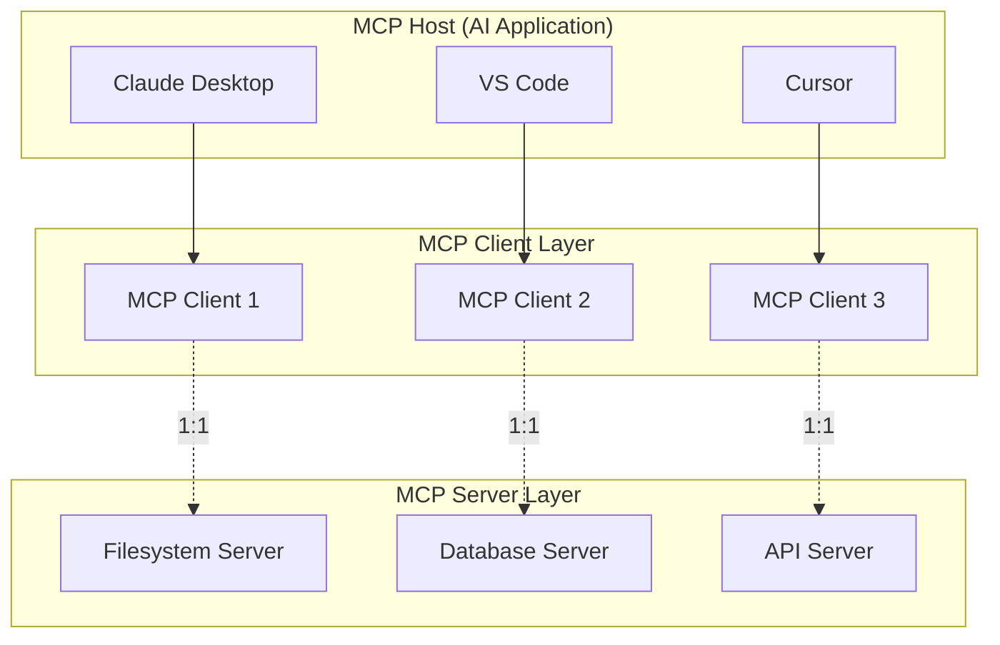
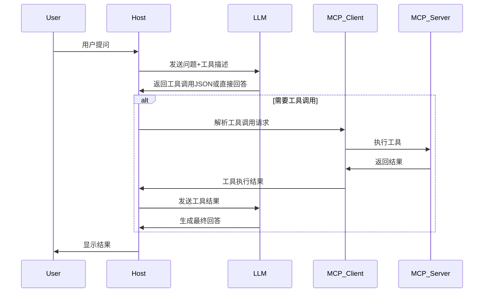
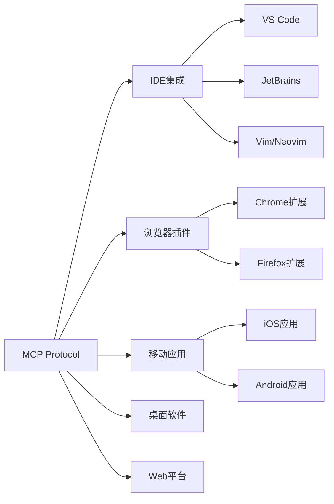

# Model Context Protocol (MCP) 全面解析指南

> **作者**: Claude Code Assistant  
> **版本**: 1.0  
> **最后更新**: 2025年01月  
> **适用范围**: AI应用开发者、系统架构师、产品经理

---

## 📋 目录

1. [概述与核心理念](#1-概述与核心理念)
2. [架构设计深度解析](#2-架构设计深度解析)
3. [核心概念与组件](#3-核心概念与组件)
4. [技术实现原理](#4-技术实现原理)
5. [开发指南](#5-开发指南)
6. [实际应用场景](#6-实际应用场景)
7. [最佳实践](#7-最佳实践)
8. [与其他技术的对比](#8-与其他技术的对比)
9. [生态系统](#9-生态系统)
10. [未来展望](#10-未来展望)

---

## 1. 概述与核心理念

### 1.1 什么是MCP

**Model Context Protocol (MCP)** 是由 Anthropic 于2024年11月25日发布的开放协议，旨在标准化AI应用程序与外部数据源和工具之间的交互方式。

**核心类比**: MCP 就像AI世界的USB-C接口
- **USB-C**: 统一了设备与配件的连接标准
- **MCP**: 统一了AI模型与外部资源的连接标准

### 1.2 解决的核心问题

#### 传统痛点
1. **平台依赖性强**: 不同LLM平台(OpenAI、Google、Anthropic)的函数调用API差异巨大
2. **开发成本高**: 切换模型时需要重写代码，适配成本高
3. **安全性问题**: 敏感数据需要上传到云端
4. **交互性限制**: 缺乏统一的工具调用标准

#### MCP的解决方案
```
传统方式: AI应用 → 特定API → 工具A
                 → 特定API → 工具B
                 → 特定API → 工具C

MCP方式:   AI应用 → MCP协议 → 标准化接口 → 工具A/B/C
```

### 1.3 核心优势

| 优势 | 说明 | 实际价值 |
|------|------|----------|
| **生态统一** | 提供大量现成插件，开箱即用 | 减少重复开发，加速项目落地 |
| **平台无关** | 支持任何兼容MCP的AI模型 | 避免厂商锁定，灵活切换 |
| **数据安全** | 数据留在本地，可控传输 | 满足企业安全合规要求 |
| **标准开放** | 开源协议，社区驱动发展 | 持续演进，生态繁荣 |

---

## 2. 架构设计深度解析

### 2.1 整体架构概览



### 2.2 核心参与者

#### 2.2.1 MCP Host (主机)
- **定义**: 协调和管理多个MCP客户端的AI应用程序
- **职责**: 
  - 接收用户输入
  - 与AI模型交互
  - 管理MCP客户端生命周期
  - 展示最终结果
- **典型实现**: Claude Desktop、VS Code、Cursor

#### 2.2.2 MCP Client (客户端)
- **定义**: 维护与MCP服务器连接的组件
- **职责**:
  - 建立和维护与服务器的连接
  - 处理协议通信
  - 为主机提供上下文数据
- **特点**: 与服务器一对一映射

#### 2.2.3 MCP Server (服务器)
- **定义**: 提供具体功能和数据的程序
- **分类**:
  - **本地服务器**: 运行在本机，使用STDIO传输
  - **远程服务器**: 运行在远程，使用HTTP传输
- **职责**: 执行具体的工具调用、提供资源数据

### 2.3 分层架构

#### 2.3.1 数据层 (Data Layer)
**基于JSON-RPC 2.0的协议层**

```json
{
  "jsonrpc": "2.0",
  "method": "tools/call",
  "params": {
    "name": "filesystem_read",
    "arguments": {
      "path": "/Users/example/document.txt"
    }
  },
  "id": 1
}
```

**核心功能**:
- 生命周期管理: 连接初始化、能力协商、连接终止
- 服务器特性: Tools、Resources、Prompts
- 客户端特性: Sampling、Elicitation、Logging
- 通知机制: 实时更新、进度跟踪

#### 2.3.2 传输层 (Transport Layer)
**两种传输机制**:

| 传输方式 | 适用场景 | 优势 | 限制 |
|----------|----------|------|------|
| **STDIO** | 本地服务器 | 无网络开销，最优性能 | 仅限本机通信 |
| **HTTP/SSE** | 远程服务器 | 支持远程通信，标准认证 | 网络延迟，复杂度高 |

---

## 3. 核心概念与组件

### 3.1 MCP原语 (Primitives)

#### 3.1.1 Tools (工具)
**可执行的函数，AI可以调用来执行操作**

```python
@mcp.tool()
def search_files(pattern: str, directory: str = ".") -> str:
    """搜索文件系统中匹配模式的文件
    
    Args:
        pattern: 搜索模式 (支持通配符)
        directory: 搜索目录 (默认当前目录)
    """
    # 实现搜索逻辑
    return "搜索结果..."
```

**特点**:
- 需要用户授权
- 可以修改系统状态
- 支持复杂参数

#### 3.1.2 Resources (资源)
**为AI提供上下文信息的数据源**

```python
@mcp.resource("config://settings")
def get_app_settings() -> str:
    """获取应用程序配置信息"""
    return json.dumps({
        "database_url": "postgresql://...",
        "api_keys": ["key1", "key2"],
        "features": ["feature_a", "feature_b"]
    })
```

**特点**:
- 只读访问
- 提供结构化数据
- 支持实时更新

#### 3.1.3 Prompts (提示)
**可重用的交互模板**

```python
@mcp.prompt()
def code_review_prompt(code: str, language: str) -> str:
    """代码审查提示模板"""
    return f"""
    请审查以下{language}代码:
    
    ```{language}
    {code}
    ```
    
    重点关注:
    1. 代码质量和可读性
    2. 潜在的安全问题
    3. 性能优化建议
    4. 最佳实践遵循情况
    """
```

### 3.2 客户端原语

#### 3.2.1 Sampling (采样)
**允许服务器请求AI模型补全**

```python
# 服务器可以请求客户端的AI模型进行推理
response = await client.sample_completion(
    prompt="基于以下数据生成报告摘要: ...",
    max_tokens=500
)
```

#### 3.2.2 Elicitation (请求)
**向用户请求额外信息**

```python
# 服务器可以请求用户确认或输入
user_input = await client.request_user_input(
    prompt="请确认是否删除这些文件？",
    input_type="confirmation"
)
```

#### 3.2.3 Logging (日志)
**发送调试和监控信息**

```python
await client.log_message(
    level="info",
    message="文件处理完成",
    data={"processed_files": 42}
)
```

---

## 4. 技术实现原理

### 4.1 工具选择机制

#### 4.1.1 基于Prompt的智能选择

```python
async def build_tools_context(available_tools):
    """构建工具上下文"""
    tools_description = []
    
    for tool in available_tools:
        desc = f"""
        Tool: {tool.name}
        Description: {tool.description}
        Arguments: {format_arguments(tool.input_schema)}
        """
        tools_description.append(desc)
    
    system_prompt = f"""
    你是一个有用的助手，可以访问以下工具:
    
    {chr(10).join(tools_description)}
    
    根据用户的问题选择合适的工具。如果不需要工具，直接回复。
    
    重要：当需要使用工具时，必须只返回以下JSON格式:
    {{
        "tool": "tool-name",
        "arguments": {{
            "argument-name": "value"
        }}
    }}
    """
    
    return system_prompt
```

#### 4.1.2 决策流程



### 4.2 生命周期管理

#### 4.2.1 初始化序列

```json
{
  "jsonrpc": "2.0",
  "method": "initialize",
  "params": {
    "protocolVersion": "2024-11-05",
    "capabilities": {
      "roots": {
        "listChanged": true
      },
      "sampling": {}
    },
    "clientInfo": {
      "name": "Claude Desktop",
      "version": "1.0.0"
    }
  }
}
```

#### 4.2.2 能力协商

```json
{
  "jsonrpc": "2.0",
  "result": {
    "protocolVersion": "2024-11-05",
    "capabilities": {
      "logging": {},
      "tools": {
        "listChanged": true
      },
      "resources": {
        "subscribe": true,
        "listChanged": true
      }
    },
    "serverInfo": {
      "name": "filesystem-server",
      "version": "1.0.0"
    }
  }
}
```

### 4.3 通知机制

```python
# 服务器可以主动通知客户端工具列表变化
await server.send_notification(
    method="notifications/tools/list_changed",
    params={}
)

# 客户端接收到通知后重新获取工具列表
tools = await client.list_tools()
```

---

## 5. 开发指南

### 5.1 环境搭建

#### 5.1.1 Python开发环境

```bash
# 安装uv包管理器
curl -LsSf https://astral.sh/uv/install.sh | sh

# 创建项目
uv init my-mcp-server
cd my-mcp-server

# 设置Python版本
echo "3.11" > .python-version

# 安装依赖
uv add "mcp[cli]"
```

#### 5.1.2 TypeScript开发环境

```bash
# 创建项目
npm init -y
npm install @modelcontextprotocol/sdk

# TypeScript支持
npm install -D typescript @types/node
npx tsc --init
```

### 5.2 开发MCP Server

#### 5.2.1 简单文件操作服务器

```python
import os
from pathlib import Path
from mcp.server.fastmcp import FastMCP

# 创建MCP服务器
mcp = FastMCP("文件操作服务器")

@mcp.tool()
def list_files(directory: str = ".") -> str:
    """列出目录中的所有文件
    
    Args:
        directory: 目录路径，默认为当前目录
    """
    try:
        path = Path(directory)
        if not path.exists():
            return f"目录不存在: {directory}"
        
        files = []
        for item in path.iterdir():
            if item.is_file():
                files.append(f"📄 {item.name}")
            elif item.is_dir():
                files.append(f"📁 {item.name}/")
        
        return "\n".join(files) if files else "目录为空"
    except Exception as e:
        return f"错误: {str(e)}"

@mcp.tool()
def read_file(file_path: str) -> str:
    """读取文件内容
    
    Args:
        file_path: 文件路径
    """
    try:
        with open(file_path, 'r', encoding='utf-8') as f:
            content = f.read()
        return content
    except Exception as e:
        return f"读取文件失败: {str(e)}"

@mcp.tool()
def write_file(file_path: str, content: str) -> str:
    """写入文件内容
    
    Args:
        file_path: 文件路径
        content: 要写入的内容
    """
    try:
        with open(file_path, 'w', encoding='utf-8') as f:
            f.write(content)
        return f"文件写入成功: {file_path}"
    except Exception as e:
        return f"写入文件失败: {str(e)}"

# 资源示例
@mcp.resource("file://config")
def get_config() -> str:
    """获取服务器配置信息"""
    config = {
        "server_name": "文件操作服务器",
        "version": "1.0.0",
        "supported_operations": ["list", "read", "write"],
        "max_file_size": "10MB"
    }
    return json.dumps(config, ensure_ascii=False, indent=2)

if __name__ == "__main__":
    mcp.run()
```

#### 5.2.2 HTTP服务器模式

```python
from mcp.server.fastmcp import FastMCP
from mcp.server.sse import SseServerTransport
import asyncio

mcp = FastMCP("HTTP文件服务器")

# ... 添加工具定义 ...

async def main():
    # 使用SSE传输
    transport = SseServerTransport("/sse")
    
    async with mcp.run_server() as server:
        await transport.run(server, host="localhost", port=8080)

if __name__ == "__main__":
    asyncio.run(main())
```

### 5.3 客户端配置

#### 5.3.1 Claude Desktop配置

```json
{
  "mcpServers": {
    "filesystem": {
      "command": "uv",
      "args": [
        "--directory", "/path/to/your/project",
        "run", "your-server.py"
      ]
    },
    "remote-server": {
      "command": "curl",
      "args": ["-X", "POST", "http://localhost:8080/sse"],
      "env": {
        "API_KEY": "your-api-key"
      }
    }
  }
}
```

#### 5.3.2 环境变量配置

```bash
# ~/.bashrc 或 ~/.zshrc
export MCP_SERVER_PATH="/path/to/your/servers"
export MCP_LOG_LEVEL="debug"
export MCP_TIMEOUT="30000"
```

---

## 6. 实际应用场景

### 6.1 文件管理自动化

**场景**: AI自动整理下载文件夹

```python
@mcp.tool()
def organize_downloads() -> str:
    """自动按文件类型整理下载文件夹"""
    downloads_path = Path.home() / "Downloads"
    
    # 文件类型映射
    type_mapping = {
        'images': ['.jpg', '.jpeg', '.png', '.gif', '.bmp'],
        'documents': ['.pdf', '.doc', '.docx', '.txt', '.rtf'],
        'videos': ['.mp4', '.avi', '.mov', '.mkv'],
        'archives': ['.zip', '.rar', '.7z', '.tar.gz']
    }
    
    organized_count = 0
    for file_path in downloads_path.iterdir():
        if file_path.is_file():
            suffix = file_path.suffix.lower()
            for folder_name, extensions in type_mapping.items():
                if suffix in extensions:
                    target_folder = downloads_path / folder_name
                    target_folder.mkdir(exist_ok=True)
                    file_path.rename(target_folder / file_path.name)
                    organized_count += 1
                    break
    
    return f"已整理 {organized_count} 个文件"
```

### 6.2 开发工作流自动化

**场景**: AI自动进行代码审查

```python
@mcp.tool()
def review_pull_request(repo: str, pr_number: int) -> str:
    """自动审查Pull Request
    
    Args:
        repo: 仓库名称 (格式: owner/repo)
        pr_number: PR编号
    """
    # 获取PR信息
    pr_info = github_client.get_pull_request(repo, pr_number)
    
    # 分析代码变更
    changes = github_client.get_pr_diff(repo, pr_number)
    
    # AI审查
    review_prompt = f"""
    请审查以下代码变更:
    
    标题: {pr_info['title']}
    描述: {pr_info['body']}
    变更文件: {len(changes)} 个
    
    代码变更:
    {format_diff(changes)}
    
    请提供详细的审查意见，包括:
    1. 代码质量评估
    2. 潜在问题识别
    3. 改进建议
    4. 安全风险评估
    """
    
    # 使用客户端采样能力
    review_result = await client.sample_completion(
        prompt=review_prompt,
        max_tokens=1000
    )
    
    # 提交审查评论
    github_client.create_review_comment(
        repo, pr_number, review_result
    )
    
    return f"已完成PR #{pr_number}的自动审查"
```

### 6.3 数据分析自动化

**场景**: 智能数据报告生成

```python
@mcp.tool()
def generate_sales_report(data_source: str, period: str) -> str:
    """生成销售数据报告
    
    Args:
        data_source: 数据源路径或数据库连接
        period: 统计周期 (daily/weekly/monthly)
    """
    # 连接数据源
    data = load_sales_data(data_source, period)
    
    # 数据分析
    analysis = {
        'total_sales': data['amount'].sum(),
        'avg_order_value': data['amount'].mean(),
        'top_products': data.groupby('product')['amount'].sum().head(5),
        'growth_rate': calculate_growth_rate(data, period)
    }
    
    # 生成可视化图表
    chart_data = create_charts(analysis)
    
    # 生成HTML报告
    report_html = generate_html_report(analysis, chart_data)
    
    # 保存报告
    report_path = f"sales_report_{period}_{datetime.now().strftime('%Y%m%d')}.html"
    with open(report_path, 'w', encoding='utf-8') as f:
        f.write(report_html)
    
    return f"销售报告已生成: {report_path}"
```

### 6.4 内容创作辅助

**场景**: 自动生成技术文档

```python
@mcp.tool()
def generate_api_docs(api_spec_path: str) -> str:
    """基于API规范自动生成文档
    
    Args:
        api_spec_path: OpenAPI规范文件路径
    """
    # 解析API规范
    with open(api_spec_path, 'r') as f:
        api_spec = yaml.safe_load(f)
    
    # 提取API信息
    endpoints = extract_endpoints(api_spec)
    models = extract_models(api_spec)
    
    # 生成文档内容
    doc_content = f"""
    # API 文档
    
    ## 概述
    {api_spec.get('info', {}).get('description', '')}
    
    ## 接口列表
    """
    
    for endpoint in endpoints:
        doc_content += format_endpoint_doc(endpoint)
    
    doc_content += "\n## 数据模型\n"
    for model in models:
        doc_content += format_model_doc(model)
    
    # 保存文档
    doc_path = "api_documentation.md"
    with open(doc_path, 'w', encoding='utf-8') as f:
        f.write(doc_content)
    
    return f"API文档已生成: {doc_path}"
```

---

## 7. 最佳实践

### 7.1 安全性最佳实践

#### 7.1.1 权限控制

```python
import os
from pathlib import Path

class SecureFileServer:
    def __init__(self, allowed_paths: list[str]):
        self.allowed_paths = [Path(p).resolve() for p in allowed_paths]
    
    def _is_path_allowed(self, target_path: str) -> bool:
        """检查路径是否在允许范围内"""
        try:
            resolved_path = Path(target_path).resolve()
            return any(
                resolved_path.is_relative_to(allowed) 
                for allowed in self.allowed_paths
            )
        except:
            return False
    
    @mcp.tool()
    def secure_read_file(self, file_path: str) -> str:
        """安全地读取文件"""
        if not self._is_path_allowed(file_path):
            return "错误: 文件路径不在允许范围内"
        
        # 继续执行文件读取...
```

#### 7.1.2 输入验证

```python
from pydantic import BaseModel, validator

class FileOperationArgs(BaseModel):
    file_path: str
    content: str = ""
    
    @validator('file_path')
    def validate_file_path(cls, v):
        # 防止路径遍历攻击
        if '..' in v or v.startswith('/'):
            raise ValueError('不安全的文件路径')
        return v
    
    @validator('content')
    def validate_content(cls, v):
        # 限制内容大小
        if len(v) > 1024 * 1024:  # 1MB
            raise ValueError('文件内容过大')
        return v
```

### 7.2 性能优化

#### 7.2.1 异步操作

```python
import asyncio
import aiofiles

@mcp.tool()
async def batch_process_files(file_paths: list[str]) -> str:
    """批量处理文件"""
    async def process_single_file(file_path: str) -> str:
        async with aiofiles.open(file_path, 'r') as f:
            content = await f.read()
            # 处理文件内容
            processed = await process_content(content)
            return processed
    
    # 并发处理
    tasks = [process_single_file(path) for path in file_paths]
    results = await asyncio.gather(*tasks, return_exceptions=True)
    
    success_count = sum(1 for r in results if not isinstance(r, Exception))
    return f"成功处理 {success_count}/{len(file_paths)} 个文件"
```

#### 7.2.2 缓存机制

```python
from functools import lru_cache
import time

class CachedDataServer:
    def __init__(self):
        self._cache = {}
        self._cache_ttl = 300  # 5分钟
    
    @mcp.tool()
    def get_expensive_data(self, query: str) -> str:
        """获取计算密集型数据（带缓存）"""
        cache_key = f"expensive_data:{query}"
        current_time = time.time()
        
        # 检查缓存
        if cache_key in self._cache:
            data, timestamp = self._cache[cache_key]
            if current_time - timestamp < self._cache_ttl:
                return data
        
        # 计算新数据
        result = expensive_computation(query)
        
        # 更新缓存
        self._cache[cache_key] = (result, current_time)
        
        return result
```

### 7.3 错误处理

#### 7.3.1 优雅的错误处理

```python
import logging
from typing import Union

logger = logging.getLogger(__name__)

@mcp.tool()
def robust_file_operation(operation: str, file_path: str, content: str = "") -> str:
    """健壮的文件操作"""
    try:
        if operation == "read":
            with open(file_path, 'r', encoding='utf-8') as f:
                return f.read()
        elif operation == "write":
            with open(file_path, 'w', encoding='utf-8') as f:
                f.write(content)
            return f"文件写入成功: {file_path}"
        else:
            return f"不支持的操作: {operation}"
            
    except FileNotFoundError:
        logger.warning(f"文件未找到: {file_path}")
        return f"错误: 文件 '{file_path}' 不存在"
    except PermissionError:
        logger.warning(f"权限不足: {file_path}")
        return f"错误: 没有权限访问文件 '{file_path}'"
    except UnicodeDecodeError:
        logger.warning(f"编码错误: {file_path}")
        return f"错误: 文件 '{file_path}' 编码格式不支持"
    except Exception as e:
        logger.error(f"未预期的错误: {str(e)}")
        return f"操作失败: {str(e)}"
```

#### 7.3.2 重试机制

```python
import asyncio
from functools import wraps

def retry(max_attempts: int = 3, delay: float = 1.0):
    def decorator(func):
        @wraps(func)
        async def wrapper(*args, **kwargs):
            last_exception = None
            
            for attempt in range(max_attempts):
                try:
                    return await func(*args, **kwargs)
                except Exception as e:
                    last_exception = e
                    if attempt < max_attempts - 1:
                        await asyncio.sleep(delay * (2 ** attempt))  # 指数退避
                    
            raise last_exception
        return wrapper
    return decorator

@retry(max_attempts=3, delay=1.0)
@mcp.tool()
async def reliable_api_call(endpoint: str) -> str:
    """可靠的API调用"""
    # 可能失败的API调用
    response = await make_api_request(endpoint)
    return response
```

### 7.4 监控和日志

#### 7.4.1 结构化日志

```python
import json
import logging
from datetime import datetime

class StructuredLogger:
    def __init__(self, name: str):
        self.logger = logging.getLogger(name)
        
    def log_tool_call(self, tool_name: str, args: dict, result: str, duration: float):
        """记录工具调用"""
        log_entry = {
            "timestamp": datetime.utcnow().isoformat(),
            "event_type": "tool_call",
            "tool_name": tool_name,
            "arguments": args,
            "result_length": len(result),
            "duration_ms": duration * 1000,
            "success": True
        }
        self.logger.info(json.dumps(log_entry))
    
    def log_error(self, error: Exception, context: dict):
        """记录错误"""
        log_entry = {
            "timestamp": datetime.utcnow().isoformat(),
            "event_type": "error",
            "error_type": type(error).__name__,
            "error_message": str(error),
            "context": context
        }
        self.logger.error(json.dumps(log_entry))

# 使用示例
structured_logger = StructuredLogger("mcp_server")

@mcp.tool()
def monitored_operation(data: str) -> str:
    """带监控的操作"""
    start_time = time.time()
    
    try:
        result = process_data(data)
        duration = time.time() - start_time
        
        structured_logger.log_tool_call(
            tool_name="monitored_operation",
            args={"data_length": len(data)},
            result=result,
            duration=duration
        )
        
        return result
    except Exception as e:
        structured_logger.log_error(e, {"data_length": len(data)})
        raise
```

---

## 8. 与其他技术的对比

### 8.1 MCP vs Function Calling

| 特性 | MCP | Function Calling |
|------|-----|------------------|
| **标准化** | 统一协议，跨平台 | 各厂商实现不同 |
| **平台依赖** | 平台无关 | 强依赖特定LLM |
| **开发成本** | 一次开发，处处运行 | 需要为每个平台适配 |
| **扩展性** | 丰富的生态系统 | 受限于平台能力 |
| **安全性** | 数据可本地化 | 通常需要云端处理 |

### 8.2 MCP vs API Gateway

| 特性 | MCP | API Gateway |
|------|-----|-------------|
| **目标用户** | AI应用开发者 | 通用API管理 |
| **协议特化** | 专为AI交互设计 | 通用HTTP/REST |
| **上下文管理** | 内置上下文支持 | 需要额外实现 |
| **AI优化** | 原生AI工具支持 | 需要自定义适配 |

### 8.3 MCP vs Plugin Systems

| 特性 | MCP | 传统插件系统 |
|------|-----|--------------|
| **架构模式** | 客户端-服务器 | 进程内扩展 |
| **隔离性** | 进程级隔离 | 依赖宿主进程 |
| **稳定性** | 单个服务器故障不影响其他 | 插件错误可能影响整个应用 |
| **语言支持** | 多语言支持 | 通常限制于宿主语言 |

---

## 9. 生态系统

### 9.1 官方MCP服务器

#### 9.1.1 核心工具类

| 服务器 | 功能 | 使用场景 |
|--------|------|----------|
| **filesystem** | 文件系统操作 | 文件管理、代码审查 |
| **github** | GitHub集成 | 代码仓库管理 |
| **postgres** | PostgreSQL数据库 | 数据查询分析 |
| **sqlite** | SQLite数据库 | 本地数据管理 |
| **brave-search** | 网页搜索 | 信息检索 |

#### 9.1.2 开发工具类

| 服务器 | 功能 | 使用场景 |
|--------|------|----------|
| **puppeteer** | 浏览器自动化 | 网页测试、爬虫 |
| **sequential-thinking** | 结构化思维 | 复杂问题分解 |
| **memory** | 对话记忆 | 长期上下文保持 |

### 9.2 第三方生态

#### 9.2.1 热门第三方服务器

```bash
# 高德地图集成
npm install @amap/amap-maps-mcp-server

# Excel操作
pip install excel-mcp-server

# 图表生成
npm install @antv/mcp-server-chart

# Mermaid图表
npm install @peng-shawn/mermaid-mcp-server

# arXiv论文检索
pip install arxiv-mcp-server
```

#### 9.2.2 企业级服务器

```python
# 企业数据库连接器
@mcp.tool()
def query_enterprise_db(sql: str) -> str:
    """查询企业数据库"""
    # 安全的SQL执行
    # 结果格式化
    # 权限验证
    pass

# 企业API集成
@mcp.tool()
def call_enterprise_api(endpoint: str, params: dict) -> str:
    """调用企业内部API"""
    # API认证
    # 请求处理
    # 响应转换
    pass
```

### 9.3 开发工具

#### 9.3.1 MCP Inspector
**调试和测试工具**

```bash
# 启动检查器
mcp dev your-server.py

# 访问 http://localhost:5173
# 功能:
# - 工具列表查看
# - 实时调用测试
# - 参数验证
# - 响应预览
```

#### 9.3.2 SDK支持

```python
# Python SDK
from mcp.server.fastmcp import FastMCP
from mcp.server.sse import SseServerTransport

# TypeScript SDK
import { Server } from "@modelcontextprotocol/sdk/server/index.js";
import { StdioServerTransport } from "@modelcontextprotocol/sdk/server/stdio.js";
```

---

## 10. 未来展望

### 10.1 技术发展趋势

#### 10.1.1 协议演进
- **版本兼容性**: 向后兼容的协议升级
- **性能优化**: 更高效的传输机制
- **安全增强**: 更严格的安全标准

#### 10.1.2 AI能力增强
- **多模态支持**: 图像、音频、视频处理
- **实时交互**: 低延迟的实时响应
- **智能调度**: 更智能的工具选择算法

### 10.2 生态扩展

#### 10.2.1 平台集成


#### 10.2.2 行业应用

```python
# 医疗健康MCP服务器
@mcp.tool()
def analyze_medical_image(image_path: str) -> str:
    """分析医学影像"""
    # AI辅助诊断
    # 病变检测
    # 报告生成
    pass

# 金融分析MCP服务器
@mcp.tool()
def analyze_market_data(symbol: str, period: str) -> str:
    """分析市场数据"""
    # 技术指标计算
    # 风险评估
    # 投资建议
    pass

# 教育MCP服务器
@mcp.tool()
def generate_quiz(topic: str, difficulty: str) -> str:
    """生成测验题目"""
    # 智能出题
    # 难度调节
    # 个性化推荐
    pass
```

### 10.3 挑战与机遇

#### 10.3.1 技术挑战
- **性能优化**: 大规模部署的性能瓶颈
- **安全防护**: 更复杂的安全威胁
- **标准化**: 不同实现间的兼容性

#### 10.3.2 发展机遇
- **AI普及**: AI应用的广泛采用
- **开发者社区**: 活跃的开源社区
- **企业需求**: 企业级AI应用的需求增长

---

## 📚 参考资源

### 官方资源
- [MCP官方文档](https://modelcontextprotocol.io/)
- [MCP GitHub仓库](https://github.com/modelcontextprotocol)
- [Python SDK文档](https://modelcontextprotocol.io/docs/python)
- [TypeScript SDK文档](https://modelcontextprotocol.io/docs/typescript)

### 社区资源
- [Awesome MCP Servers](https://github.com/modelcontextprotocol/servers)
- [MCP Server Registry](https://mcp.so/)
- [社区讨论](https://github.com/modelcontextprotocol/specification/discussions)

### 学习教程
- [MCP快速入门指南](https://modelcontextprotocol.io/docs/getting-started)
- [构建第一个MCP服务器](https://modelcontextprotocol.io/docs/getting-started/server)
- [MCP安全最佳实践](https://modelcontextprotocol.io/docs/concepts/security)

### 实用工具
- [MCP Inspector](https://modelcontextprotocol.io/docs/tools/inspector)
- [MCP CLI](https://modelcontextprotocol.io/docs/tools/cli)
- [服务器模板](https://github.com/modelcontextprotocol/create-server)

---

**© 2025 Claude Code Assistant. 本文档遵循MIT许可证。**

> 📝 **更新日志**  
> - v1.0 (2025-01): 初版发布，完整覆盖MCP技术栈
> - 持续更新中...

> 💡 **贡献指南**  
> 欢迎提交Issue和Pull Request来完善本文档