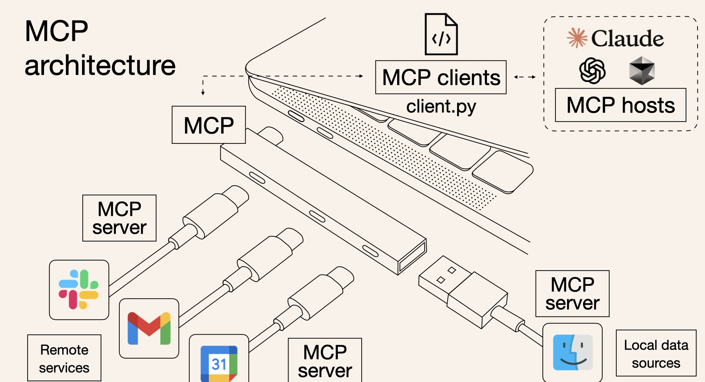
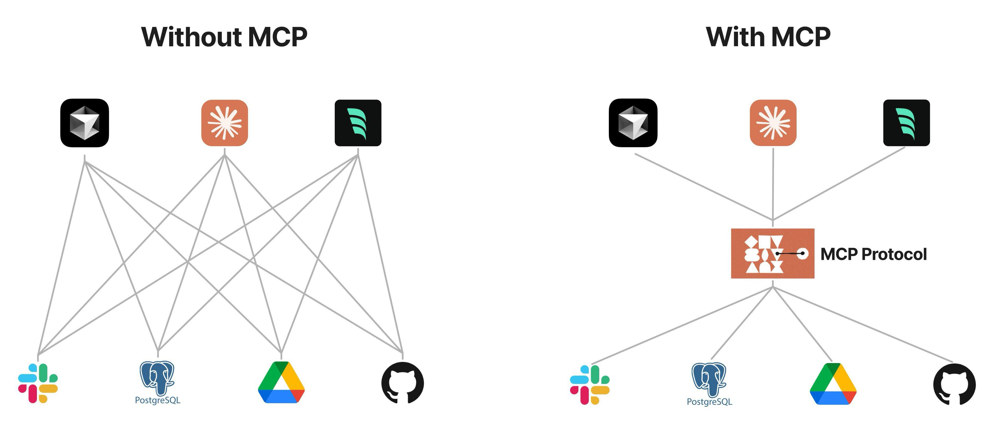
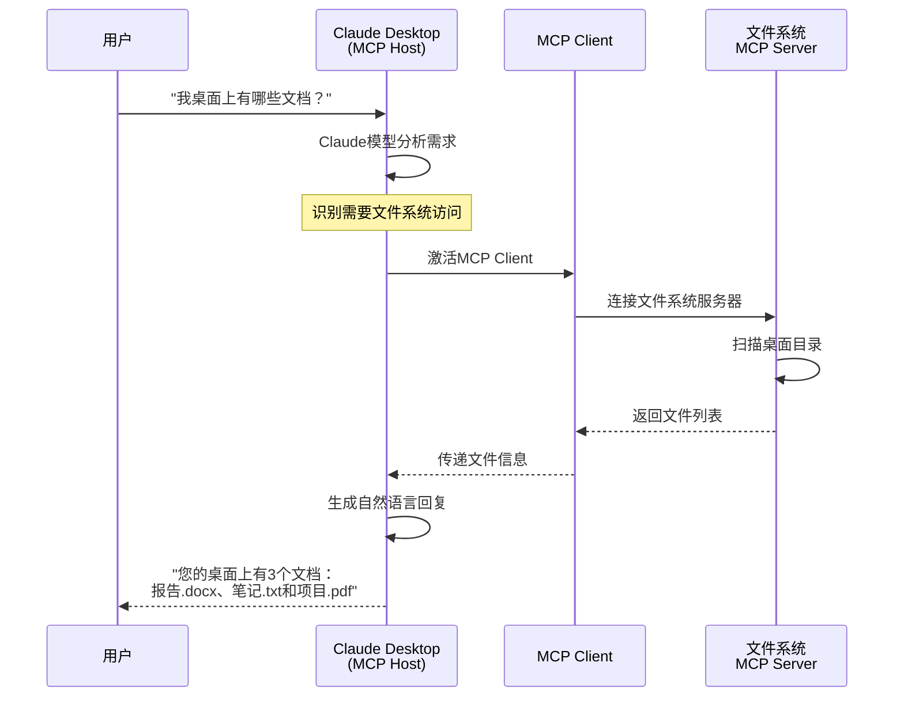
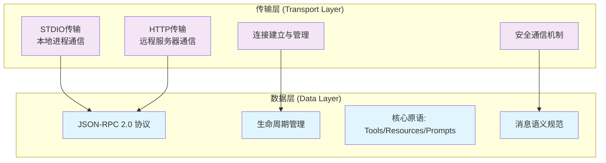
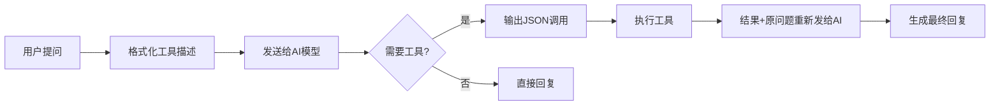

# Model Context Protocol (MCP) 完整指南



## 目录

- [1. MCP 核心概念](#1-mcp-核心概念)
  - [1.1 什么是 MCP？](#11-什么是-mcp)
  - [1.2 为什么需要MCP？](#12-为什么需要mcp)
  - [1.3 MCP vs Function Call](#13-mcp-vs-function-call)
- [2. MCP 架构设计](#2-mcp-架构设计)
  - [2.1 双层架构：协议与传输分离](#21-双层架构协议与传输分离)
  - [2.2 MCP架构分层](#22-mcp架构分层)
  - [2.3 核心原语概述](#23-核心原语概述)
- [3. MCP 技术深入](#3-mcp-技术深入)
  - [3.1 服务器原语（Server Primitives）](#31-服务器原语server-primitives)
  - [3.2 客户端原语（Client Primitives）](#32-客户端原语client-primitives)
  - [3.3 AI工具选择机制深度解析](#33-ai工具选择机制深度解析)
- [4. 开发实战指南 (动手实践)](#4-开发实战指南-动手实践)
  - [4.1 5分钟创建第一个MCP工具](#41-5分钟创建第一个mcp工具)
  - [4.2 完整实战案例：桌面文档管理器](#42-完整实战案例桌面文档管理器)
- [5. MCP 安装配置指南](#5-mcp-安装配置指南)
  - [5.1 claude mcp 命令概述](#51-claude-mcp-命令概述)
  - [5.2 claude mcp add 详解](#52-claude-mcp-add-详解)
  - [5.3 其他管理命令](#53-其他管理命令)
  - [5.4 安装配置方式](#54-安装配置方式)
- [6. MCP 生态系统](#6-mcp-生态系统)
  - [6.1 官方工具集](#61-官方工具集)
  - [6.2 社区工具推荐](#62-社区工具推荐)

---

## 1. MCP 核心概念

### 1.1 什么是 MCP？

**Model Context Protocol (MCP)** 是由 Anthropic 于 2024年11月25日 发布的开放协议，专门用于标准化 AI 应用程序与外部数据源和工具之间的交互方式。

### MCP 核心架构

MCP 采用**客户端-服务器架构设计**，AI应用通过MCP客户端与多个MCP服务器建立一对一连接：


#### 架构参与者（Participants）

**MCP Host（AI应用）**：
- **定义**：协调和管理一个或多个MCP客户端的AI应用
- **示例**：Claude Code、Claude Desktop、Visual Studio Code
- **职责**：创建客户端实例、协调多服务器通信、管理生命周期

**MCP Client（客户端）**：
- **定义**：维护与MCP服务器连接并获取上下文的组件
- **特点**：与MCP服务器保持专用的一对一连接
- **职责**：协议通信、消息传递、状态管理

**MCP Server（服务器）**：
- **定义**：向MCP客户端提供上下文的程序
- **类型**：本地服务器（STDIO）、远程服务器（HTTP/SSE）
- **示例**：Sentry服务器、文件系统服务器、数据库服务器


#### 核心类比：AI 世界的 USB-C
就像 USB-C 为各种设备提供了统一的连接标准，MCP 为 AI 模型与外部资源提供了统一的交互协议。



### 1.2 为什么需要MCP？

#### Prompt Engineering 发展的必然产物

MCP的出现是 **Prompt Engineering 发展的自然结果**。更结构化的上下文信息对模型性能提升是显著的：

```
发展阶段对比：
┌─────────────────────────────────────────────┐
│ 手工Prompt时代                               │
│ ├─ 人工从数据库筛选信息                      │
│ ├─ 手动复制粘贴到prompt中                    │
│ └─ 问题复杂度↑ = 手工成本↑↑                 │
└─────────────────────────────────────────────┘
                    ↓
┌─────────────────────────────────────────────┐
│ Function Call时代                           │
│ ├─ 预定义函数获取数据                        │
│ ├─ 自动化水平显著提升                        │
│ └─ 但平台依赖性强，兼容性差                  │
└─────────────────────────────────────────────┘
                    ↓
┌─────────────────────────────────────────────┐
│ MCP统一协议时代                             │
│ ├─ 标准化工具调用接口                        │
│ ├─ 跨平台兼容，生态共享                      │
│ └─ 数据安全，本地处理                        │
└─────────────────────────────────────────────┘
```

#### Function Call 的根本局限性

**平台依赖性问题**：
```python
# OpenAI 方式
functions=[{
    "name": "get_weather", 
    "parameters": {"type": "object", "properties": {...}}
}]

# Google 方式  
tools=[vertexai.generative_models.Tool(
    function_declarations=[...]
)]

# 切换模型 = 重写所有代码！
```

**核心痛点对比**：

| 方面 | Function Call | MCP |
|-----|--------------|-----|
| **工具定义格式** | 各平台语法不同，需要多套适配代码 | 统一JSON-RPC格式，一套代码多平台复用 |
| **开发复杂度** | 每个AI平台需要单独开发和维护 | 标准化接口，降低开发和维护成本 |
| **生态建设** | 各自为政，重复开发相同功能 | 社区共建，工具可跨平台共享 |
| **协议标准化** | 缺乏统一标准，厂商各自定义 | 基于JSON-RPC 2.0的开放标准协议 |
| **支持范围** | 主要在各自AI平台生态内 | 目前主要支持Claude系列，逐步扩展中 |

#### MCP的核心洞察

**设计哲学**: "数据与工具是客观存在的，连接方式应该标准化"

```
传统困境:
┌─────────────┐    ┌─────────────┐    ┌─────────────┐
│   工具A     │    │   工具B     │    │   工具C     │
│  (MySQL)    │    │ (文件系统)   │    │  (API调用)  │
└─────────────┘    └─────────────┘    └─────────────┘
       │                  │                  │
    专用接口           专用接口           专用接口
       │                  │                  │
┌─────────────┐    ┌─────────────┐    ┌─────────────┐
│  OpenAI     │    │   Google    │    │   Claude    │
│ Functions   │    │ Extensions  │    │ Tool Use    │
└─────────────┘    └─────────────┘    └─────────────┘

MCP方案:
┌─────────────┐    ┌─────────────┐    ┌─────────────┐
│MCP Server A │    │MCP Server B │    │MCP Server C │
│  (MySQL)    │    │ (文件系统)   │    │  (API调用)  │
└─────────────┘    └─────────────┘    └─────────────┘
       │                  │                  │
         \                │                /
          \               │               /
           ──────── MCP Protocol ────────
                         │
    ┌─────────────────────────────────────────┐
    │        任何支持MCP的AI应用                │
    │   OpenAI, Google, Claude, 自定义...      │
    └─────────────────────────────────────────┘
```

### 1.3 MCP的核心价值

#### 四大技术优势

**1. 生态统一** - 一次开发，处处运行
- 100+ 现成MCP服务器可直接使用
- 社区共建，避免重复造轮

**2. 平台无关** - 告别厂商锁定  
- 同一套工具适配所有AI模型
- 自由选择最佳模型方案

**3. 数据安全** - 本地处理，精确控制
- 敏感数据无需上传云端
- 用户完全控制数据访问权限

**4. 标准化** - 统一接口，降低复杂度
- JSON-RPC 2.0 标准协议
- 类型安全的参数验证

#### 不同角色的价值

**对开发者**
- 减少 80% 的重复工作：一次开发，多平台复用
- 降低学习曲线：统一的开发模式和 API
- 丰富的生态：100+ 现成的 MCP 服务器可直接使用

**对企业**
- 数据安全：敏感数据留在本地，精确控制访问权限  
- 降低成本：避免厂商锁定，灵活选择 AI 模型
- 快速集成：标准化接口，加速 AI 项目落地

**对用户**
- 更智能的 AI：能访问实时数据和专业工具
- 无缝体验：在不同应用间保持上下文连续性
- 隐私保护：数据处理透明可控

---

## 2. MCP 怎么工作

### 2.1 从实际场景理解MCP工作流程

让我们通过一个实际场景来理解MCP是如何工作的：

#### 场景：你问Claude "我桌面上有哪些文档？"

**MCP交互流程图**：



**完整的交互流程**：

1. **用户提问** → "我桌面上有哪些文档？"
2. **AI分析** → 识别需要文件系统访问权限  
3. **MCP连接** → 激活文件系统MCP服务器
4. **执行操作** → 扫描桌面目录，获取文件列表
5. **返回结果** → 整合文件信息生成自然回复
6. **用户获得答案** → 看到真实的桌面文件清单

这就是MCP的魅力：**让AI能够像人一样，在需要时主动获取实时信息来回答问题**。

### 2.2 MCP双层架构

**MCP架构分层图**：



MCP采用分层设计，包含两个核心层次：

#### 数据层（Data Layer）
- **协议基础**：基于JSON-RPC 2.0的通信协议
- **生命周期管理**：处理连接初始化、能力协商、连接终止
- **核心原语**：定义Tools、Resources、Prompts等功能
- **消息语义**：规定客户端和服务器之间的交互规范

#### 传输层（Transport Layer）  
- **通信机制**：管理客户端和服务器之间的连接通道
- **STDIO传输**：本地进程间通信，性能最优，无网络开销
- **HTTP传输**：远程服务器通信，支持标准HTTP认证
- **消息框架**：处理连接建立、消息传递、安全通信

**分层优势**：
- 数据层专注协议语义，传输层处理通信细节
- 相同的JSON-RPC消息格式适用于所有传输方式
- 架构清晰，便于扩展和维护

### 2.3 核心原语概述

MCP基于官方架构设计，采用双向通信模式，包含两大类核心原语：

**服务器原语（Server Primitives）**：
- **Tools (工具)** - 让AI执行具体操作，如读取文件、查询数据库、调用API等
- **Resources (资源)** - 为AI提供上下文信息，如配置文件、系统状态、日志记录等  
- **Prompts (提示模板)** - 为特定任务提供标准化的处理模板和专业指导

**客户端原语（Client Primitives）**：
- **Sampling (采样)** - 服务器可请求客户端使用AI模型生成内容
- **Elicitation (交互)** - 服务器可请求客户端从用户获取额外信息
- **Logging (日志)** - 服务器可向客户端发送日志消息

当你问"桌面上有哪些文档？"时，AI主要通过服务器原语中的Tools扫描文件系统，必要时可结合Resources了解系统环境。

> **技术实现详解**：完整的技术规范、代码示例和开发指南请参考第3章《MCP技术深入》。

### 2.4 MCP交互流程总览

现在我们知道了MCP的核心原语，让我们看看它们是如何协同工作的：

#### 实际运行示例

以"帮我整理桌面文件"为例：

**步骤分解**：
1. **用户请求** → "帮我整理桌面文件"
2. **AI分析** → 需要文件信息 + 整理建议
3. **能力调用**：
   - **Tools**: 扫描桌面文件
   - **Resources**: 读取系统信息  
   - **Prompts**: 应用整理模板
4. **结果整合** → 个性化的文件整理方案
5. **回复用户** → 提供具体整理建议

> **想深入了解技术实现细节？** 包括双向通信机制、工具选择算法、架构设计原理等，请参考第3章《MCP技术深入》。


---

## 3. MCP 技术深入

本章深入解析MCP的核心架构。根据官方架构文档，MCP协议采用双向通信设计，包含两大类核心原语：

- **服务器原语**（Server Primitives）：Tools、Resources、Prompts - 由服务器实现并向客户端公开
- **客户端原语**（Client Primitives）：Sampling、Elicitation、Logging - 由客户端实现并向服务器提供

这种对称设计使得服务器和客户端都能主动发起交互，构建了真正的双向通信能力。

### 3.1 服务器原语（Server Primitives）

**理解服务器原语的核心思路**：把MCP服务器想象成一个"工具箱"，里面装着AI可以使用的各种能力。就像现实中的工具箱有螺丝刀、扳手、锤子，MCP工具箱里有Tools（干活的工具）、Resources（参考资料）、Prompts（操作手册）。

**实际使用分布**：
- **Tools (90%+)**：日常使用的主力工具，如读文件、查数据库、调API
- **Resources (<20%)**：提供背景信息，如系统配置、环境状态  
- **Prompts (<5%)**：特殊场景的专业模板，如代码审查、文档生成

服务器原语是MCP协议的核心组件，由服务器实现并向客户端公开。根据官方架构标准，包含三种类型：

#### 3.1.1 Tools - 工具调用

**定义**：Tools是MCP服务器向客户端公开的可调用函数，让AI能够执行具体操作。

**如何定义工具**：
```python
from mcp.server.fastmcp import FastMCP

mcp = FastMCP("文件管理工具")

@mcp.tool()
def read_file(file_path: str) -> str:
    """读取指定文件内容
    
    Args:
        file_path: 文件路径
        
    Returns:
        文件内容字符串
    """
    try:
        with open(file_path, 'r', encoding='utf-8') as f:
            return f.read()
    except FileNotFoundError:
        return f"错误：文件 {file_path} 不存在"
    except Exception as e:
        return f"读取文件时出错：{str(e)}"
```

**如何使用工具**：
1. AI分析用户需求，自动选择合适工具
2. AI填充必要参数，调用工具函数
3. 工具执行后返回结果给AI
4. AI基于结果生成用户友好的回复

**实际效果**：
- 用户说："帮我读取config.json文件内容"
- AI自动调用`read_file("config.json")`
- 返回文件内容或错误信息


#### 3.1.2 Resources - 资源访问（可选功能）

**定义**：Resources为AI提供上下文信息，如配置文件、系统状态等。

**如何定义资源**：
```python
@mcp.resource("config://app/settings")
def get_app_config():
    """获取应用配置信息"""
    return {
        "name": "My App",
        "version": "1.0.0",
        "debug_mode": False
    }
```

**使用场景**：AI可以通过`@config://app/settings`引用此资源，获取应用配置信息来提供更准确的建议。实际使用中较少，大多数情况通过Tools获取数据更直接。

#### 3.1.3 Prompts - 提示模板（高级功能）

**定义**：Prompts是预定义模板，为特定任务提供标准化处理模板。

**如何定义提示模板**：
```python
@mcp.prompt()
def code_review_prompt(code: str) -> str:
    """代码审查提示模板"""
    return f"""请审查以下代码的：
1. 代码规范和风格
2. 潜在的bug和安全问题
3. 性能优化建议
4. 可读性和维护性

代码：
{code}
"""
```

**使用场景**：通过`/code-review`命令调用此模板，为代码审查提供标准化指导。在实际项目中使用较少。

### 3.2 客户端原语（Client Primitives）

**理解客户端原语的核心思路**：如果说服务器原语是"AI能调用的工具"，那客户端原语就是"工具能反过来请求AI做的事"。这实现了真正的双向通信：不仅AI能使用工具，工具也能"回调"AI。

**典型使用场景**：
- **代码生成工具**：请求AI根据需求生成代码（Sampling）
- **配置向导**：请求用户输入API密钥、选择环境（Elicitation）  
- **监控系统**：向客户端发送运行状态、错误信息（Logging）

**实际使用频率较低**：大多数MCP工具只需要服务器原语就够用了，客户端原语主要用于高级交互场景。

客户端原语是MCP客户端提供给服务器的能力，实现服务器到客户端的反向调用。

#### 3.2.1 Sampling - 模型推理

**作用**：服务器可以请求客户端使用AI模型生成内容

**使用场景**：
```python
# 服务器请求客户端生成代码
def generate_code_suggestion(requirements: str):
    """请求AI生成代码建议"""
    prompt = f"根据需求生成Python代码：{requirements}"
    
    # 向客户端发起采样请求
    response = client.sampling.create_message(
        messages=[{"role": "user", "content": prompt}],
        max_tokens=500,
        temperature=0.7
    )
    
    return response.content
```

#### 3.2.2 Elicitation - 用户交互

**作用**：服务器可以请求客户端从用户获取额外信息

**实现示例**：
```python
def interactive_setup():
    """交互式配置设置"""
    
    # 请求用户输入API密钥
    api_key = client.elicitation.request_input(
        prompt="请输入您的API密钥：",
        input_type="password"
    )
    
    # 请求用户选择配置选项
    env = client.elicitation.request_choice(
        prompt="选择运行环境：",
        choices=["development", "staging", "production"]
    )
    
    return {"api_key": api_key, "environment": env}
```

#### 3.2.3 Logging - 日志记录

**作用**：服务器可以向客户端发送日志信息

**日志级别和使用**：
```python
import logging

def complex_operation():
    """演示日志记录的复杂操作"""
    
    client.logging.log(
        level="INFO", 
        message="开始执行复杂操作"
    )
    
    try:
        # 执行某些操作
        result = perform_calculation()
        
        client.logging.log(
            level="DEBUG",
            message=f"计算结果: {result}"
        )
        
        return result
        
    except Exception as e:
        client.logging.log(
            level="ERROR",
            message=f"操作失败: {str(e)}"
        )
        raise
```

### 3.3 AI工具选择机制深度解析

MCP最神奇的地方在于：**AI是如何从众多工具中精确选择合适的那一个**？这背后的原理值得深入了解。

#### 3.3.1 工具如何"自我介绍"：描述格式化机制

**核心问题**：MCP工具如何让AI"看懂"自己？

**关键洞察**：AI无法直接理解代码，只能通过文本描述来认识工具。MCP框架会自动将每个工具转换为AI可理解的结构化文本。

**第一步：工具描述自动格式化**

当用户提问时，MCP客户端会将所有可用工具转换为结构化文本：

```python
# 工具描述格式化机制
class Tool:
    def format_for_llm(self) -> str:
        """将工具信息格式化为AI可理解的文本"""
        args_desc = []
        if "properties" in self.input_schema:
            for param_name, param_info in self.input_schema["properties"].items():
                arg_desc = f"- {param_name}: {param_info.get('description', 'No description')}"
                if param_name in self.input_schema.get("required", []):
                    arg_desc += " (required)"
                args_desc.append(arg_desc)
        
        return f"""
Tool: {self.name}
Description: {self.description}
Arguments:
{chr(10).join(args_desc)}
"""
```

**第二步：构建System Prompt**

所有工具描述会被整合到一个统一的system prompt中：

```python
# System Prompt构建（基于实际MCP源码）
async def start(self):
    # 获取所有工具
    all_tools = []
    for server in self.servers:
        tools = await server.list_tools()
        all_tools.extend(tools)
    
    # 格式化工具描述
    tools_description = "\n".join([tool.format_for_llm() for tool in all_tools])
    
    # 构建System Prompt
    system_message = (
        "You are a helpful assistant with access to these tools:\n\n"
        f"{tools_description}\n"
        "Choose the appropriate tool based on the user's question. "
        "If no tool is needed, reply directly.\n\n"
        "IMPORTANT: When you need to use a tool, you must ONLY respond with "
        "the exact JSON object format below, nothing else:\n"
        '{"tool": "tool-name", "arguments": {"argument-name": "value"}}\n\n'
        "After receiving a tool's response:\n"
        "1. Transform the raw data into a natural, conversational response\n"
        "2. Keep responses concise but informative\n"
        "3. Focus on the most relevant information"
    )
```

**工具信息的自动提取**

MCP通过装饰器自动提取工具元信息：

```python
@mcp.tool()
def get_weather(city: str, unit: str = "celsius") -> str:
    """获取指定城市的天气信息
    
    Args:
        city: 城市名称，如"北京"、"上海"
        unit: 温度单位，支持celsius和fahrenheit，默认celsius
    """
    # 工具实现
```

**自动提取的信息**：
- **name**: 函数名 `get_weather`
- **description**: docstring中的描述  
- **arguments**: 通过类型注解推断参数类型和要求
- **required**: 无默认值的参数自动标记为required

#### 3.3.2 AI如何"使用工具"：调用执行机制

**核心问题**：AI拿到工具描述后，如何决定使用哪个工具并执行？

**执行逻辑**：AI通过分析用户问题和工具描述，输出JSON格式的调用指令，然后系统执行工具并将结果反馈给AI。



通过源码深入分析，AI使用工具的过程可以分为两个关键步骤：

**步骤1：AI分析决策阶段**
AI分析用户问题，对比所有工具描述，决定是否需要工具以及选择哪个工具：

```python
# 简化的核心执行逻辑
while True:
    # 用户输入消息
    messages.append({"role": "user", "content": user_input})
    
    # 发送给AI模型（包含system prompt和用户消息）
    llm_response = self.llm_client.get_response(messages)
    
    # 处理AI响应（检查是否包含工具调用）
    result = await self.process_llm_response(llm_response)
    
    # 如果执行了工具，将结果重新发给AI
    if result != llm_response:
        messages.append({"role": "assistant", "content": llm_response})
        messages.append({"role": "system", "content": result})
        
        # 获取最终回复
        final_response = self.llm_client.get_response(messages)
        messages.append({"role": "assistant", "content": final_response})
    else:
        # 无需工具，直接返回
        messages.append({"role": "assistant", "content": llm_response})
```

**步骤2：系统执行阶段**
系统接收AI的调用指令，执行具体工具，并将结果返回给AI：

```python
async def process_llm_response(self, llm_response):
    """处理AI响应，执行工具调用"""
    # 检查是否包含JSON格式的工具调用
    if self.is_tool_call(llm_response):
        try:
            # 解析工具调用JSON
            tool_call = self.parse_tool_call(llm_response)
            
            # 执行指定工具
            result = await self.execute_tool(tool_call)
            
            return result
            
        except Exception as e:
            # 容错处理：跳过无效工具调用
            return llm_response
    
    return llm_response
```

**关键设计洞察**：
- **Prompt工程核心**：所有工具选择基于结构化文本描述，任何支持Prompt的模型理论上都能使用MCP
- **Claude专项优化**：Anthropic针对Claude做了专门的MCP训练，因此Claude在工具选择准确性上表现更好
- **双轮对话机制**：工具执行结果与原问题一起重新发送给AI，确保AI能基于实际数据生成自然回复
- **容错设计**：无效的工具调用被自动跳过，保证对话连续性

#### 3.3.3 开发最佳实践

**工具描述优化**

```python
# ❌ 模糊的描述
@mcp.tool()
def process_data(data: str) -> str:
    """处理数据"""
    pass

# ✅ 清晰的描述  
@mcp.tool()
def analyze_sales_data(csv_data: str) -> str:
    """分析销售数据并生成报告
    
    功能：解析CSV格式的销售数据，计算总销售额、平均订单价值、
    最佳销售产品等关键指标，并生成结构化的分析报告。
    
    Args:
        csv_data: CSV格式的销售数据，必须包含date,product,amount列
        
    Returns:
        包含销售分析结果的JSON格式报告
    """
    pass
```

**参数设计原则**

1. **参数名要语义化**: 使用`city_name`而不是`c`
2. **提供默认值**: 减少必需参数数量
3. **类型注解完整**: 帮助MCP生成准确的参数描述
4. **文档字符串详细**: 说明参数用途、格式要求、示例值

---

## 4. 开发实战指南 (动手实践)

### 4.1 5分钟创建第一个MCP工具

#### 目标：创建一个天气查询服务器
基于官方示例，让Claude能够查询美国天气预报和灾害预警

#### 五步搞定

**Step 1: 环境搭建**
```bash
# 安装现代Python包管理器
curl -LsSf https://astral.sh/uv/install.sh | sh

# 创建项目
mkdir weather-server && cd weather-server
uv init --python=3.11

# 安装依赖
uv add "mcp[cli]" httpx

# 创建文件
touch weather.py
```

**Step 2: 核心代码**

#### 代码结构示意图

```
weather.py 核心组件
├── 🛠️ MCP工具（核心）
│   ├── get_alerts(state)     # 天气预警
│   └── get_forecast(lat,lon) # 天气预报
├── 🔧 辅助函数
│   ├── make_nws_request()    # API调用
│   └── format_alert()       # 数据格式化
└── 🚀 mcp.run()             # 启动服务器
```

#### 数据流向图

```
用户提问 → Claude → MCP客户端 → weather.py → 美国气象局API
    ↑                                ↓              ↓
格式化回答 ← Claude ← MCP客户端 ← 数据处理 ← JSON响应
```

<details>
<summary>点击展开完整代码 (weather.py)</summary>

```python
from typing import Any
import httpx
from mcp.server.fastmcp import FastMCP

# 初始化FastMCP服务器
mcp = FastMCP("weather")

# 常量配置
NWS_API_BASE = "https://api.weather.gov"
USER_AGENT = "weather-app/1.0"

async def make_nws_request(url: str) -> dict[str, Any] | None:
    """向NWS API发送请求，带错误处理"""
    headers = {
        "User-Agent": USER_AGENT,
        "Accept": "application/geo+json"
    }
    
    async with httpx.AsyncClient() as client:
        try:
            response = await client.get(url, headers=headers, timeout=30.0)
            response.raise_for_status()
            return response.json()
        except Exception:
            return None

def format_alert(feature: dict) -> str:
    """格式化预警信息为可读字符串"""
    props = feature["properties"]
    return f"""
事件: {props.get('event', 'Unknown')}
区域: {props.get('areaDesc', 'Unknown')}
严重程度: {props.get('severity', 'Unknown')}
描述: {props.get('description', 'No description available')}
指导: {props.get('instruction', 'No specific instructions provided')}
"""

@mcp.tool()
async def get_alerts(state: str) -> str:
    """获取美国州的天气预警
    
    Args:
        state: 美国州代码，如CA、NY
    """
    url = f"{NWS_API_BASE}/alerts/active/area/{state}"
    data = await make_nws_request(url)
    
    if not data or "features" not in data:
        return "无法获取预警信息或未找到预警。"
    
    if not data["features"]:
        return "该州没有活跃的天气预警。"
    
    alerts = [format_alert(feature) for feature in data["features"]]
    return "\n---\n".join(alerts)

@mcp.tool()
async def get_forecast(latitude: float, longitude: float) -> str:
    """获取指定位置的天气预报
    
    Args:
        latitude: 纬度
        longitude: 经度
    """
    # 首先获取预报网格端点
    points_url = f"{NWS_API_BASE}/points/{latitude},{longitude}"
    points_data = await make_nws_request(points_url)
    
    if not points_data:
        return "无法获取该位置的预报数据。"
    
    # 从points响应中获取预报URL
    forecast_url = points_data["properties"]["forecast"]
    forecast_data = await make_nws_request(forecast_url)
    
    if not forecast_data:
        return "无法获取详细预报。"
    
    # 格式化预报时段为可读格式
    periods = forecast_data["properties"]["periods"]
    forecasts = []
    
    for period in periods[:5]:  # 只显示接下来5个时段
        forecast = f"""
{period['name']}:
温度: {period['temperature']}°{period['temperatureUnit']}
风力: {period['windSpeed']} {period['windDirection']}
预报: {period['detailedForecast']}
"""
        forecasts.append(forecast)
    
    return "\n---\n".join(forecasts)

if __name__ == "__main__":
    # 初始化并运行服务器
    mcp.run(transport='stdio')
```

</details>

**Step 3: 测试服务器**

服务器代码完成后，首先进行独立测试确保功能正常：

```bash
# 启动MCP服务器（独立运行模式）
uv run weather.py
```

**预期行为**：
- 服务器启动后会等待来自MCP客户端的消息
- 不会有可见输出，这是正常的（服务器在监听STDIO输入）
- 按 `Ctrl+C` 可以停止服务器

**这一步的作用**：
- ✅ 验证代码语法正确
- ✅ 确认依赖库正常加载
- ✅ 检查服务器能够正常启动
- ✅ 为下一步的Claude配置做准备

**Step 4: 配置Claude Code**

```bash
# 在当前项目中添加MCP服务器
claude mcp add weather -- uv run weather.py

# 验证配置
claude mcp list

# 查看详细信息
claude mcp get weather
```

**Step 5: 测试效果**

在Claude中测试以下问题：

1. **天气预报查询**：
   "萨克拉门托的天气怎么样？"（纬度38.5816，经度-121.4944）

2. **预警信息查询**：
   "德克萨斯州有什么天气预警吗？"

Claude会自动：
- 识别需要天气查询功能
- 选择合适的工具（get_forecast 或 get_alerts）
- 调用美国国家气象局API
- 返回格式化的天气信息

#### 核心学习点
- **装饰器 `@mcp.tool()`**：将异步函数变成MCP工具
- **类型注解**：支持多种参数类型（字符串、浮点数）
- **错误处理**：API调用的容错机制
- **异步支持**：处理网络请求的最佳实践

### 4.2 进阶实践：完整MCP服务器

#### 实际项目案例：桌面txt文件管理器

基于前面的基础版本，我们创建一个包含Tools、Resources、Prompts的完整MCP服务器：

**完整功能清单**：
- **4个工具**：统计文件、列出文件、查找文件、获取系统信息
- **2个资源**：系统信息和文件列表资源
- **2个提示模板**：文件分析和清理建议

**核心架构**：
```python
from mcp.server.fastmcp import FastMCP
import os
import platform
from pathlib import Path

# 初始化MCP服务器
mcp = FastMCP("桌面txt文件管理器")

# === Tools 实现 ===
@mcp.tool()
def count_desktop_txt_files() -> str:
    """统计当前用户桌面上的txt文件数量"""
    # 跨平台桌面路径检测
    desktop_path = get_desktop_path()
    if not desktop_path.exists():
        return f"错误：无法找到桌面目录 {desktop_path}"
    
    txt_files = list(desktop_path.glob("*.txt"))
    return f"桌面txt文件数量：{len(txt_files)} 个"

@mcp.tool()
def list_desktop_txt_files(include_details: bool = False) -> str:
    """获取桌面上所有txt文件的名称列表"""
    # 实现细节...

# === Resources 实现 ===  
@mcp.resource("desktop://system-info")
def get_system_resource():
    """提供系统信息资源"""
    return json.dumps({
        "platform": platform.system(),
        "desktop_path": str(get_desktop_path()),
        "python_version": platform.python_version()
    })

# === Prompts 实现 ===
@mcp.prompt()
def analyze_txt_files_prompt(file_count: int, file_list: str) -> str:
    """文件分析提示模板"""
    return f"""
请分析以下桌面txt文件情况：
- 文件数量：{file_count}
- 文件列表：{file_list}

请提供：
1. 文件组织建议
2. 可能的清理方案
3. 备份建议
"""
```

**配置和使用**：
```bash
# 添加到Claude Code
claude mcp add desktop-txt-manager -- python desktop_txt_manager_full.py

# 测试各种功能
# Tools: "统计桌面txt文件"
# Resources: "@desktop://system-info"  
# Prompts: "/analyze-txt-files"
```

**实际效果演示**：
1. **工具调用**：AI自动选择合适的工具执行任务
2. **资源访问**：AI获取系统信息提供准确建议
3. **提示模板**：AI使用标准化模板生成专业分析

这个案例展示了MCP的核心价值：**一次开发，多种能力，标准化交互**。

---

## 5. MCP 安装配置指南

### 5.1 claude mcp 命令概述

#### 命令结构

`claude mcp` 是 Claude Code 提供的专用命令行工具，用于管理 MCP 服务器的完整生命周期。

**基本语法**：
```bash
claude mcp [子命令] [选项] [参数...]
```

#### 核心子命令一览

| 命令 | 功能 | 常用程度 | 示例 |
|------|------|----------|------|
| **add** | 添加MCP服务器 | ⭐⭐⭐⭐⭐ | `claude mcp add weather -- python weather.py` |
| **list** | 列出所有配置的服务器 | ⭐⭐⭐⭐ | `claude mcp list` |
| **get** | 查看特定服务器详情 | ⭐⭐⭐ | `claude mcp get weather` |
| **remove** | 删除MCP服务器 | ⭐⭐⭐ | `claude mcp remove weather` |
| **serve** | 将Claude Code作为MCP服务器运行 | ⭐⭐ | `claude mcp serve --http` |
| **reset-project-choices** | 重置项目范围的批准选择 | ⭐ | `claude mcp reset-project-choices` |

#### 配置范围系统

**MCP服务器配置支持三个不同的范围级别**，根据官方文档说明：

| 作用域 | 存储位置 | 可见范围 | 典型用法 | 添加方式 |
| --------------- | -------------------------------- | ------- | --------- | -------------- |
| **Local**（本地） | `~/.claude.json` 的 projects 节点 | 仅当前目录 | 个人调试、敏感凭证 | 默认或 `-s local` |
| **Project**（项目） | 项目根目录 `.mcp.json` | 仓库内所有成员 | 团队共享工具 | `-s project` |
| **User**（用户） | `~/.claude.json` 的 mcpServers 节点 | 本机所有项目 | 常用通用工具 | `-s user` |

**Local vs Project 深度对比**：

| 维度      | Local                                    | Project                       |
| ------- | ---------------------------------------- | ----------------------------- |
| 文件位置    | `~/.claude.json` 中的 `projects.<绝对路径>` 节点 | 项目根目录下的 `.mcp.json`           |
| 是否进版本控制 | ❌ 不在仓库，**不会**被 git 追踪                    | ✅ 在仓库，**会**被 git 追踪           |
| 多人协作    | 仅你自己有效，同事克隆后看不到                          | 团队/CI 克隆后自动生效                 |
| 典型场景    | 放个人 token、私钥等**敏感**信息；临时调试用              | 放团队共享的工具链，如公司内网 API、公共数据库     |
| 生效条件    | 只有 `pwd` 等于配置里写的那个绝对路径时才加载               | 只要 `.mcp.json` 存在就加载（不论在哪台机器） |

**范围层次和优先级**：
根据官方文档，当同名服务器存在于多个范围时，系统按以下优先级解决冲突：
Local > Project > User（本地配置覆盖项目配置，项目配置覆盖用户配置）

**安全机制**：
- 出于安全考虑，Claude Code在使用来自.mcp.json文件的项目范围服务器之前会提示用户批准
- 如需重置这些批准选择，使用`claude mcp reset-project-choices`命令

#### 传输协议支持

| 协议 | 适用场景 | 示例 |
|------|---------|------|
| **stdio** | 本地进程通信（默认） | `claude mcp add filesystem -- npx -y @modelcontextprotocol/server-filesystem ~/Documents` |
| **sse** | 实时流式通信 | `claude mcp add --transport sse linear https://mcp.linear.app/sse` |
| **http** | 标准HTTP API | `claude mcp add --transport http hubspot https://mcp.hubspot.com/anthropic` |

### 5.2 claude mcp add 详解

#### 基本语法

```bash
# 基本语法
claude mcp add <name> <command> [args...]

# 实际示例：添加Airtable服务器
claude mcp add airtable --env AIRTABLE_API_KEY=YOUR_KEY \
  -- npx -y airtable-mcp-server
```

> **💡 理解"--"参数的核心作用**：
>
> 双破折号(`--`)分隔Claude自身的CLI标志与传递给MCP服务器的命令和参数。`--`之前的是Claude的选项（如`--env`、`--scope`），`--`之后的是运行MCP服务器的实际命令。
>
> **示例说明**：
> - `claude mcp add filesystem -- npx -y @modelcontextprotocol/server-filesystem ~/Documents` → 运行：npx -y @modelcontextprotocol/server-filesystem ~/Documents
> - `claude mcp add airtable --env AIRTABLE_API_KEY=key123 -- npx -y airtable-mcp-server` → 运行：npx -y airtable-mcp-server，环境变量：AIRTABLE_API_KEY=key123
>
> 这样可以防止Claude的标志与服务器标志之间的冲突。

#### 完整参数说明

| 参数 | 简写 | 默认值 | 说明 | 适用协议 |
|------|------|-------|------|---------|
| **--scope** | **-s** | **local** | **配置作用域**：local（项目特定）/user（跨项目）/project（团队共享） | 全部 |
| **--transport** | **-t** | **stdio** | **传输协议**：stdio（本地进程）/sse（流式）/http（标准HTTP） | 全部 |
| **--env** | **-e** | 无 | **环境变量设置**：格式 `--env KEY=value`，可多次使用 | stdio |
| **--header** | **-H** | 无 | **HTTP请求头**：格式 `--header "Key: Value"`，支持认证 | sse/http |

#### 分协议详细配置

**Option 1: 本地stdio服务器**

Stdio服务器作为本地进程运行，非常适合需要直接系统访问或自定义脚本的工具。

**基本语法**：
```bash
claude mcp add <name> <command> [args...]
```

**stdio服务器示例**：
```bash
# 文件系统访问（官方服务器）
claude mcp add filesystem -- npx -y @modelcontextprotocol/server-filesystem ~/Documents

# Airtable数据库集成
claude mcp add airtable --env AIRTABLE_API_KEY=YOUR_KEY \
  -- npx -y airtable-mcp-server

# SQLite数据库服务器
claude mcp add sqlite-server --scope user \
  --env SQLITE_DB_PATH="./data.db" \
  -- uvx run sqlite_explorer.py
```

**Option 2: 远程SSE服务器（实时流式）**

适用场景：云服务，实时更新需求，持续数据流

**基本语法**：
```bash
claude mcp add --transport sse <name> <url>
```

**SSE服务器示例**：
```bash
# Linear项目管理（真实服务）
claude mcp add --transport sse linear https://mcp.linear.app/sse

# 带认证头的私有API示例
claude mcp add --transport sse private-api https://api.company.com/mcp \
  --header "X-API-Key: your-key-here"
```

**Option 3: 远程HTTP服务器（标准REST）**

适用场景：标准HTTP API，REST服务，Web服务集成

**基本语法**：
```bash
claude mcp add --transport http <name> <url>
```

**HTTP服务器示例**：
```bash
# HubSpot CRM（真实服务）
claude mcp add --transport http hubspot https://mcp.hubspot.com/anthropic

# Daloopa数据平台（真实服务）
claude mcp add --transport http daloopa https://mcp.daloopa.com/server/mcp
```

### 5.3 其他管理命令

#### claude mcp list - 查看配置

**基本用法**：
```bash
# 列出所有MCP服务器
claude mcp list

# 仅显示特定范围的服务器
claude mcp list --scope user
claude mcp list --scope project
```

**管理服务器命令**：
```bash
# 列出所有已配置的服务器
claude mcp list

# 获取特定服务器的详细信息
claude mcp get airtable

# 删除服务器
claude mcp remove filesystem

# 在Claude Code中检查服务器状态
/mcp
```

#### claude mcp get - 查看详情

**基本用法**：
```bash
# 查看特定服务器配置详情
claude mcp get airtable
claude mcp get filesystem

# 查看服务器状态和连接信息
claude mcp get sqlite-server --verbose
```

#### claude mcp remove - 删除服务器

**基本用法**：
```bash
# 删除指定服务器
claude mcp remove airtable

# 指定范围删除
claude mcp remove --scope project sqlite-server
claude mcp remove --scope user filesystem

# 强制删除（无确认提示）
claude mcp remove hubspot --force
```

#### claude mcp serve - 服务器模式

**核心功能**：让Claude Code作为MCP服务器运行，供其他MCP客户端连接和使用。

**主要使用场景**：

1. **为Claude Desktop提供服务**
   ```json
   // 在Claude Desktop的配置中添加：
   {
     "mcpServers": {
       "claude-code": {
         "command": "claude",
         "args": ["mcp", "serve"],
         "env": {}
       }
     }
   }
   ```

2. **团队协作开发环境**
   - 启动Claude Code作为共享的MCP服务器
   - 团队成员可以通过统一的服务器访问代码库和工具
   - 支持远程开发环境的代码操作

3. **CI/CD集成**
   - 在持续集成流水线中启动Claude Code服务器
   - 自动化代码审查、测试生成、文档更新等任务

**基本用法**：
```bash
# STDIO模式（默认）- 适用于Claude Desktop
claude mcp serve

# HTTP模式 - 适用于远程访问
claude mcp serve --http --port 3000

# 指定监听地址 - 适用于团队共享
claude mcp serve --http --host 0.0.0.0 --port 8080
```

**实际应用价值**：
- **扩展Claude Desktop功能**：将Claude Code的文件操作、代码分析能力直接集成到Claude Desktop中
- **统一开发环境**：提供标准化的代码操作接口，支持多种客户端连接
- **自动化工作流**：结合MCP协议实现复杂的自动化开发任务

### 5.4 JSON配置文件详解

#### 编辑 JSON 配置文件

**适用场景**：批量配置、团队协作、复杂环境管理

**JSON格式规范**：

```json
{
  "mcpServers": {
    "server-name": {
      "command": "/path/to/server",
      "args": [],
      "env": {}
    }
  }
}
```

**环境变量扩展支持**：

根据官方文档，Claude Code支持在.mcp.json文件中进行环境变量扩展，语法如下：

**支持的语法**：
- `${VAR}` - 扩展为环境变量VAR的值
- `${VAR:-default}` - 如果VAR设置则使用VAR值，否则使用default

**扩展位置**：环境变量可以在以下字段中扩展：
- `command` - 服务器可执行文件路径  
- `args` - 命令行参数
- `env` - 传递给服务器的环境变量
- `url` - 用于SSE/HTTP服务器类型
- `headers` - 用于SSE/HTTP服务器认证

**带变量扩展的配置示例**：
```json
{
  "mcpServers": {
    "api-server": {
      "type": "sse",
      "url": "${API_BASE_URL:-https://api.example.com}/mcp",
      "headers": {
        "Authorization": "Bearer ${API_KEY}"
      }
    }
  }
}
```

注意：如果必需的环境变量未设置且没有默认值，Claude Code将无法解析配置。


#### Claude Desktop 导入

**适用场景**：从Claude Desktop迁移已有配置

```bash
# 导入所有配置
claude mcp import-from-claude-desktop

# 选择性导入特定服务器
claude mcp import-from-claude-desktop --server filesystem --server github

# 从JSON文件批量导入
claude mcp add-from-json ./team-config.json
claude mcp add-from-json https://company.com/mcp-config.json
```

**Claude Desktop配置文件位置**：
- macOS: `~/Library/Application Support/Claude/claude_desktop_config.json`
- Windows: `%APPDATA%/Claude/claude_desktop_config.json`

---

## 6. MCP生态总览

### 热门MCP项目推荐

#### 官方维护项目

| 项目名称 | 功能描述 | 维护状态 |
|---------|---------|---------|
| [**filesystem**](https://github.com/modelcontextprotocol/servers/tree/main/src/filesystem) | 文件系统操作 | 官方维护 |
| [**brave-search**](https://github.com/modelcontextprotocol/servers/tree/main/src/brave-search) | Brave搜索引擎 | 官方维护 |
| [**slack**](https://github.com/modelcontextprotocol/servers/tree/main/src/slack) | Slack消息集成 | 官方维护 |
| [**postgres**](https://github.com/modelcontextprotocol/servers/tree/main/src/postgres) | PostgreSQL数据库 | 官方维护 |
| [**git**](https://github.com/modelcontextprotocol/servers/tree/main/src/git) | Git版本控制 | 官方维护 |

#### 社区热门项目

| 项目名称 | 功能描述 | Stars | 类型 |
|---------|---------|-------|------|
| [**playwright**](https://github.com/browserbase/mcp-server-playwright) | 浏览器自动化 | 19k+ | 网页操作 |
| [**github**](https://github.com/github/gh-mcp) | GitHub官方服务器 | 22k+ | 代码管理 |
| [**aws**](https://github.com/aws/mcp-server-aws) | AWS云服务集成 | 6.2k+ | 云服务 |
| [**browser-mcp**](https://github.com/UI-TARS/browser-mcp) | 浏览器控制 | 4.1k+ | 网页交互 |
| [**whatsapp**](https://github.com/semioz/whatsapp-mcp-server) | WhatsApp消息 | 4.8k+ | 消息通信 |

#### 工具与服务分类

| 项目名称 | 功能描述 | 适用场景 |
|---------|---------|---------|
| [**linear**](https://github.com/abdulrahman305/mcp-server-linear) | Linear项目管理 | 任务跟踪、项目协作 |
| [**jira**](https://github.com/joshuarileydev/mcp-server-jira) | Jira集成 | Issue管理、敏捷开发 |
| [**docker**](https://github.com/donghyun-chae/mcp-server-docker) | Docker容器管理 | 容器操作、部署自动化 |
| [**salesforce**](https://github.com/nabeelkausari/mcp-server-salesforce) | CRM系统集成 | 客户关系管理 |
| [**notion**](https://github.com/v-3/notion-mcp-server) | Notion知识库 | 文档管理、知识协作 |
| [**gmail**](https://github.com/adhikasp/mcp-server-gmail) | Gmail邮件服务 | 邮件自动化处理 |
| [**screenshot**](https://github.com/BrowserLoop/mcp-server-screenshot) | 屏幕截图 | 自动截图、图像分析 |
| [**sqlite**](https://github.com/modelcontextprotocol/servers/tree/main/src/sqlite) | SQLite数据库 | 本地数据查询管理 |


---

## 总结

### 核心要点回顾

1. **什么是MCP**：标准化AI与外部工具连接的开放协议
2. **完整架构**：服务器原语（Tools/Resources/Prompts）+ 客户端原语（Sampling/Elicitation/Logging）+ AI工具选择机制
3. **为什么需要**：解决Function Call平台依赖和重复开发问题  
4. **如何使用**：装饰器 + 配置文件创建强大工具，支持跨平台标准化交互
5. **生态现状**：1000+项目，企业级应用快速落地

### MCP的价值

MCP带来的不只是技术协议，更是AI应用开发范式的转变：

- **从平台绑定到标准开放**
- **从重复开发到生态共享**  
- **从数据上云到本地安全**
- **从割裂工具到统一接口**

未来，每个AI应用都将支持MCP，每个开发者都能轻松为AI赋能。这是开放生态的胜利。