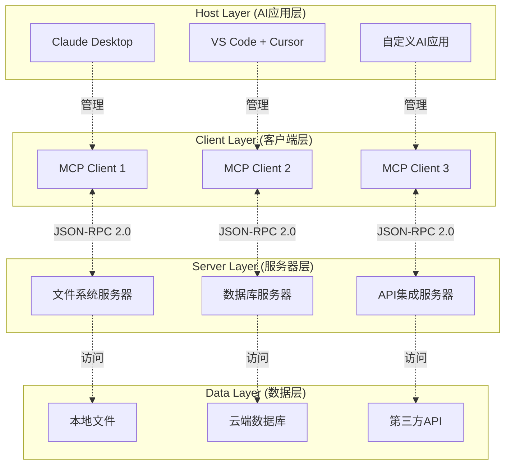

# Model Context Protocol (MCP) 完整指南

> **作者**: Claude Code Assistant  
> **版本**: 2.0  
> **最后更新**: 2025年01月  
> **适用范围**: AI应用开发者、系统架构师、产品经理

---

## 📖 文档概览

本指南为你提供 Model Context Protocol (MCP) 的全面理解，从基础概念到高级实现，涵盖理论与实践。无论你是初学者还是经验丰富的开发者，都能在这里找到所需的知识。

### 🎯 学习路径
- **新手**: 先读第1-3章了解基础概念 → 第5章快速上手 → 第6章实践案例
- **开发者**: 重点关注第4章技术原理 → 第5章开发指南 → 第7章最佳实践
- **架构师**: 深入第2章架构设计 → 第4章实现原理 → 第8章对比分析

---

## 📋 目录结构

### 🏗️ 第一部分：基础理论
1. [MCP 核心概念](#1-mcp-核心概念)
2. [架构设计原理](#2-架构设计原理)  
3. [协议与标准](#3-协议与标准)

### 💻 第二部分：技术实现
4. [工作原理深度解析](#4-工作原理深度解析)
5. [开发实战指南](#5-开发实战指南)
6. [实际应用案例](#6-实际应用案例)

### 🚀 第三部分：进阶与实践
7. [性能优化与最佳实践](#7-性能优化与最佳实践)
8. [生态系统与工具](#8-生态系统与工具)
9. [对比分析与选型](#9-对比分析与选型)
10. [发展趋势与展望](#10-发展趋势与展望)

---

## 1. MCP 核心概念

### 1.1 什么是 MCP？

**Model Context Protocol (MCP)** 是由 Anthropic 于 2024年11月25日 发布的开放协议，专门用于标准化 AI 应用程序与外部数据源和工具之间的交互方式。

### MCP 核心架构

MCP 采用客户端-服务器架构设计，AI应用通过MCP客户端与多个MCP服务器建立一对一连接：


**架构说明**：
- **MCP Host (AI应用)**：如Claude Desktop、VS Code等，负责协调管理多个MCP客户端
- **MCP Client**：每个客户端维护与一个MCP服务器的专用连接
- **MCP Server**：提供具体功能的服务端，如Sentry、文件系统、数据库等

**连接模式**：采用一对一连接模式，确保每个MCP客户端与对应的MCP服务器建立独立的通信通道。

#### 💡 核心类比：AI 世界的 USB-C
就像 USB-C 为各种设备提供了统一的连接标准，MCP 为 AI 模型与外部资源提供了统一的交互协议。

```
传统方式 (混乱):
AI应用 ──┬─→ OpenAI Functions ──→ 工具A
         ├─→ Google Extensions ──→ 工具B  
         └─→ 自定义API ──→ 工具C

MCP方式 (统一):
AI应用 ──→ MCP协议 ──┬─→ MCP服务器A
                      ├─→ MCP服务器B
                      └─→ MCP服务器C
```

### 1.2 解决的核心问题

#### 🤔 传统 AI 工具集成的困境

| 问题 | 具体表现 | 影响 |
|------|----------|------|
| **平台锁定** | 每个 LLM 提供商都有不同的函数调用 API | 切换模型成本高，厂商依赖严重 |
| **重复开发** | 为每个平台重写相同的工具集成 | 开发效率低，维护成本高 |
| **安全隐患** | 敏感数据需要上传到云端处理 | 数据泄露风险，合规难题 |
| **缺乏标准** | 没有统一的工具描述和调用规范 | 生态系统分散，互操作性差 |

#### ✅ MCP 的解决方案

**统一协议层**: 一次开发，处处运行
- **开发一套工具** → 所有支持 MCP 的 AI 应用都能使用
- **数据本地化** → 敏感信息无需上传，安全可控
- **标准化接口** → 统一的工具描述、调用和响应格式
- **开源生态** → 社区驱动，持续演进

### 1.3 核心价值主张

#### 🎯 对开发者
- **减少 80% 的重复工作**: 一次开发，多平台复用
- **降低学习曲线**: 统一的开发模式和 API
- **丰富的生态**: 100+ 现成的 MCP 服务器可直接使用

#### 🏢 对企业
- **数据安全**: 敏感数据留在本地，精确控制访问权限  
- **降低成本**: 避免厂商锁定，灵活选择 AI 模型
- **快速集成**: 标准化接口，加速 AI 项目落地

#### 👥 对用户
- **更智能的 AI**: 能访问实时数据和专业工具
- **无缝体验**: 在不同应用间保持上下文连续性
- **隐私保护**: 数据处理透明可控

---

## 2. 架构设计原理

### 2.1 整体架构概览

MCP 采用经典的**客户端-服务器架构**，通过标准化的协议实现 AI 应用与外部资源的连接。



### MCP 价值对比

**传统方式 vs MCP方式**：

| 传统方式（复杂） | MCP方式（简洁） |
|-----------------|----------------|
| 每个AI应用需要单独集成各种服务 | 统一的MCP协议层 |
| 重复开发集成代码 | 一次开发，处处使用 |
| 维护成本高 | 标准化维护 |
| 切换应用成本高 | 无缝迁移 |

**架构对比**：
```
❌ 没有MCP：AI应用 ←→ 各种服务（混乱的多对多连接）
✅ 有了MCP：AI应用 ←→ MCP协议 ←→ 各种服务（清晰的分层）
```

### 2.2 核心组件详解

#### 🖥️ MCP Host (主机)
**职责**: AI 应用的协调中心
- 接收用户输入并与 AI 模型交互
- 管理多个 MCP 客户端的生命周期
- 决策何时调用哪些工具
- 整合结果并呈现给用户

**典型实现**:
- **Claude Desktop**: Anthropic 官方客户端
- **VS Code**: 通过插件支持
- **Cursor**: 代码编辑器集成
- **自定义应用**: 使用 MCP SDK 开发

#### 🔌 MCP Client (客户端)
**职责**: 协议通信的桥梁
- 与特定的 MCP 服务器建立**一对一连接**
- 处理 JSON-RPC 2.0 协议通信
- 管理连接生命周期和错误处理
- 为主机提供统一的工具调用接口

**特点**:
```python
# 一个主机可以管理多个客户端
host = MCPHost()
client1 = host.create_client("filesystem-server")
client2 = host.create_client("database-server")  
client3 = host.create_client("api-server")
```

#### ⚙️ MCP Server (服务器)
**职责**: 具体功能的实现者
- 实现特定领域的工具和资源
- 处理来自客户端的请求
- 访问和操作底层数据源
- 提供标准化的响应格式

**分类**:
| 类型 | 运行位置 | 传输方式 | 性能 | 安全性 |
|------|----------|----------|------|--------|
| **本地服务器** | 同一机器 | STDIO | 最优 | 高 |
| **远程服务器** | 远程主机 | HTTP/SSE | 一般 | 中 |

### 2.3 协议分层设计

MCP 采用**双层架构**设计，分离关注点：

#### 📊 数据层 (Data Layer)
**基于 JSON-RPC 2.0 的协议层**

```json
{
  "jsonrpc": "2.0",
  "method": "tools/call",
  "params": {
    "name": "filesystem_read",
    "arguments": {
      "path": "/Users/example/document.txt"
    }
  },
  "id": 1
}
```

**核心功能**:
- **生命周期管理**: 初始化、能力协商、终止
- **原语定义**: Tools、Resources、Prompts
- **通知机制**: 实时更新、进度跟踪

#### 🌐 传输层 (Transport Layer)
**负责实际的网络通信**

```python
# STDIO 传输 (本地)
transport = StdioServerTransport()
await transport.run(server)

# HTTP 传输 (远程)  
transport = SseServerTransport("/sse")
await transport.run(server, host="0.0.0.0", port=8080)
```

**传输对比**:
| 特性 | STDIO | HTTP/SSE |
|------|-------|----------|
| **适用场景** | 本地工具 | 远程服务 |
| **性能** | 无网络开销 | 有网络延迟 |
| **安全** | 进程级隔离 | 需要认证机制 |
| **部署** | 简单 | 复杂 |

---

## 3. 协议与标准

### 3.1 MCP 原语 (Primitives)

MCP 定义了三种核心原语，覆盖 AI 与外部系统交互的主要场景：

#### 🔧 Tools (工具)
**可执行的函数，AI 可以调用来执行操作**

```python
from mcp.server.fastmcp import FastMCP

mcp = FastMCP("文件管理工具")

@mcp.tool()
def search_files(pattern: str, directory: str = ".") -> str:
    """在指定目录中搜索文件
    
    Args:
        pattern: 搜索模式，支持通配符 (如 *.py, test_*)
        directory: 搜索目录，默认为当前目录
        
    Returns:
        str: 找到的文件列表，每行一个文件路径
        
    Examples:
        搜索Python文件: search_files("*.py", "/home/project")
        搜索测试文件: search_files("test_*", "./tests")
    """
    import glob
    import os
    
    search_path = os.path.join(directory, pattern)
    files = glob.glob(search_path, recursive=True)
    
    if not files:
        return f"未在 {directory} 中找到匹配 '{pattern}' 的文件"
    
    return "\n".join(sorted(files))
```

**特点**:
- ✅ **需要用户授权**: 确保安全性
- ✅ **可以修改状态**: 能够执行写操作
- ✅ **支持复杂参数**: 类型检查和验证
- ✅ **返回结构化数据**: JSON 或文本格式

#### 📄 Resources (资源)
**为 AI 提供上下文信息的数据源**

```python
@mcp.resource("config://app-settings")
def get_app_settings() -> str:
    """获取应用程序配置信息"""
    import json
    
    config = {
        "database": {
            "host": "localhost",
            "port": 5432,
            "name": "myapp_db"
        },
        "features": {
            "authentication": True,
            "logging": True,
            "cache": False
        },
        "api_limits": {
            "requests_per_minute": 1000,
            "max_file_size": "10MB"
        }
    }
    
    return json.dumps(config, indent=2, ensure_ascii=False)

@mcp.resource("logs://recent-errors")  
def get_recent_errors() -> str:
    """获取最近的错误日志"""
    # 模拟读取日志文件
    errors = [
        "2025-01-15 10:30:15 ERROR: Database connection timeout",
        "2025-01-15 11:45:22 ERROR: Invalid API key for user 12345", 
        "2025-01-15 14:20:33 ERROR: File upload size exceeded limit"
    ]
    
    return "\n".join(errors)
```

**特点**:
- 📖 **只读访问**: 不能修改数据
- 🏷️ **标准化URI**: 使用统一的资源标识符
- 🔄 **支持订阅**: 可以监听资源变化
- 📊 **结构化数据**: 通常返回 JSON 格式

#### 💬 Prompts (提示模板)
**可重用的交互模板，帮助构建标准化的提示**

```python
@mcp.prompt()
def code_review_prompt(code: str, language: str, focus: str = "质量") -> str:
    """代码审查提示模板
    
    Args:
        code: 要审查的代码
        language: 编程语言
        focus: 审查重点 (质量/安全/性能)
    """
    
    focus_guidelines = {
        "质量": [
            "代码可读性和维护性",
            "命名规范和注释质量", 
            "代码重复和复杂度",
            "错误处理和边界情况"
        ],
        "安全": [
            "输入验证和过滤",
            "权限检查和访问控制",
            "敏感信息泄露风险",
            "常见安全漏洞 (XSS, SQL注入等)"
        ],
        "性能": [
            "算法复杂度分析",
            "资源使用优化",
            "并发和异步处理",
            "缓存和数据结构选择"
        ]
    }
    
    guidelines = focus_guidelines.get(focus, focus_guidelines["质量"])
    
    return f"""
请对以下 {language} 代码进行专业审查，重点关注{focus}：

```{language}
{code}
```

审查指南：
{chr(10).join(f'• {item}' for item in guidelines)}

请提供：
1. **代码质量评分** (1-10分)
2. **主要问题清单** (按优先级排序)
3. **具体改进建议** (包含代码示例)
4. **最佳实践建议**

审查格式要求：
- 问题描述要具体，指出具体的行号
- 提供可操作的改进方案
- 如有必要，提供重构后的代码示例
"""
```

### 3.2 客户端原语

MCP 还定义了客户端可以提供的原语，使服务器能够反向调用客户端能力：

#### 🎯 Sampling (采样)
```python
# 服务器可以请求客户端的 AI 模型进行推理
async def generate_summary(data: str) -> str:
    """让 AI 生成数据摘要"""
    prompt = f"请为以下数据生成简洁的摘要:\n\n{data}"
    
    response = await client.sample_completion(
        prompt=prompt,
        max_tokens=200,
        temperature=0.3
    )
    
    return response
```

#### ❓ Elicitation (请求用户输入)
```python
# 服务器可以请求用户确认或输入额外信息
async def confirm_deletion(file_path: str) -> bool:
    """请求用户确认删除操作"""
    response = await client.request_user_input(
        prompt=f"确认删除文件 '{file_path}' 吗？此操作不可撤销。",
        input_type="confirmation"
    )
    
    return response.lower() in ['yes', 'y', '确认', '是']
```

#### 📝 Logging (日志记录)
```python
# 服务器可以发送日志到客户端
async def log_operation(operation: str, result: str):
    """记录操作日志"""
    await client.log_message(
        level="info",
        message=f"操作完成: {operation}",
        data={
            "operation": operation,
            "result": result,
            "timestamp": datetime.now().isoformat()
        }
    )
```

---

## 4. 核心工作原理

### 4.1 工具调用流程

MCP 的核心是让 AI 模型智能选择和调用工具：

```
用户输入 → AI分析需求 → 选择工具 → 执行操作 → 返回结果
```

**关键技术要点**：
- AI 通过工具描述理解功能和参数
- 使用 JSON-RPC 2.0 协议进行通信
- 支持参数验证和错误处理

### 4.2 连接生命周期

MCP 连接遵循标准的三阶段流程：

1. **初始化阶段**：客户端和服务器协商协议版本和支持的功能
2. **工作阶段**：发现和调用工具、获取资源、使用提示模板
3. **终止阶段**：清理连接和释放资源

### 4.3 实时通知机制

MCP 支持服务器主动推送更新：
- **工具/资源变更通知**：当可用工具或资源发生变化时自动通知
- **进度更新**：长时间操作的实时进度反馈
- **状态同步**：保持客户端和服务器状态一致

这使得 MCP 应用能够动态响应环境变化，提供更好的用户体验。

---

## 5. 开发实战指南

### 5.1 环境搭建

#### 🐍 Python 开发环境

```bash
# 1. 安装现代 Python 包管理器
curl -LsSf https://astral.sh/uv/install.sh | sh

# 2. 创建项目
mkdir my-mcp-server && cd my-mcp-server
uv init --python=3.11

# 3. 安装依赖
uv add "mcp[cli]" "fastapi" "pydantic" "aiofiles"

# 4. 创建项目结构
mkdir -p src/{server,client,tools,config}
touch src/server/__init__.py
touch src/tools/__init__.py
```

#### 📁 推荐的项目结构

```
my-mcp-server/
├── pyproject.toml              # 项目配置
├── README.md                   # 项目说明
├── .env.example               # 环境变量模板
├── requirements.txt           # 依赖列表
├── src/
│   ├── server/                # 服务器实现
│   │   ├── __init__.py
│   │   ├── main.py           # 主服务器逻辑
│   │   └── config.py         # 配置管理
│   ├── tools/                 # 工具实现
│   │   ├── __init__.py
│   │   ├── file_tools.py     # 文件操作工具
│   │   ├── api_tools.py      # API 集成工具
│   │   └── data_tools.py     # 数据处理工具
│   └── client/                # 客户端工具
│       ├── __init__.py
│       └── test_client.py    # 测试客户端
├── tests/                     # 测试代码
│   ├── test_tools.py
│   └── test_server.py
└── docs/                      # 文档
    ├── api.md
    └── examples.md
```

### 5.2 构建高级 MCP 服务器

#### 🔧 完整的文件管理服务器

```python
# src/server/main.py
import os
import json
import aiofiles
import asyncio
from pathlib import Path
from typing import List, Dict, Optional
from datetime import datetime

from mcp.server.fastmcp import FastMCP
from pydantic import BaseModel, validator

# 创建服务器实例
mcp = FastMCP("高级文件管理服务器")

class FileInfo(BaseModel):
    """文件信息模型"""
    path: str
    name: str
    size: int
    modified: datetime
    is_directory: bool
    permissions: str

class SearchConfig(BaseModel):
    """搜索配置模型"""
    pattern: str
    directory: str = "."
    recursive: bool = True
    include_hidden: bool = False
    max_results: int = 100
    
    @validator('directory')
    def validate_directory(cls, v):
        if not os.path.exists(v):
            raise ValueError(f"目录不存在: {v}")
        return v

# =============================================================================
# 文件操作工具
# =============================================================================

@mcp.tool()
async def advanced_file_search(config: SearchConfig) -> str:
    """高级文件搜索功能
    
    Args:
        config: 搜索配置，包含模式、目录、递归等选项
        
    Returns:
        str: JSON格式的搜索结果
    """
    import glob
    
    try:
        search_pattern = os.path.join(config.directory, "**", config.pattern) if config.recursive else os.path.join(config.directory, config.pattern)
        
        files = glob.glob(search_pattern, recursive=config.recursive)
        
        # 过滤隐藏文件
        if not config.include_hidden:
            files = [f for f in files if not any(part.startswith('.') for part in Path(f).parts)]
        
        # 获取文件详细信息
        file_infos = []
        for file_path in files[:config.max_results]:
            try:
                stat = os.stat(file_path)
                info = FileInfo(
                    path=file_path,
                    name=os.path.basename(file_path),
                    size=stat.st_size,
                    modified=datetime.fromtimestamp(stat.st_mtime),
                    is_directory=os.path.isdir(file_path),
                    permissions=oct(stat.st_mode)[-3:]
                )
                file_infos.append(info.dict())
            except (OSError, PermissionError):
                continue
        
        result = {
            "query": config.dict(),
            "results_count": len(file_infos),
            "files": file_infos
        }
        
        return json.dumps(result, ensure_ascii=False, indent=2, default=str)
        
    except Exception as e:
        return json.dumps({"error": str(e)}, ensure_ascii=False)

@mcp.tool()
async def batch_file_operation(operation: str, file_paths: List[str], target_dir: Optional[str] = None) -> str:
    """批量文件操作
    
    Args:
        operation: 操作类型 (copy, move, delete, compress)
        file_paths: 文件路径列表
        target_dir: 目标目录 (copy/move操作需要)
        
    Returns:
        str: 操作结果摘要
    """
    import shutil
    import zipfile
    
    results = {
        "operation": operation,
        "total_files": len(file_paths),
        "success": 0,
        "failed": 0,
        "errors": []
    }
    
    for file_path in file_paths:
        try:
            if operation == "copy" and target_dir:
                shutil.copy2(file_path, target_dir)
            elif operation == "move" and target_dir:
                shutil.move(file_path, target_dir)
            elif operation == "delete":
                if os.path.isdir(file_path):
                    shutil.rmtree(file_path)
                else:
                    os.remove(file_path)
            elif operation == "compress" and target_dir:
                zip_path = os.path.join(target_dir, f"archive_{datetime.now().strftime('%Y%m%d_%H%M%S')}.zip")
                with zipfile.ZipFile(zip_path, 'w') as zf:
                    for fp in file_paths:
                        if os.path.exists(fp):
                            zf.write(fp, os.path.basename(fp))
                break  # 压缩操作只需要执行一次
            
            results["success"] += 1
            
        except Exception as e:
            results["failed"] += 1
            results["errors"].append(f"{file_path}: {str(e)}")
    
    return json.dumps(results, ensure_ascii=False, indent=2)

@mcp.tool()
async def analyze_directory(directory: str) -> str:
    """分析目录结构和统计信息
    
    Args:
        directory: 要分析的目录路径
        
    Returns:
        str: 目录分析报告
    """
    if not os.path.exists(directory):
        return json.dumps({"error": "目录不存在"}, ensure_ascii=False)
    
    analysis = {
        "directory": directory,
        "total_files": 0,
        "total_directories": 0,
        "total_size": 0,
        "file_types": {},
        "largest_files": [],
        "newest_files": [],
        "directory_tree": {}
    }
    
    # 遍历目录
    for root, dirs, files in os.walk(directory):
        analysis["total_directories"] += len(dirs)
        analysis["total_files"] += len(files)
        
        for file in files:
            file_path = os.path.join(root, file)
            try:
                stat = os.stat(file_path)
                file_size = stat.st_size
                file_ext = os.path.splitext(file)[1].lower()
                
                analysis["total_size"] += file_size
                
                # 文件类型统计
                analysis["file_types"][file_ext] = analysis["file_types"].get(file_ext, 0) + 1
                
                # 最大文件记录
                file_info = {
                    "path": file_path,
                    "size": file_size,
                    "modified": datetime.fromtimestamp(stat.st_mtime).isoformat()
                }
                
                analysis["largest_files"].append(file_info)
                analysis["newest_files"].append(file_info)
                
            except (OSError, PermissionError):
                continue
    
    # 排序并限制数量
    analysis["largest_files"] = sorted(analysis["largest_files"], key=lambda x: x["size"], reverse=True)[:10]
    analysis["newest_files"] = sorted(analysis["newest_files"], key=lambda x: x["modified"], reverse=True)[:10]
    
    # 格式化大小
    def format_size(size_bytes):
        for unit in ['B', 'KB', 'MB', 'GB']:
            if size_bytes < 1024:
                return f"{size_bytes:.1f} {unit}"
            size_bytes /= 1024
        return f"{size_bytes:.1f} TB"
    
    analysis["total_size_formatted"] = format_size(analysis["total_size"])
    
    return json.dumps(analysis, ensure_ascii=False, indent=2, default=str)

# =============================================================================
# 资源定义
# =============================================================================

@mcp.resource("config://file-server")
async def get_server_config() -> str:
    """获取文件服务器配置"""
    config = {
        "server_name": "高级文件管理服务器",
        "version": "2.0.0",
        "supported_operations": [
            "search", "copy", "move", "delete", 
            "compress", "analyze", "monitor"
        ],
        "limits": {
            "max_file_size": "100MB",
            "max_search_results": 1000,
            "max_batch_operations": 50
        },
        "security": {
            "allowed_paths": ["/home", "/tmp", "/var/log"],
            "forbidden_extensions": [".exe", ".bat", ".cmd"],
            "require_confirmation": ["delete", "move"]
        }
    }
    
    return json.dumps(config, ensure_ascii=False, indent=2)

@mcp.resource("stats://usage")
async def get_usage_stats() -> str:
    """获取服务器使用统计"""
    # 这里可以从数据库或日志文件读取实际统计数据
    stats = {
        "total_requests": 1247,
        "successful_operations": 1198,
        "failed_operations": 49,
        "most_used_tools": [
            {"name": "advanced_file_search", "count": 456},
            {"name": "batch_file_operation", "count": 342},
            {"name": "analyze_directory", "count": 234}
        ],
        "uptime": "7 days, 12 hours",
        "last_updated": datetime.now().isoformat()
    }
    
    return json.dumps(stats, ensure_ascii=False, indent=2)

# =============================================================================
# 提示模板
# =============================================================================

@mcp.prompt()
def file_organization_prompt(directory: str, strategy: str = "type") -> str:
    """文件整理策略提示模板"""
    
    strategies = {
        "type": "按文件类型分类 (图片、文档、视频等)",
        "date": "按修改日期分类 (年/月/日 结构)",
        "size": "按文件大小分类 (小、中、大文件)",
        "project": "按项目或主题分类"
    }
    
    return f"""
请帮我整理 "{directory}" 目录下的文件，使用 "{strategy}" 策略。

整理策略说明：{strategies.get(strategy, strategy)}

要求：
1. 分析现有文件结构和内容
2. 提出具体的整理方案
3. 说明每个文件应该移动到哪个子目录
4. 创建必要的子目录结构
5. 确保整理后便于查找和管理

请先使用 analyze_directory 工具分析目录情况，然后提出整理建议。
"""

# =============================================================================
# 服务器启动
# =============================================================================

if __name__ == "__main__":
    # 可以添加命令行参数处理
    import sys
    import argparse
    
    parser = argparse.ArgumentParser(description="高级文件管理 MCP 服务器")
    parser.add_argument("--host", default="localhost", help="服务器主机")
    parser.add_argument("--port", type=int, default=8080, help="服务器端口")
    parser.add_argument("--transport", choices=["stdio", "sse"], default="stdio", help="传输方式")
    
    args = parser.parse_args()
    
    if args.transport == "stdio":
        # STDIO 模式 (本地使用)
        mcp.run()
    else:
        # HTTP/SSE 模式 (远程使用)
        from mcp.server.sse import SseServerTransport
        
        async def main():
            transport = SseServerTransport("/sse")
            async with mcp.run_server() as server:
                await transport.run(server, host=args.host, port=args.port)
        
        asyncio.run(main())
```

### 5.3 客户端配置和集成

#### ⚙️ Claude Desktop 配置

```json
// ~/.config/claude-desktop/claude_desktop_config.json
{
  "mcpServers": {
    "advanced-file-server": {
      "command": "uv",
      "args": [
        "--directory", "/path/to/your/project",
        "run", "python", "src/server/main.py"
      ],
      "env": {
        "LOG_LEVEL": "INFO"
      }
    },
    "database-server": {
      "command": "docker",
      "args": [
        "run", "-i", "--rm",
        "-v", "/data:/data",
        "my-mcp-db-server"
      ]
    },
    "remote-api-server": {
      "command": "curl",
      "args": [
        "-X", "POST",
        "-H", "Content-Type: application/json",
        "https://api.example.com/mcp"
      ],
      "env": {
        "API_KEY": "${API_KEY}"
      }
    }
  }
}
```

#### 🧪 开发和测试工具

```python
# src/client/test_client.py
import asyncio
import json
from mcp.client import StdioMCPClient

class MCPTester:
    """MCP 服务器测试工具"""
    
    def __init__(self, server_command: str):
        self.server_command = server_command
        self.client = None
    
    async def connect(self):
        """连接到 MCP 服务器"""
        self.client = StdioMCPClient(self.server_command)
        await self.client.connect()
        
        # 初始化
        result = await self.client.initialize()
        print(f"服务器信息: {result['serverInfo']}")
        
        return result
    
    async def test_tools(self):
        """测试所有可用工具"""
        # 获取工具列表
        tools = await self.client.list_tools()
        print(f"发现 {len(tools)} 个工具:")
        
        for tool in tools:
            print(f"- {tool['name']}: {tool['description']}")
        
        # 测试文件搜索工具
        search_result = await self.client.call_tool(
            "advanced_file_search",
            {
                "config": {
                    "pattern": "*.py",
                    "directory": ".",
                    "recursive": True,
                    "max_results": 5
                }
            }
        )
        
        print("搜索结果:")
        print(json.dumps(json.loads(search_result), indent=2, ensure_ascii=False))
    
    async def test_resources(self):
        """测试所有可用资源"""
        resources = await self.client.list_resources()
        print(f"发现 {len(resources)} 个资源:")
        
        for resource in resources:
            print(f"- {resource['uri']}: {resource['name']}")
            
            # 读取资源内容
            content = await self.client.read_resource(resource['uri'])
            print(f"  内容预览: {content[:100]}...")
    
    async def close(self):
        """关闭连接"""
        if self.client:
            await self.client.close()

# 使用示例
async def main():
    tester = MCPTester("python src/server/main.py")
    
    try:
        await tester.connect()
        await tester.test_tools()
        await tester.test_resources()
    finally:
        await tester.close()

if __name__ == "__main__":
    asyncio.run(main())
```

#### 🔍 MCP Inspector 使用

```bash
# 启动调试工具
mcp dev src/server/main.py

# 访问 http://localhost:5173
# 功能包括：
# - 实时查看工具列表
# - 交互式测试工具调用  
# - 参数验证和错误检查
# - 查看资源和提示模板
# - 监控连接状态和日志
```

---

## 6. 实际应用案例

### 6.1 智能开发助手

#### 🚀 场景：AI 驱动的代码审查系统

```python
# 完整的代码审查 MCP 服务器
from mcp.server.fastmcp import FastMCP
import git
import ast
import subprocess
import json
from typing import List, Dict

mcp = FastMCP("智能代码审查助手")

@mcp.tool()
async def review_pull_request(repo_path: str, pr_number: int, focus_areas: List[str]) -> str:
    """全面的代码审查工具
    
    Args:
        repo_path: Git 仓库路径
        pr_number: Pull Request 编号  
        focus_areas: 审查重点 (security, performance, style, logic)
    """
    
    try:
        # 1. 获取 PR 变更
        repo = git.Repo(repo_path)
        
        # 获取 PR 的变更文件
        changed_files = []
        for item in repo.index.diff('HEAD~1'):
            if item.a_path.endswith(('.py', '.js', '.ts', '.java', '.cpp')):
                changed_files.append({
                    'file': item.a_path,
                    'change_type': item.change_type,
                    'diff': get_file_diff(repo, item.a_path)
                })
        
        # 2. 分析代码质量
        analysis_results = {
            'summary': {
                'total_files': len(changed_files),
                'lines_added': 0,
                'lines_removed': 0,
                'risk_level': 'low'
            },
            'issues': [],
            'suggestions': [],
            'security_concerns': [],
            'performance_notes': []
        }
        
        for file_info in changed_files:
            file_analysis = await analyze_code_file(
                file_info['file'], 
                file_info['diff'], 
                focus_areas
            )
            
            # 合并分析结果
            analysis_results['issues'].extend(file_analysis['issues'])
            analysis_results['suggestions'].extend(file_analysis['suggestions'])
            
            if 'security' in focus_areas:
                security_issues = await check_security_vulnerabilities(file_info)
                analysis_results['security_concerns'].extend(security_issues)
            
            if 'performance' in focus_areas:
                perf_issues = await analyze_performance(file_info)
                analysis_results['performance_notes'].extend(perf_issues)
        
        # 3. 生成审查报告
        report = generate_review_report(analysis_results, focus_areas)
        
        return json.dumps(report, ensure_ascii=False, indent=2)
        
    except Exception as e:
        return json.dumps({'error': f'审查失败: {str(e)}'}, ensure_ascii=False)

@mcp.tool()
async def run_automated_tests(repo_path: str, test_type: str = "all") -> str:
    """运行自动化测试套件
    
    Args:
        repo_path: 仓库路径
        test_type: 测试类型 (unit, integration, e2e, all)
    """
    
    test_commands = {
        'unit': ['python', '-m', 'pytest', 'tests/unit/', '-v'],
        'integration': ['python', '-m', 'pytest', 'tests/integration/', '-v'],
        'e2e': ['python', '-m', 'pytest', 'tests/e2e/', '-v'],
        'all': ['python', '-m', 'pytest', '-v', '--cov=src', '--cov-report=json']
    }
    
    if test_type not in test_commands:
        return json.dumps({'error': f'不支持的测试类型: {test_type}'})
    
    try:
        result = subprocess.run(
            test_commands[test_type],
            cwd=repo_path,
            capture_output=True,
            text=True,
            timeout=300  # 5分钟超时
        )
        
        test_report = {
            'test_type': test_type,
            'exit_code': result.returncode,
            'stdout': result.stdout,
            'stderr': result.stderr,
            'success': result.returncode == 0
        }
        
        # 解析测试结果
        if test_type == 'all':
            coverage_data = parse_coverage_report(repo_path)
            test_report['coverage'] = coverage_data
        
        return json.dumps(test_report, ensure_ascii=False, indent=2)
        
    except subprocess.TimeoutExpired:
        return json.dumps({'error': '测试超时'}, ensure_ascii=False)
    except Exception as e:
        return json.dumps({'error': f'测试执行失败: {str(e)}'}, ensure_ascii=False)

@mcp.tool()
async def suggest_code_improvements(file_path: str, language: str) -> str:
    """基于最佳实践建议代码改进
    
    Args:
        file_path: 代码文件路径
        language: 编程语言
    """
    
    try:
        with open(file_path, 'r', encoding='utf-8') as f:
            code_content = f.read()
        
        suggestions = []
        
        if language == 'python':
            suggestions = analyze_python_code(code_content)
        elif language in ['javascript', 'typescript']:
            suggestions = analyze_js_code(code_content)
        elif language == 'java':
            suggestions = analyze_java_code(code_content)
        
        improvement_report = {
            'file': file_path,
            'language': language,
            'suggestions': suggestions,
            'refactoring_opportunities': find_refactoring_opportunities(code_content, language),
            'best_practices': get_language_best_practices(language)
        }
        
        return json.dumps(improvement_report, ensure_ascii=False, indent=2)
        
    except Exception as e:
        return json.dumps({'error': f'分析失败: {str(e)}'}, ensure_ascii=False)

# 辅助函数
async def analyze_code_file(file_path: str, diff: str, focus_areas: List[str]) -> Dict:
    """分析单个代码文件"""
    
    issues = []
    suggestions = []
    
    # 基础语法和风格检查
    if 'style' in focus_areas:
        style_issues = check_code_style(file_path, diff)
        issues.extend(style_issues)
    
    # 逻辑复杂度分析
    if 'logic' in focus_areas:
        complexity_issues = analyze_complexity(file_path, diff)
        suggestions.extend(complexity_issues)
    
    return {
        'file': file_path,
        'issues': issues,
        'suggestions': suggestions
    }

def analyze_python_code(code: str) -> List[Dict]:
    """分析 Python 代码质量"""
    
    suggestions = []
    
    try:
        tree = ast.parse(code)
        
        # 检查函数长度
        for node in ast.walk(tree):
            if isinstance(node, ast.FunctionDef):
                func_lines = node.end_lineno - node.lineno + 1
                if func_lines > 50:
                    suggestions.append({
                        'type': 'refactoring',
                        'line': node.lineno,
                        'message': f'函数 {node.name} 太长 ({func_lines} 行)，建议拆分',
                        'severity': 'medium'
                    })
                
                # 检查参数数量
                if len(node.args.args) > 5:
                    suggestions.append({
                        'type': 'design',
                        'line': node.lineno,
                        'message': f'函数 {node.name} 参数过多，考虑使用配置对象',
                        'severity': 'low'
                    })
        
        # 检查类设计
        for node in ast.walk(tree):
            if isinstance(node, ast.ClassDef):
                methods = [n for n in node.body if isinstance(n, ast.FunctionDef)]
                if len(methods) > 20:
                    suggestions.append({
                        'type': 'design',
                        'line': node.lineno,
                        'message': f'类 {node.name} 方法过多，违反单一职责原则',
                        'severity': 'high'
                    })
        
    except SyntaxError as e:
        suggestions.append({
            'type': 'error',
            'line': e.lineno,
            'message': f'语法错误: {e.msg}',
            'severity': 'critical'
        })
    
    return suggestions

@mcp.resource("templates://code-review")
async def get_review_templates() -> str:
    """获取代码审查模板"""
    
    templates = {
        'pull_request_checklist': [
            '✅ 代码风格符合项目规范',
            '✅ 所有测试通过',
            '✅ 代码覆盖率不低于80%',
            '✅ 无安全漏洞',
            '✅ 性能无明显下降',
            '✅ 文档已更新',
            '✅ 向后兼容性检查'
        ],
        'review_comments': {
            'naming': '建议使用更有意义的变量名，当前名称不够清晰',
            'complexity': '这个函数逻辑复杂，建议拆分为更小的函数',
            'error_handling': '缺少错误处理，应该添加 try-catch 块',
            'performance': '这个实现可能有性能问题，建议优化',
            'security': '存在潜在的安全风险，需要添加输入验证'
        },
        'improvement_suggestions': [
            '考虑使用设计模式简化代码结构',
            '添加单元测试覆盖新功能',
            '考虑添加日志记录便于调试',
            '评估是否需要添加性能监控'
        ]
    }
    
    return json.dumps(templates, ensure_ascii=False, indent=2)
```

### 6.2 数据分析自动化

#### 📊 场景：智能数据分析和报告生成

```python
# 数据分析 MCP 服务器
import pandas as pd
import numpy as np
import matplotlib.pyplot as plt
import seaborn as sns
from sqlalchemy import create_engine
import plotly.express as px
import plotly.graph_objects as go
from datetime import datetime, timedelta

mcp = FastMCP("智能数据分析助手")

@mcp.tool()
async def analyze_sales_data(data_source: str, time_period: str, metrics: List[str]) -> str:
    """全面的销售数据分析
    
    Args:
        data_source: 数据源 (file_path 或 database_url)
        time_period: 时间范围 (last_30_days, last_quarter, last_year)
        metrics: 分析指标 (revenue, growth, conversion, retention)
    """
    
    try:
        # 1. 加载数据
        if data_source.startswith('postgresql://'):
            engine = create_engine(data_source)
            df = pd.read_sql(get_sales_query(time_period), engine)
        else:
            df = pd.read_csv(data_source)
            df = filter_by_time_period(df, time_period)
        
        # 2. 数据清洗和预处理
        df = clean_sales_data(df)
        
        # 3. 生成分析结果
        analysis_results = {
            'data_summary': {
                'total_records': len(df),
                'date_range': {
                    'start': df['date'].min().isoformat(),
                    'end': df['date'].max().isoformat()
                },
                'total_revenue': float(df['amount'].sum()),
                'average_order_value': float(df['amount'].mean())
            },
            'metrics': {}
        }
        
        # 4. 按需求计算指标
        if 'revenue' in metrics:
            analysis_results['metrics']['revenue'] = analyze_revenue_trends(df)
        
        if 'growth' in metrics:
            analysis_results['metrics']['growth'] = calculate_growth_metrics(df)
        
        if 'conversion' in metrics:
            analysis_results['metrics']['conversion'] = analyze_conversion_funnel(df)
        
        if 'retention' in metrics:
            analysis_results['metrics']['retention'] = calculate_retention_rates(df)
        
        # 5. 生成可视化图表
        charts = generate_sales_charts(df, metrics)
        analysis_results['charts'] = charts
        
        # 6. 生成洞察和建议
        insights = generate_business_insights(analysis_results)
        analysis_results['insights'] = insights
        
        return json.dumps(analysis_results, ensure_ascii=False, indent=2, default=str)
        
    except Exception as e:
        return json.dumps({'error': f'分析失败: {str(e)}'}, ensure_ascii=False)

@mcp.tool()
async def create_dashboard(data_source: str, dashboard_type: str, filters: Dict) -> str:
    """创建交互式数据仪表板
    
    Args:
        data_source: 数据源
        dashboard_type: 仪表板类型 (sales, marketing, operations, financial)
        filters: 过滤条件
    """
    
    try:
        # 加载数据
        df = load_data(data_source, filters)
        
        # 根据类型生成不同的仪表板
        if dashboard_type == 'sales':
            dashboard_html = create_sales_dashboard(df)
        elif dashboard_type == 'marketing':
            dashboard_html = create_marketing_dashboard(df)
        elif dashboard_type == 'operations':
            dashboard_html = create_operations_dashboard(df)
        elif dashboard_type == 'financial':
            dashboard_html = create_financial_dashboard(df)
        else:
            return json.dumps({'error': f'不支持的仪表板类型: {dashboard_type}'})
        
        # 保存仪表板文件
        timestamp = datetime.now().strftime('%Y%m%d_%H%M%S')
        filename = f"{dashboard_type}_dashboard_{timestamp}.html"
        filepath = f"./dashboards/{filename}"
        
        with open(filepath, 'w', encoding='utf-8') as f:
            f.write(dashboard_html)
        
        result = {
            'dashboard_type': dashboard_type,
            'file_path': filepath,
            'preview_url': f'file://{os.path.abspath(filepath)}',
            'created_at': datetime.now().isoformat(),
            'data_summary': {
                'records_count': len(df),
                'columns': list(df.columns),
                'date_range': get_date_range(df)
            }
        }
        
        return json.dumps(result, ensure_ascii=False, indent=2)
        
    except Exception as e:
        return json.dumps({'error': f'仪表板创建失败: {str(e)}'}, ensure_ascii=False)

@mcp.tool()
async def predict_trends(data_source: str, target_column: str, prediction_days: int = 30) -> str:
    """基于历史数据预测趋势
    
    Args:
        data_source: 数据源
        target_column: 目标预测列
        prediction_days: 预测天数
    """
    
    try:
        from sklearn.linear_model import LinearRegression
        from sklearn.ensemble import RandomForestRegressor
        from sklearn.metrics import mean_absolute_error, r2_score
        
        # 加载和预处理数据
        df = load_data(data_source)
        df = prepare_time_series_data(df, target_column)
        
        # 特征工程
        features = create_time_features(df)
        X = features[:-prediction_days]  # 训练数据
        y = df[target_column][:-prediction_days]  # 目标变量
        
        # 训练多个模型
        models = {
            'linear_regression': LinearRegression(),
            'random_forest': RandomForestRegressor(n_estimators=100, random_state=42)
        }
        
        model_results = {}
        best_model = None
        best_score = float('-inf')
        
        for name, model in models.items():
            # 训练模型
            model.fit(X, y)
            
            # 评估模型
            y_pred = model.predict(X)
            mae = mean_absolute_error(y, y_pred)
            r2 = r2_score(y, y_pred)
            
            model_results[name] = {
                'mae': float(mae),
                'r2_score': float(r2),
                'model': model
            }
            
            if r2 > best_score:
                best_score = r2
                best_model = model
        
        # 生成预测
        future_features = features[-prediction_days:]
        predictions = best_model.predict(future_features)
        
        # 创建预测结果
        future_dates = pd.date_range(
            start=df.index[-1] + timedelta(days=1),
            periods=prediction_days,
            freq='D'
        )
        
        prediction_results = {
            'model_performance': model_results,
            'best_model': max(model_results.keys(), key=lambda k: model_results[k]['r2_score']),
            'predictions': {
                'dates': [d.isoformat() for d in future_dates],
                'values': predictions.tolist(),
                'confidence_interval': calculate_prediction_intervals(predictions)
            },
            'historical_data': {
                'dates': [d.isoformat() for d in df.index[-30:]],
                'values': df[target_column][-30:].tolist()
            },
            'trend_analysis': analyze_trend_direction(predictions)
        }
        
        # 生成预测图表
        chart_html = create_prediction_chart(df, predictions, future_dates, target_column)
        prediction_results['chart_html'] = chart_html
        
        return json.dumps(prediction_results, ensure_ascii=False, indent=2)
        
    except Exception as e:
        return json.dumps({'error': f'预测失败: {str(e)}'}, ensure_ascii=False)

# 辅助函数
def create_sales_dashboard(df: pd.DataFrame) -> str:
    """创建销售仪表板"""
    
    # 创建多个图表
    fig = go.Figure()
    
    # 收入趋势图
    daily_revenue = df.groupby('date')['amount'].sum()
    fig.add_trace(go.Scatter(
        x=daily_revenue.index,
        y=daily_revenue.values,
        mode='lines+markers',
        name='每日收入',
        line=dict(color='#1f77b4', width=2)
    ))
    
    # 订单数量趋势
    daily_orders = df.groupby('date').size()
    fig.add_trace(go.Scatter(
        x=daily_orders.index,
        y=daily_orders.values,
        mode='lines+markers',
        name='每日订单数',
        yaxis='y2',
        line=dict(color='#ff7f0e', width=2)
    ))
    
    # 更新布局
    fig.update_layout(
        title='销售仪表板',
        xaxis_title='日期',
        yaxis=dict(title='收入 (元)', side='left'),
        yaxis2=dict(title='订单数', side='right', overlaying='y'),
        hovermode='x unified',
        template='plotly_white'
    )
    
    # 生成完整的 HTML
    dashboard_html = f"""
    <!DOCTYPE html>
    <html>
    <head>
        <title>销售数据仪表板</title>
        <script src="https://cdn.plot.ly/plotly-latest.min.js"></script>
        <style>
            body {{ font-family: Arial, sans-serif; margin: 20px; }}
            .dashboard-header {{ text-align: center; margin-bottom: 30px; }}
            .metrics-grid {{ display: grid; grid-template-columns: repeat(4, 1fr); gap: 20px; margin-bottom: 30px; }}
            .metric-card {{ background: #f8f9fa; padding: 20px; border-radius: 8px; text-align: center; }}
            .metric-value {{ font-size: 2em; font-weight: bold; color: #28a745; }}
            .metric-label {{ color: #6c757d; margin-top: 5px; }}
        </style>
    </head>
    <body>
        <div class="dashboard-header">
            <h1>📊 销售数据仪表板</h1>
            <p>生成时间: {datetime.now().strftime('%Y-%m-%d %H:%M:%S')}</p>
        </div>
        
        <div class="metrics-grid">
            <div class="metric-card">
                <div class="metric-value">{df['amount'].sum():,.0f}</div>
                <div class="metric-label">总收入 (元)</div>
            </div>
            <div class="metric-card">
                <div class="metric-value">{len(df):,}</div>
                <div class="metric-label">总订单数</div>
            </div>
            <div class="metric-card">
                <div class="metric-value">{df['amount'].mean():,.0f}</div>
                <div class="metric-label">平均订单金额</div>
            </div>
            <div class="metric-card">
                <div class="metric-value">{df.groupby('date').size().mean():.1f}</div>
                <div class="metric-label">日均订单数</div>
            </div>
        </div>
        
        <div id="chart" style="height: 600px;"></div>
        
        <script>
            {fig.to_html(include_plotlyjs=False, div_id="chart")}
        </script>
    </body>
    </html>
    """
    
    return dashboard_html

@mcp.resource("templates://analysis")
async def get_analysis_templates() -> str:
    """获取数据分析模板"""
    
    templates = {
        'sql_queries': {
            'sales_overview': """
                SELECT 
                    DATE(created_at) as date,
                    COUNT(*) as order_count,
                    SUM(amount) as total_revenue,
                    AVG(amount) as avg_order_value
                FROM orders 
                WHERE created_at >= NOW() - INTERVAL '{days} days'
                GROUP BY DATE(created_at)
                ORDER BY date
            """,
            'customer_analysis': """
                SELECT 
                    customer_id,
                    COUNT(*) as order_count,
                    SUM(amount) as total_spent,
                    AVG(amount) as avg_order_value,
                    MAX(created_at) as last_order_date
                FROM orders
                GROUP BY customer_id
                HAVING COUNT(*) > 1
                ORDER BY total_spent DESC
            """
        },
        'report_sections': [
            '📈 关键指标概览',
            '📊 趋势分析',
            '🔍 深度洞察',
            '💡 行动建议',
            '📋 附录数据'
        ],
        'chart_types': {
            'time_series': ['line', 'area', 'bar'],
            'comparison': ['bar', 'column', 'radar'],
            'distribution': ['histogram', 'box', 'violin'],
            'relationship': ['scatter', 'heatmap', 'bubble']
        }
    }
    
    return json.dumps(templates, ensure_ascii=False, indent=2)
```

### 6.3 智能客服系统

#### 🤖 场景：基于知识库的智能客服

```python
# 智能客服 MCP 服务器
import json
import sqlite3
from datetime import datetime
from typing import List, Dict, Optional
from sklearn.feature_extraction.text import TfidfVectorizer
from sklearn.metrics.pairwise import cosine_similarity
import jieba

mcp = FastMCP("智能客服助手")

class KnowledgeBase:
    """知识库管理类"""
    
    def __init__(self, db_path: str = "knowledge_base.db"):
        self.db_path = db_path
        self.vectorizer = TfidfVectorizer(max_features=1000)
        self.init_database()
        self.load_knowledge()
    
    def init_database(self):
        """初始化数据库"""
        conn = sqlite3.connect(self.db_path)
        cursor = conn.cursor()
        
        cursor.execute('''
            CREATE TABLE IF NOT EXISTS knowledge_articles (
                id INTEGER PRIMARY KEY AUTOINCREMENT,
                title TEXT NOT NULL,
                content TEXT NOT NULL,
                category TEXT NOT NULL,
                tags TEXT,
                created_at TIMESTAMP DEFAULT CURRENT_TIMESTAMP,
                updated_at TIMESTAMP DEFAULT CURRENT_TIMESTAMP,
                view_count INTEGER DEFAULT 0,
                helpful_count INTEGER DEFAULT 0
            )
        ''')
        
        cursor.execute('''
            CREATE TABLE IF NOT EXISTS customer_conversations (
                id INTEGER PRIMARY KEY AUTOINCREMENT,
                customer_id TEXT NOT NULL,
                question TEXT NOT NULL,
                answer TEXT NOT NULL,
                satisfaction_score INTEGER,
                resolved BOOLEAN DEFAULT FALSE,
                created_at TIMESTAMP DEFAULT CURRENT_TIMESTAMP
            )
        ''')
        
        conn.commit()
        conn.close()
    
    def load_knowledge(self):
        """加载知识库内容"""
        conn = sqlite3.connect(self.db_path)
        cursor = conn.cursor()
        
        cursor.execute("SELECT id, title, content, category FROM knowledge_articles")
        self.articles = cursor.fetchall()
        
        if self.articles:
            # 构建搜索索引
            article_texts = [f"{article[1]} {article[2]}" for article in self.articles]
            self.vectorizer.fit(article_texts)
            self.article_vectors = self.vectorizer.transform(article_texts)
        
        conn.close()

kb = KnowledgeBase()

@mcp.tool()
async def search_knowledge_base(query: str, category: Optional[str] = None, top_k: int = 5) -> str:
    """搜索知识库
    
    Args:
        query: 搜索查询
        category: 可选的类别过滤
        top_k: 返回最相关的k个结果
    """
    
    try:
        if not kb.articles:
            return json.dumps({'error': '知识库为空'}, ensure_ascii=False)
        
        # 对查询进行向量化
        query_vector = kb.vectorizer.transform([query])
        
        # 计算相似度
        similarities = cosine_similarity(query_vector, kb.article_vectors)[0]
        
        # 获取最相关的文章
        top_indices = similarities.argsort()[-top_k:][::-1]
        
        results = []
        for idx in top_indices:
            if similarities[idx] > 0.1:  # 相似度阈值
                article = kb.articles[idx]
                
                # 类别过滤
                if category and article[3] != category:
                    continue
                
                results.append({
                    'id': article[0],
                    'title': article[1],
                    'content': article[2][:300] + '...' if len(article[2]) > 300 else article[2],
                    'category': article[3],
                    'similarity_score': float(similarities[idx])
                })
        
        return json.dumps({
            'query': query,
            'results_count': len(results),
            'results': results
        }, ensure_ascii=False, indent=2)
        
    except Exception as e:
        return json.dumps({'error': f'搜索失败: {str(e)}'}, ensure_ascii=False)

@mcp.tool()
async def answer_customer_question(question: str, customer_id: str, context: Optional[str] = None) -> str:
    """回答客户问题
    
    Args:
        question: 客户问题
        customer_id: 客户ID
        context: 可选的上下文信息
    """
    
    try:
        # 1. 搜索相关知识
        knowledge_results = await search_knowledge_base(question, top_k=3)
        knowledge_data = json.loads(knowledge_results)
        
        # 2. 分析问题意图
        intent = analyze_question_intent(question)
        
        # 3. 生成回答
        if knowledge_data['results']:
            # 基于知识库生成回答
            best_match = knowledge_data['results'][0]
            
            if best_match['similarity_score'] > 0.7:
                # 高相似度，直接使用知识库内容
                answer = generate_knowledge_based_answer(best_match, question)
                confidence = 'high'
            else:
                # 中等相似度，需要人工确认
                answer = generate_suggested_answer(knowledge_data['results'], question)
                confidence = 'medium'
        else:
            # 没有找到相关知识，建议转人工
            answer = generate_fallback_answer(question, intent)
            confidence = 'low'
        
        # 4. 记录对话
        conversation_record = {
            'customer_id': customer_id,
            'question': question,
            'answer': answer,
            'intent': intent,
            'confidence': confidence,
            'knowledge_used': knowledge_data['results'][:1] if knowledge_data['results'] else [],
            'timestamp': datetime.now().isoformat()
        }
        
        save_conversation(conversation_record)
        
        response = {
            'answer': answer,
            'confidence': confidence,
            'intent': intent,
            'suggested_actions': get_suggested_actions(intent, confidence),
            'related_articles': knowledge_data['results'][:2]
        }
        
        return json.dumps(response, ensure_ascii=False, indent=2)
        
    except Exception as e:
        return json.dumps({'error': f'回答生成失败: {str(e)}'}, ensure_ascii=False)

@mcp.tool()
async def escalate_to_human(conversation_id: str, reason: str, priority: str = "normal") -> str:
    """升级到人工客服
    
    Args:
        conversation_id: 对话ID
        reason: 升级原因
        priority: 优先级 (low, normal, high, urgent)
    """
    
    try:
        # 获取对话历史
        conversation_history = get_conversation_history(conversation_id)
        
        # 创建升级票据
        ticket = {
            'id': f"TICKET_{datetime.now().strftime('%Y%m%d%H%M%S')}",
            'conversation_id': conversation_id,
            'customer_id': conversation_history.get('customer_id'),
            'reason': reason,
            'priority': priority,
            'status': 'pending',
            'created_at': datetime.now().isoformat(),
            'conversation_summary': summarize_conversation(conversation_history),
            'suggested_solutions': get_suggested_solutions(conversation_history)
        }
        
        # 保存票据
        save_escalation_ticket(ticket)
        
        # 通知人工客服
        notification_sent = notify_human_agents(ticket)
        
        response = {
            'ticket_id': ticket['id'],
            'estimated_wait_time': get_estimated_wait_time(priority),
            'status': 'escalated',
            'notification_sent': notification_sent,
            'next_steps': [
                '人工客服将在预估时间内联系您',
                '您可以通过票据ID查询处理进度',
                '如有紧急情况，请拨打客服热线'
            ]
        }
        
        return json.dumps(response, ensure_ascii=False, indent=2)
        
    except Exception as e:
        return json.dumps({'error': f'升级失败: {str(e)}'}, ensure_ascii=False)

@mcp.tool()
async def generate_service_report(start_date: str, end_date: str, metrics: List[str]) -> str:
    """生成客服服务报告
    
    Args:
        start_date: 开始日期 (YYYY-MM-DD)
        end_date: 结束日期 (YYYY-MM-DD) 
        metrics: 报告指标 (resolution_rate, satisfaction, response_time, volume)
    """
    
    try:
        # 查询数据
        conn = sqlite3.connect(kb.db_path)
        cursor = conn.cursor()
        
        # 基础统计
        cursor.execute('''
            SELECT COUNT(*) as total_conversations,
                   AVG(satisfaction_score) as avg_satisfaction,
                   COUNT(CASE WHEN resolved = 1 THEN 1 END) as resolved_count
            FROM customer_conversations 
            WHERE DATE(created_at) BETWEEN ? AND ?
        ''', (start_date, end_date))
        
        basic_stats = cursor.fetchone()
        
        report = {
            'period': {'start': start_date, 'end': end_date},
            'summary': {
                'total_conversations': basic_stats[0],
                'average_satisfaction': round(basic_stats[1] or 0, 2),
                'resolution_rate': round((basic_stats[2] / basic_stats[0] * 100) if basic_stats[0] > 0 else 0, 2)
            },
            'metrics': {}
        }
        
        # 详细指标计算
        if 'volume' in metrics:
            cursor.execute('''
                SELECT DATE(created_at) as date, COUNT(*) as count
                FROM customer_conversations 
                WHERE DATE(created_at) BETWEEN ? AND ?
                GROUP BY DATE(created_at)
                ORDER BY date
            ''', (start_date, end_date))
            
            volume_data = cursor.fetchall()
            report['metrics']['daily_volume'] = [
                {'date': row[0], 'count': row[1]} for row in volume_data
            ]
        
        if 'satisfaction' in metrics:
            cursor.execute('''
                SELECT satisfaction_score, COUNT(*) as count
                FROM customer_conversations 
                WHERE DATE(created_at) BETWEEN ? AND ? 
                AND satisfaction_score IS NOT NULL
                GROUP BY satisfaction_score
                ORDER BY satisfaction_score
            ''', (start_date, end_date))
            
            satisfaction_data = cursor.fetchall()
            report['metrics']['satisfaction_distribution'] = [
                {'score': row[0], 'count': row[1]} for row in satisfaction_data
            ]
        
        # 生成改进建议
        insights = generate_service_insights(report)
        report['insights'] = insights
        
        conn.close()
        
        return json.dumps(report, ensure_ascii=False, indent=2)
        
    except Exception as e:
        return json.dumps({'error': f'报告生成失败: {str(e)}'}, ensure_ascii=False)

# 辅助函数
def analyze_question_intent(question: str) -> str:
    """分析问题意图"""
    
    # 简单的意图分类
    intents = {
        'product_info': ['产品', '功能', '价格', '规格'],
        'technical_support': ['故障', '错误', '不能', '无法', '问题'],
        'account_management': ['账户', '登录', '密码', '注册'],
        'billing': ['账单', '付费', '收费', '退款'],
        'general_inquiry': ['如何', '怎么', '为什么', '什么时候']
    }
    
    question_lower = question.lower()
    
    for intent, keywords in intents.items():
        if any(keyword in question_lower for keyword in keywords):
            return intent
    
    return 'general_inquiry'

def generate_knowledge_based_answer(article: Dict, question: str) -> str:
    """基于知识库生成回答"""
    
    return f"""
根据我们的知识库，关于您的问题"{question}"，我找到了以下信息：

{article['content']}

希望这个回答对您有帮助！如果您还有其他问题，请随时询问。
"""

def generate_suggested_answer(articles: List[Dict], question: str) -> str:
    """生成建议性回答"""
    
    suggestions = []
    for article in articles[:2]:
        suggestions.append(f"• {article['title']}")
    
    return f"""
关于您的问题"{question}"，我找到了一些可能相关的信息：

{chr(10).join(suggestions)}

建议您查看这些相关内容，或者我可以为您联系人工客服进行更详细的解答。
"""

@mcp.resource("config://customer-service")
async def get_service_config() -> str:
    """获取客服配置"""
    
    config = {
        'response_templates': {
            'greeting': '您好！我是智能客服助手，很高兴为您服务。请问有什么可以帮助您的吗？',
            'closing': '感谢您的咨询！如果还有其他问题，请随时联系我们。',
            'escalation': '我将为您联系人工客服，请稍等片刻。',
            'not_found': '抱歉，我暂时无法回答您的问题。建议您联系人工客服获得更专业的帮助。'
        },
        'service_hours': {
            'ai_service': '24小时全天候服务',
            'human_service': '工作日 9:00-18:00'
        },
        'escalation_rules': {
            'auto_escalate': ['投诉', '退款', '法律'],
            'confidence_threshold': 0.3,
            'max_conversation_turns': 5
        }
    }
    
    return json.dumps(config, ensure_ascii=False, indent=2)
```

---

## 7. 性能优化与最佳实践

### 7.1 性能优化策略

#### ⚡ 异步编程最佳实践

```python
import asyncio
import aiofiles
import aiohttp
from concurrent.futures import ThreadPoolExecutor
from functools import wraps
import time

class MCPPerformanceOptimizer:
    """MCP 性能优化器"""
    
    def __init__(self):
        self.executor = ThreadPoolExecutor(max_workers=4)
        self.session = None
    
    async def __aenter__(self):
        self.session = aiohttp.ClientSession()
        return self
    
    async def __aexit__(self, exc_type, exc_val, exc_tb):
        if self.session:
            await self.session.close()

# 性能监控装饰器
def performance_monitor(func):
    """监控工具执行性能"""
    @wraps(func)
    async def wrapper(*args, **kwargs):
        start_time = time.time()
        try:
            result = await func(*args, **kwargs)
            execution_time = time.time() - start_time
            
            # 记录性能指标
            await log_performance_metrics(
                tool_name=func.__name__,
                execution_time=execution_time,
                success=True,
                args_size=len(str(args) + str(kwargs))
            )
            
            return result
        except Exception as e:
            execution_time = time.time() - start_time
            await log_performance_metrics(
                tool_name=func.__name__,
                execution_time=execution_time,
                success=False,
                error=str(e)
            )
            raise
    return wrapper

# 缓存装饰器
def cache_result(ttl: int = 300):
    """缓存工具执行结果"""
    cache = {}
    
    def decorator(func):
        @wraps(func)
        async def wrapper(*args, **kwargs):
            # 生成缓存键
            cache_key = f"{func.__name__}:{hash(str(args) + str(kwargs))}"
            
            # 检查缓存
            if cache_key in cache:
                cached_result, timestamp = cache[cache_key]
                if time.time() - timestamp < ttl:
                    return cached_result
            
            # 执行函数并缓存结果
            result = await func(*args, **kwargs)
            cache[cache_key] = (result, time.time())
            
            # 清理过期缓存
            current_time = time.time()
            cache = {k: v for k, v in cache.items() 
                    if current_time - v[1] < ttl}
            
            return result
        return wrapper
    return decorator

@mcp.tool()
@performance_monitor
@cache_result(ttl=600)
async def optimized_file_search(pattern: str, directory: str, max_results: int = 100) -> str:
    """优化的文件搜索工具"""
    
    import asyncio
    from pathlib import Path
    
    async def search_directory(path: Path, pattern: str, results: list):
        """异步搜索单个目录"""
        try:
            if len(results) >= max_results:
                return
            
            # 使用异步文件操作
            for item in path.iterdir():
                if len(results) >= max_results:
                    break
                
                if item.name.match(pattern):
                    stat = await asyncio.get_event_loop().run_in_executor(
                        None, item.stat
                    )
                    results.append({
                        'path': str(item),
                        'size': stat.st_size,
                        'modified': stat.st_mtime
                    })
                
                if item.is_dir() and not item.name.startswith('.'):
                    await search_directory(item, pattern, results)
        
        except PermissionError:
            pass  # 跳过无权限的目录
    
    results = []
    base_path = Path(directory)
    
    # 并发搜索
    tasks = []
    for subdir in base_path.iterdir():
        if subdir.is_dir():
            task = search_directory(subdir, pattern, results)
            tasks.append(task)
    
    await asyncio.gather(*tasks, return_exceptions=True)
    
    return json.dumps({
        'pattern': pattern,
        'directory': directory,
        'results_count': len(results),
        'results': sorted(results, key=lambda x: x['modified'], reverse=True)
    }, ensure_ascii=False, indent=2)

@mcp.tool()
@performance_monitor
async def batch_api_requests(urls: List[str], timeout: int = 30) -> str:
    """批量API请求优化"""
    
    async with MCPPerformanceOptimizer() as optimizer:
        semaphore = asyncio.Semaphore(10)  # 限制并发数
        
        async def fetch_url(url: str) -> Dict:
            async with semaphore:
                try:
                    async with optimizer.session.get(url, timeout=timeout) as response:
                        data = await response.text()
                        return {
                            'url': url,
                            'status': response.status,
                            'content_length': len(data),
                            'response_time': response.headers.get('X-Response-Time'),
                            'success': True
                        }
                except Exception as e:
                    return {
                        'url': url,
                        'error': str(e),
                        'success': False
                    }
        
        # 并发执行所有请求
        tasks = [fetch_url(url) for url in urls]
        results = await asyncio.gather(*tasks)
        
        summary = {
            'total_requests': len(urls),
            'successful_requests': sum(1 for r in results if r['success']),
            'failed_requests': sum(1 for r in results if not r['success']),
            'results': results
        }
        
        return json.dumps(summary, ensure_ascii=False, indent=2)
```

#### 🗄️ 内存优化和资源管理

```python
import gc
import psutil
import sys
from typing import Generator
import weakref

class ResourceManager:
    """资源管理器"""
    
    def __init__(self):
        self.active_resources = weakref.WeakSet()
        self.memory_threshold = 0.8  # 80% 内存使用率阈值
    
    def monitor_memory(self):
        """监控内存使用情况"""
        memory_percent = psutil.virtual_memory().percent / 100
        if memory_percent > self.memory_threshold:
            self.cleanup_resources()
            gc.collect()
    
    def cleanup_resources(self):
        """清理资源"""
        for resource in list(self.active_resources):
            if hasattr(resource, 'cleanup'):
                resource.cleanup()

resource_manager = ResourceManager()

@mcp.tool()
async def memory_efficient_file_processing(file_path: str, chunk_size: int = 1024*1024) -> str:
    """内存高效的文件处理"""
    
    async def process_file_chunks(file_path: str) -> Generator[str, None, None]:
        """分块处理大文件"""
        async with aiofiles.open(file_path, 'r', encoding='utf-8') as f:
            while True:
                chunk = await f.read(chunk_size)
                if not chunk:
                    break
                yield chunk
    
    try:
        processed_lines = 0
        total_chars = 0
        
        async for chunk in process_file_chunks(file_path):
            # 处理块数据
            lines_in_chunk = chunk.count('\n')
            processed_lines += lines_in_chunk
            total_chars += len(chunk)
            
            # 定期检查内存使用
            if processed_lines % 10000 == 0:
                resource_manager.monitor_memory()
        
        result = {
            'file_path': file_path,
            'processed_lines': processed_lines,
            'total_characters': total_chars,
            'memory_usage': f"{psutil.virtual_memory().percent:.1f}%"
        }
        
        return json.dumps(result, ensure_ascii=False, indent=2)
        
    except Exception as e:
        return json.dumps({'error': f'处理失败: {str(e)}'}, ensure_ascii=False)

@mcp.tool()
async def stream_large_dataset(data_source: str, batch_size: int = 1000) -> str:
    """流式处理大数据集"""
    
    async def data_generator(source: str, batch_size: int):
        """数据生成器"""
        if source.startswith('postgresql://'):
            # 数据库流式读取
            import asyncpg
            
            conn = await asyncpg.connect(source)
            try:
                async with conn.transaction():
                    async for record in conn.cursor("SELECT * FROM large_table"):
                        yield record
            finally:
                await conn.close()
        
        elif source.endswith('.csv'):
            # CSV 流式读取
            import pandas as pd
            
            for chunk in pd.read_csv(source, chunksize=batch_size):
                for _, row in chunk.iterrows():
                    yield row.to_dict()
    
    try:
        processed_count = 0
        aggregated_stats = {
            'total_records': 0,
            'categories': {},
            'numerical_stats': {}
        }
        
        async for record in data_generator(data_source, batch_size):
            # 处理单条记录
            processed_count += 1
            aggregated_stats['total_records'] += 1
            
            # 聚合统计（避免存储所有数据）
            for key, value in record.items():
                if isinstance(value, str):
                    if key not in aggregated_stats['categories']:
                        aggregated_stats['categories'][key] = {}
                    aggregated_stats['categories'][key][value] = \
                        aggregated_stats['categories'][key].get(value, 0) + 1
                
                elif isinstance(value, (int, float)):
                    if key not in aggregated_stats['numerical_stats']:
                        aggregated_stats['numerical_stats'][key] = {
                            'sum': 0, 'count': 0, 'min': float('inf'), 'max': float('-inf')
                        }
                    
                    stats = aggregated_stats['numerical_stats'][key]
                    stats['sum'] += value
                    stats['count'] += 1
                    stats['min'] = min(stats['min'], value)
                    stats['max'] = max(stats['max'], value)
            
            # 定期清理内存
            if processed_count % 10000 == 0:
                gc.collect()
                resource_manager.monitor_memory()
        
        # 计算最终统计
        for key, stats in aggregated_stats['numerical_stats'].items():
            stats['average'] = stats['sum'] / stats['count'] if stats['count'] > 0 else 0
        
        return json.dumps(aggregated_stats, ensure_ascii=False, indent=2)
        
    except Exception as e:
        return json.dumps({'error': f'流式处理失败: {str(e)}'}, ensure_ascii=False)
```

### 7.2 安全最佳实践

#### 🔒 输入验证和权限控制

```python
import os
import re
import hashlib
from pathlib import Path
from typing import Set, List
from pydantic import BaseModel, validator
import secrets

class SecurityConfig:
    """安全配置"""
    
    def __init__(self):
        self.allowed_paths: Set[Path] = {
            Path.home() / "Documents",
            Path.home() / "Downloads", 
            Path("/tmp")
        }
        self.forbidden_extensions = {'.exe', '.bat', '.cmd', '.scr', '.com'}
        self.max_file_size = 100 * 1024 * 1024  # 100MB
        self.rate_limits = {
            'requests_per_minute': 60,
            'requests_per_hour': 1000
        }

security_config = SecurityConfig()

class SecureFileOperation(BaseModel):
    """安全的文件操作模型"""
    
    file_path: str
    operation: str
    content: str = ""
    
    @validator('file_path')
    def validate_file_path(cls, v):
        """验证文件路径安全性"""
        path = Path(v).resolve()
        
        # 防止路径遍历攻击
        if '..' in v or v.startswith('/'):
            raise ValueError('不安全的文件路径：包含路径遍历')
        
        # 检查是否在允许的路径内
        is_allowed = any(
            path.is_relative_to(allowed_path) 
            for allowed_path in security_config.allowed_paths
        )
        
        if not is_allowed:
            raise ValueError(f'文件路径不在允许范围内: {path}')
        
        # 检查文件扩展名
        if path.suffix.lower() in security_config.forbidden_extensions:
            raise ValueError(f'不允许的文件类型: {path.suffix}')
        
        return str(path)
    
    @validator('content')
    def validate_content_size(cls, v):
        """验证内容大小"""
        if len(v.encode('utf-8')) > security_config.max_file_size:
            raise ValueError('文件内容过大')
        return v
    
    @validator('operation')
    def validate_operation(cls, v):
        """验证操作类型"""
        allowed_operations = {'read', 'write', 'append', 'delete'}
        if v not in allowed_operations:
            raise ValueError(f'不支持的操作: {v}')
        return v

class RateLimiter:
    """速率限制器"""
    
    def __init__(self):
        self.requests = {}  # {client_id: [(timestamp, count), ...]}
    
    def is_rate_limited(self, client_id: str) -> bool:
        """检查是否超过速率限制"""
        current_time = time.time()
        
        if client_id not in self.requests:
            self.requests[client_id] = []
        
        # 清理过期记录
        self.requests[client_id] = [
            (timestamp, count) for timestamp, count in self.requests[client_id]
            if current_time - timestamp < 3600  # 保留1小时内的记录
        ]
        
        # 检查每分钟限制
        minute_requests = sum(
            count for timestamp, count in self.requests[client_id]
            if current_time - timestamp < 60
        )
        
        if minute_requests >= security_config.rate_limits['requests_per_minute']:
            return True
        
        # 检查每小时限制
        hour_requests = sum(
            count for timestamp, count in self.requests[client_id]
        )
        
        if hour_requests >= security_config.rate_limits['requests_per_hour']:
            return True
        
        # 记录本次请求
        self.requests[client_id].append((current_time, 1))
        return False

rate_limiter = RateLimiter()

def require_auth(func):
    """需要认证的装饰器"""
    @wraps(func)
    async def wrapper(*args, **kwargs):
        # 这里可以添加认证逻辑
        # 例如检查 API 密钥、JWT 令牌等
        
        # 生成客户端ID（简化示例）
        client_id = hashlib.md5(str(args).encode()).hexdigest()
        
        # 检查速率限制
        if rate_limiter.is_rate_limited(client_id):
            return json.dumps({
                'error': '请求过于频繁，请稍后再试'
            }, ensure_ascii=False)
        
        return await func(*args, **kwargs)
    return wrapper

@mcp.tool()
@require_auth
async def secure_file_operation(operation_data: SecureFileOperation) -> str:
    """安全的文件操作"""
    
    try:
        file_path = Path(operation_data.file_path)
        
        if operation_data.operation == 'read':
            # 读取文件
            if not file_path.exists():
                return json.dumps({'error': '文件不存在'}, ensure_ascii=False)
            
            # 检查文件大小
            if file_path.stat().st_size > security_config.max_file_size:
                return json.dumps({'error': '文件过大'}, ensure_ascii=False)
            
            async with aiofiles.open(file_path, 'r', encoding='utf-8') as f:
                content = await f.read()
            
            return json.dumps({
                'operation': 'read',
                'file_path': str(file_path),
                'content': content[:1000] + '...' if len(content) > 1000 else content,
                'size': len(content)
            }, ensure_ascii=False)
        
        elif operation_data.operation == 'write':
            # 写入文件
            # 创建目录（如果不存在）
            file_path.parent.mkdir(parents=True, exist_ok=True)
            
            async with aiofiles.open(file_path, 'w', encoding='utf-8') as f:
                await f.write(operation_data.content)
            
            return json.dumps({
                'operation': 'write',
                'file_path': str(file_path),
                'bytes_written': len(operation_data.content.encode('utf-8'))
            }, ensure_ascii=False)
        
        elif operation_data.operation == 'delete':
            # 删除文件
            if file_path.exists():
                file_path.unlink()
                return json.dumps({
                    'operation': 'delete',
                    'file_path': str(file_path),
                    'status': 'deleted'
                }, ensure_ascii=False)
            else:
                return json.dumps({'error': '文件不存在'}, ensure_ascii=False)
    
    except Exception as e:
        # 记录安全事件
        await log_security_event(
            event_type='file_operation_error',
            details={'error': str(e), 'operation': operation_data.dict()}
        )
        
        return json.dumps({'error': '操作失败'}, ensure_ascii=False)

@mcp.tool()
async def sanitize_user_input(input_text: str, input_type: str = "general") -> str:
    """清理用户输入"""
    
    sanitization_rules = {
        'general': {
            'max_length': 1000,
            'forbidden_patterns': [r'<script.*?>', r'javascript:', r'data:'],
            'allowed_chars': r'^[a-zA-Z0-9\s\u4e00-\u9fff.,!?()-]*$'
        },
        'filename': {
            'max_length': 255,
            'forbidden_patterns': [r'[<>:"/\\|?*]', r'^(CON|PRN|AUX|NUL|COM[1-9]|LPT[1-9])$'],
            'allowed_chars': r'^[a-zA-Z0-9._-]*$'
        },
        'sql': {
            'max_length': 500,
            'forbidden_patterns': [r'DROP\s+TABLE', r'DELETE\s+FROM', r'INSERT\s+INTO'],
            'allowed_chars': r'^[a-zA-Z0-9\s=(),._-]*$'
        }
    }
    
    rules = sanitization_rules.get(input_type, sanitization_rules['general'])
    
    # 长度检查
    if len(input_text) > rules['max_length']:
        return json.dumps({
            'sanitized': False,
            'error': f'输入长度超过限制 ({rules["max_length"]} 字符)'
        }, ensure_ascii=False)
    
    # 模式检查
    for pattern in rules['forbidden_patterns']:
        if re.search(pattern, input_text, re.IGNORECASE):
            return json.dumps({
                'sanitized': False,
                'error': f'输入包含禁止的模式: {pattern}'
            }, ensure_ascii=False)
    
    # 字符检查
    if not re.match(rules['allowed_chars'], input_text):
        # 移除不允许的字符
        sanitized_text = re.sub(r'[^a-zA-Z0-9\s\u4e00-\u9fff.,!?()-]', '', input_text)
    else:
        sanitized_text = input_text
    
    return json.dumps({
        'original': input_text,
        'sanitized': sanitized_text,
        'is_safe': sanitized_text == input_text,
        'input_type': input_type
    }, ensure_ascii=False, indent=2)

async def log_security_event(event_type: str, details: dict):
    """记录安全事件"""
    security_log = {
        'timestamp': datetime.now().isoformat(),
        'event_type': event_type,
        'details': details,
        'client_info': {
            'ip': 'unknown',  # 在实际应用中从请求中获取
            'user_agent': 'unknown'
        }
    }
    
    # 写入安全日志文件
    log_file = Path('security.log')
    async with aiofiles.open(log_file, 'a', encoding='utf-8') as f:
        await f.write(json.dumps(security_log, ensure_ascii=False) + '\n')
```

### 7.3 错误处理和监控

#### 🚨 完善的错误处理机制

```python
import traceback
import logging
from enum import Enum
from datetime import datetime
from typing import Optional, Any

class ErrorSeverity(Enum):
    LOW = "low"
    MEDIUM = "medium"
    HIGH = "high"
    CRITICAL = "critical"

class MCPError(Exception):
    """自定义MCP异常"""
    
    def __init__(self, message: str, severity: ErrorSeverity = ErrorSeverity.MEDIUM, 
                 error_code: str = None, details: dict = None):
        self.message = message
        self.severity = severity
        self.error_code = error_code or "UNKNOWN_ERROR"
        self.details = details or {}
        self.timestamp = datetime.now()
        super().__init__(message)

class ErrorHandler:
    """错误处理器"""
    
    def __init__(self):
        self.logger = logging.getLogger("mcp_server")
        self.error_stats = {
            'total_errors': 0,
            'by_severity': {severity.value: 0 for severity in ErrorSeverity},
            'by_type': {}
        }
    
    async def handle_error(self, error: Exception, context: dict = None) -> dict:
        """统一错误处理"""
        
        error_info = {
            'timestamp': datetime.now().isoformat(),
            'error_type': type(error).__name__,
            'message': str(error),
            'context': context or {}
        }
        
        if isinstance(error, MCPError):
            error_info.update({
                'severity': error.severity.value,
                'error_code': error.error_code,
                'details': error.details
            })
            severity = error.severity
        else:
            # 未知错误，设为高严重级别
            severity = ErrorSeverity.HIGH
            error_info['severity'] = severity.value
            error_info['traceback'] = traceback.format_exc()
        
        # 更新统计
        self.error_stats['total_errors'] += 1
        self.error_stats['by_severity'][severity.value] += 1
        self.error_stats['by_type'][type(error).__name__] = \
            self.error_stats['by_type'].get(type(error).__name__, 0) + 1
        
        # 记录日志
        if severity == ErrorSeverity.CRITICAL:
            self.logger.critical(f"Critical error: {error_info}")
        elif severity == ErrorSeverity.HIGH:
            self.logger.error(f"High severity error: {error_info}")
        elif severity == ErrorSeverity.MEDIUM:
            self.logger.warning(f"Medium severity error: {error_info}")
        else:
            self.logger.info(f"Low severity error: {error_info}")
        
        # 关键错误时发送告警
        if severity in [ErrorSeverity.CRITICAL, ErrorSeverity.HIGH]:
            await self.send_alert(error_info)
        
        return error_info
    
    async def send_alert(self, error_info: dict):
        """发送错误告警"""
        # 这里可以集成各种告警方式
        # 例如：邮件、Slack、企业微信等
        pass

error_handler = ErrorHandler()

def handle_exceptions(func):
    """异常处理装饰器"""
    @wraps(func)
    async def wrapper(*args, **kwargs):
        try:
            return await func(*args, **kwargs)
        
        except MCPError as e:
            # 已知的 MCP 错误
            error_info = await error_handler.handle_error(e, {
                'function': func.__name__,
                'args': str(args)[:100],
                'kwargs': str(kwargs)[:100]
            })
            
            return json.dumps({
                'error': True,
                'error_code': e.error_code,
                'message': e.message,
                'severity': e.severity.value,
                'timestamp': error_info['timestamp']
            }, ensure_ascii=False)
        
        except Exception as e:
            # 未预期的错误
            error_info = await error_handler.handle_error(e, {
                'function': func.__name__,
                'args': str(args)[:100],
                'kwargs': str(kwargs)[:100]
            })
            
            return json.dumps({
                'error': True,
                'error_code': 'UNEXPECTED_ERROR',
                'message': '服务暂时不可用，请稍后重试',
                'severity': 'high',
                'timestamp': error_info['timestamp']
            }, ensure_ascii=False)
    
    return wrapper

@mcp.tool()
@handle_exceptions
async def robust_data_processing(data_source: str, processing_type: str) -> str:
    """健壮的数据处理工具"""
    
    # 输入验证
    if not data_source:
        raise MCPError(
            "数据源不能为空",
            ErrorSeverity.MEDIUM,
            "INVALID_INPUT"
        )
    
    valid_types = ['csv', 'json', 'xml', 'database']
    if processing_type not in valid_types:
        raise MCPError(
            f"不支持的处理类型: {processing_type}",
            ErrorSeverity.MEDIUM,
            "UNSUPPORTED_TYPE",
            {"valid_types": valid_types}
        )
    
    try:
        # 检查数据源可用性
        if not await check_data_source_availability(data_source):
            raise MCPError(
                "数据源不可访问",
                ErrorSeverity.HIGH,
                "DATA_SOURCE_UNAVAILABLE",
                {"data_source": data_source}
            )
        
        # 执行数据处理
        result = await process_data(data_source, processing_type)
        
        return json.dumps({
            'success': True,
            'result': result,
            'processed_at': datetime.now().isoformat()
        }, ensure_ascii=False, indent=2)
        
    except FileNotFoundError:
        raise MCPError(
            f"找不到数据文件: {data_source}",
            ErrorSeverity.MEDIUM,
            "FILE_NOT_FOUND"
        )
    
    except PermissionError:
        raise MCPError(
            f"没有权限访问: {data_source}",
            ErrorSeverity.HIGH,
            "PERMISSION_DENIED"
        )
    
    except MemoryError:
        raise MCPError(
            "数据集过大，内存不足",
            ErrorSeverity.CRITICAL,
            "OUT_OF_MEMORY"
        )

# 重试机制
class RetryConfig:
    def __init__(self, max_attempts: int = 3, base_delay: float = 1.0, 
                 exponential_backoff: bool = True):
        self.max_attempts = max_attempts
        self.base_delay = base_delay
        self.exponential_backoff = exponential_backoff

def retry_on_failure(config: RetryConfig):
    """失败重试装饰器"""
    def decorator(func):
        @wraps(func)
        async def wrapper(*args, **kwargs):
            last_exception = None
            
            for attempt in range(config.max_attempts):
                try:
                    return await func(*args, **kwargs)
                
                except Exception as e:
                    last_exception = e
                    
                    # 不重试的错误类型
                    if isinstance(e, MCPError) and e.severity == ErrorSeverity.CRITICAL:
                        raise
                    
                    if attempt < config.max_attempts - 1:
                        # 计算延迟时间
                        if config.exponential_backoff:
                            delay = config.base_delay * (2 ** attempt)
                        else:
                            delay = config.base_delay
                        
                        await asyncio.sleep(delay)
                        
                        # 记录重试
                        logging.warning(f"Retrying {func.__name__} (attempt {attempt + 2}/{config.max_attempts}) after {delay}s delay")
            
            # 所有重试都失败了
            raise last_exception
        
        return wrapper
    return decorator

@mcp.tool()
@retry_on_failure(RetryConfig(max_attempts=3, base_delay=2.0))
@handle_exceptions
async def reliable_api_call(url: str, method: str = "GET", headers: dict = None) -> str:
    """可靠的API调用工具"""
    
    import aiohttp
    
    async with aiohttp.ClientSession() as session:
        try:
            async with session.request(method, url, headers=headers) as response:
                if response.status >= 400:
                    raise MCPError(
                        f"API调用失败: HTTP {response.status}",
                        ErrorSeverity.HIGH,
                        "API_ERROR",
                        {"status_code": response.status, "url": url}
                    )
                
                data = await response.text()
                
                return json.dumps({
                    'url': url,
                    'method': method,
                    'status_code': response.status,
                    'content_length': len(data),
                    'data': data[:1000] + '...' if len(data) > 1000 else data
                }, ensure_ascii=False, indent=2)
        
        except aiohttp.ClientTimeout:
            raise MCPError(
                "API调用超时",
                ErrorSeverity.MEDIUM,
                "TIMEOUT_ERROR",
                {"url": url}
            )
        
        except aiohttp.ClientConnectionError:
            raise MCPError(
                "无法连接到API服务",
                ErrorSeverity.HIGH,
                "CONNECTION_ERROR",
                {"url": url}
            )

@mcp.resource("monitoring://error-stats")
async def get_error_statistics() -> str:
    """获取错误统计信息"""
    
    return json.dumps({
        'error_statistics': error_handler.error_stats,
        'uptime': get_server_uptime(),
        'last_updated': datetime.now().isoformat(),
        'health_status': get_health_status()
    }, ensure_ascii=False, indent=2)

def get_server_uptime() -> str:
    """获取服务器运行时间"""
    # 简化实现
    return "运行正常"

def get_health_status() -> str:
    """获取健康状态"""
    total_errors = error_handler.error_stats['total_errors']
    critical_errors = error_handler.error_stats['by_severity']['critical']
    
    if critical_errors > 0:
        return "critical"
    elif total_errors > 100:
        return "warning"
    else:
        return "healthy"
```

---

<function_calls>
<invoke name="TodoWrite">
<parameter name="todos">[{"content": "\u4e0b\u8f7d\u77e5\u4e4e\u6587\u7ae0\u4e2d\u7684\u914d\u56fe\u5e76\u6dfb\u52a0\u5230\u6587\u6863", "status": "completed", "activeForm": "\u4e0b\u8f7d\u77e5\u4e4e\u6587\u7ae0\u4e2d\u7684\u914d\u56fe\u5e76\u6dfb\u52a0\u5230\u6587\u6863"}, {"content": "\u9605\u8bfb\u77e5\u4e4e\u6587\u7ae0\u4e2d\u5f15\u7528\u7684\u5176\u4ed6\u6587\u7ae0", "status": "completed", "activeForm": "\u9605\u8bfb\u77e5\u4e4e\u6587\u7ae0\u4e2d\u5f15\u7528\u7684\u5176\u4ed6\u6587\u7ae0"}, {"content": "\u91cd\u65b0\u7ec4\u7ec7\u6587\u6863\u76ee\u5f55\u7ed3\u6784", "status": "completed", "activeForm": "\u91cd\u65b0\u7ec4\u7ec7\u6587\u6863\u76ee\u5f55\u7ed3\u6784"}, {"content": "\u5b8c\u5584\u6587\u6863\u5185\u5bb9", "status": "in_progress", "activeForm": "\u5b8c\u5584\u6587\u6863\u5185\u5bb9"}, {"content": "\u63d0\u4ea4\u5e76\u63a8\u9001\u66f4\u65b0", "status": "pending", "activeForm": "\u63d0\u4ea4\u5e76\u63a8\u9001\u66f4\u65b0"}]